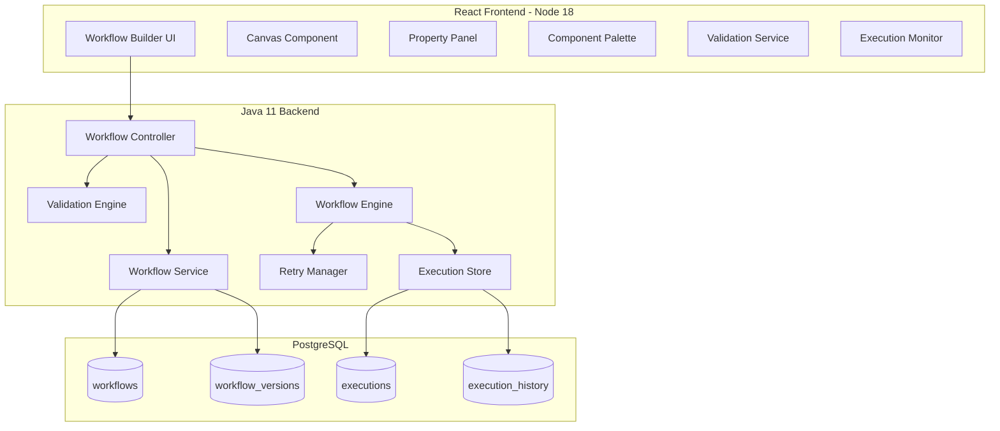
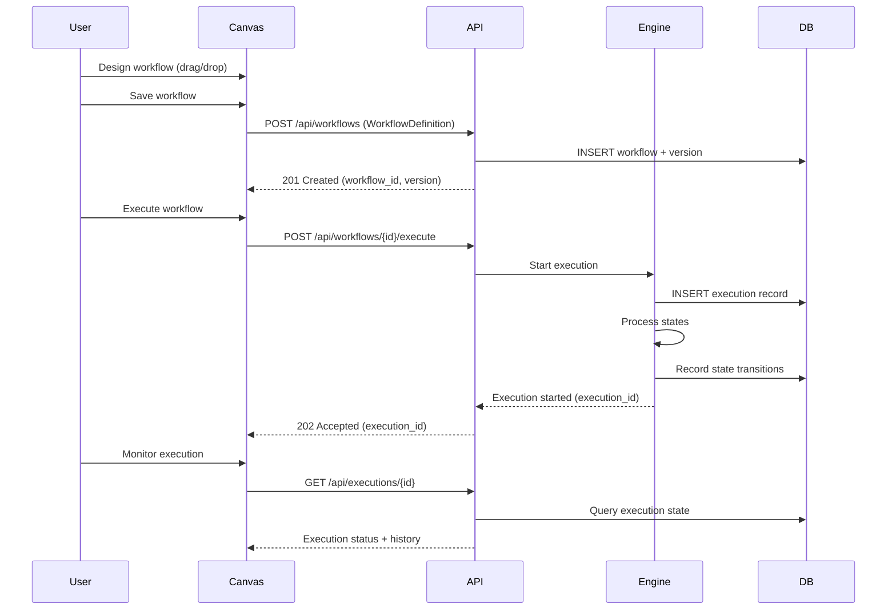

# Design Document: Chatbot Workflow Builder

## Overview

The Chatbot Workflow Builder is a full-stack application that enables non-technical users to design chatbot conversation flows through a visual drag-and-drop interface, and provides a backend engine to execute those flows as state machines. The system draws inspiration from AWS Step Functions in its state machine model — workflows are directed graphs of typed states with transitions, context variable passing, error handling, and retry logic.

The frontend is a React single-page application providing a canvas-based workflow editor with a component palette, property panels, validation, and execution monitoring. The backend is a Java 11 service exposing REST APIs for workflow CRUD, validation, and execution, backed by PostgreSQL for persistence.

### Key Design Decisions

1. **State Machine Model**: Workflows are modeled as directed graphs (not trees) to support conditional branching, parallel execution, and convergence patterns. Each state is a self-contained unit with typed configuration.
2. **JSON Workflow Definition**: The canonical representation of a workflow is a JSON document containing all states, transitions, metadata, and layout positions. This enables versioning, export/import, and round-trip serialization.
3. **Event-Driven Execution**: The workflow engine processes states sequentially (or in parallel for Parallel_State), pausing at Input_State and Wait_State boundaries. Execution state is persisted to PostgreSQL so that paused executions survive server restarts.
4. **Separation of Canvas and Engine**: The frontend serialization and backend execution use the same Workflow_Definition schema, but the canvas includes additional visual metadata (positions) that the engine ignores during execution.

## Architecture



### Component Interaction Flow



## Components and Interfaces

### Frontend Components

#### Canvas Component
- **Responsibility**: Renders the visual workflow editor with drag-and-drop support, zoom/pan controls, and state/transition visualization.
- **Technology**: React with a canvas library (e.g., React Flow) for node-based graph editing.
- **Key behaviors**:
  - Renders states as typed nodes with visual differentiation per State_Type
  - Handles drag from palette to create new state instances
  - Handles edge drawing between states to create transitions
  - Supports zoom (25%-400%) and pan controls
  - Maintains undo/redo stack (minimum 50 operations)

#### Component Palette
- **Responsibility**: Lists available State_Types for drag onto the canvas.
- **State Types**: API_Call, Condition, Response, Input, Wait, Parallel, End

#### Property Panel
- **Responsibility**: Displays and edits configuration for the selected state.
- **Dynamic rendering**: Panel fields change based on the selected state's type.
- **Validation**: Inline field validation (e.g., variable name format, URL format, duration range).

#### Validation Service (Frontend)
- **Responsibility**: Client-side workflow validation before save or execution.
- **Checks**: Single start state, all non-End states have outgoing transitions, Condition_State has exactly two labeled transitions (true/false), reachability, required fields populated, empty workflow check.

#### Execution Monitor
- **Responsibility**: Displays real-time execution status, highlights current state on canvas, shows execution history timeline.

### Backend Components

#### Workflow Controller (REST API)
- **Endpoints**:
  - `POST /api/workflows` — Create/save workflow
  - `GET /api/workflows` — List workflows (paginated, max 50/page)
  - `GET /api/workflows/{id}` — Get workflow definition
  - `PUT /api/workflows/{id}` — Update workflow (new version)
  - `DELETE /api/workflows/{id}` — Delete workflow
  - `POST /api/workflows/{id}/validate` — Validate workflow
  - `POST /api/workflows/{id}/execute` — Start execution
  - `GET /api/workflows/{id}/export` — Export as JSON file
  - `POST /api/workflows/import` — Import from JSON file
  - `GET /api/executions` — List executions (paginated, default 20, max 100)
  - `GET /api/executions/{id}` — Get execution status + history
  
#### Workflow Service
- **Responsibility**: Business logic for workflow CRUD, versioning (monotonically incrementing integer starting at 1), and serialization.

#### Validation Engine
- **Responsibility**: Server-side validation of Workflow_Definition structure.
- **Graph algorithms**: BFS/DFS for reachability check from the start state.

#### Workflow Engine
- **Responsibility**: Executes workflows as state machines.
- **State processors**: One processor per State_Type implementing the execution logic.
- **Concurrency**: Thread pool for Parallel_State branch execution.
- **Timeout management**: Configurable execution-level timeout (default 3600s) and state-level timeouts.

#### Retry Manager
- **Responsibility**: Implements exponential backoff retry logic.
- **Formula**: `delay = baseInterval * 2^(attemptNumber - 1)`
- **Constraints**: Max retries 0-10, backoff interval 1-300 seconds.

### API Contracts

#### WorkflowDefinition (JSON Schema)

```json
{
  "metadata": {
    "name": "string (1-100 chars)",
    "description": "string",
    "version": "integer",
    "createdAt": "ISO 8601",
    "lastModifiedAt": "ISO 8601"
  },
  "states": [
    {
      "id": "uuid",
      "type": "API_Call | Condition | Response | Input | Wait | Parallel | End",
      "name": "string",
      "position": { "x": "number", "y": "number" },
      "config": { /* type-specific configuration */ },
      "retryPolicy": {
        "maxRetries": "integer (0-10)",
        "backoffInterval": "integer (1-300 seconds)"
      },
      "outputMapping": { "variableName": "jsonPath" }
    }
  ],
  "transitions": [
    {
      "id": "uuid",
      "source": "state_id",
      "target": "state_id",
      "condition": "string (optional: 'true' | 'false' | 'error' | 'timeout' | 'fallback')"
    }
  ],
  "contextVariables": [
    {
      "name": "string (1-64 alphanumeric/underscore)",
      "defaultValue": "any"
    }
  ]
}
```

#### Execution Status Response

```json
{
  "executionId": "uuid",
  "workflowId": "uuid",
  "workflowName": "string",
  "status": "running | completed | failed | paused",
  "currentStateId": "uuid",
  "startTime": "ISO 8601",
  "endTime": "ISO 8601 | null",
  "elapsedTimeMs": "long",
  "contextVariables": { },
  "history": [
    {
      "stateId": "uuid",
      "stateName": "string",
      "entryTime": "ISO 8601",
      "exitTime": "ISO 8601 | null",
      "outcome": "succeeded | failed | skipped | timed_out",
      "error": {
        "message": "string",
        "stackTrace": "string (max 5000 chars)"
      }
    }
  ]
}
```

## Data Models

### PostgreSQL Schema

```sql
-- Workflows table
CREATE TABLE workflows (
    id UUID PRIMARY KEY DEFAULT gen_random_uuid(),
    name VARCHAR(100) NOT NULL,
    description TEXT,
    current_version INTEGER NOT NULL DEFAULT 1,
    created_at TIMESTAMP WITH TIME ZONE NOT NULL DEFAULT NOW(),
    last_modified_at TIMESTAMP WITH TIME ZONE NOT NULL DEFAULT NOW(),
    deleted_at TIMESTAMP WITH TIME ZONE -- soft delete
);

CREATE INDEX idx_workflows_last_modified ON workflows(last_modified_at DESC)
    WHERE deleted_at IS NULL;

-- Workflow versions table (stores each version's definition)
CREATE TABLE workflow_versions (
    id UUID PRIMARY KEY DEFAULT gen_random_uuid(),
    workflow_id UUID NOT NULL REFERENCES workflows(id),
    version INTEGER NOT NULL,
    definition JSONB NOT NULL, -- Full WorkflowDefinition JSON
    created_at TIMESTAMP WITH TIME ZONE NOT NULL DEFAULT NOW(),
    UNIQUE(workflow_id, version)
);

CREATE INDEX idx_workflow_versions_workflow ON workflow_versions(workflow_id, version DESC);

-- Executions table
CREATE TABLE executions (
    id UUID PRIMARY KEY DEFAULT gen_random_uuid(),
    workflow_id UUID NOT NULL REFERENCES workflows(id),
    workflow_version INTEGER NOT NULL,
    status VARCHAR(20) NOT NULL DEFAULT 'running'
        CHECK (status IN ('running', 'completed', 'failed', 'paused')),
    current_state_id UUID,
    context_variables JSONB NOT NULL DEFAULT '{}',
    start_time TIMESTAMP WITH TIME ZONE NOT NULL DEFAULT NOW(),
    end_time TIMESTAMP WITH TIME ZONE,
    max_duration_seconds INTEGER NOT NULL DEFAULT 3600,
    error_message TEXT,
    error_stack_trace VARCHAR(5000)
);

CREATE INDEX idx_executions_workflow ON executions(workflow_id);
CREATE INDEX idx_executions_status ON executions(status) WHERE status = 'running';
CREATE INDEX idx_executions_start_time ON executions(start_time DESC);

-- Execution history (state transitions)
CREATE TABLE execution_history (
    id UUID PRIMARY KEY DEFAULT gen_random_uuid(),
    execution_id UUID NOT NULL REFERENCES executions(id),
    state_id UUID NOT NULL,
    state_name VARCHAR(255),
    entry_time TIMESTAMP WITH TIME ZONE NOT NULL DEFAULT NOW(),
    exit_time TIMESTAMP WITH TIME ZONE,
    outcome VARCHAR(20)
        CHECK (outcome IN ('succeeded', 'failed', 'skipped', 'timed_out')),
    context_snapshot JSONB, -- Context variables at this transition
    error_message TEXT,
    error_stack_trace VARCHAR(5000),
    sequence_number INTEGER NOT NULL -- ordering within execution
);

CREATE INDEX idx_execution_history_execution ON execution_history(execution_id, sequence_number);

-- Retry attempts
CREATE TABLE retry_attempts (
    id UUID PRIMARY KEY DEFAULT gen_random_uuid(),
    execution_id UUID NOT NULL REFERENCES executions(id),
    state_id UUID NOT NULL,
    attempt_number INTEGER NOT NULL,
    attempted_at TIMESTAMP WITH TIME ZONE NOT NULL DEFAULT NOW(),
    error_message TEXT
);

CREATE INDEX idx_retry_attempts_execution ON retry_attempts(execution_id, state_id);
```

### Domain Models (Java)

```java
// Core domain entities
public enum StateType {
    API_CALL, CONDITION, RESPONSE, INPUT, WAIT, PARALLEL, END
}

public enum ExecutionStatus {
    RUNNING, COMPLETED, FAILED, PAUSED
}

public enum StateOutcome {
    SUCCEEDED, FAILED, SKIPPED, TIMED_OUT
}

public class WorkflowDefinition {
    private WorkflowMetadata metadata;
    private List<StateDefinition> states;
    private List<TransitionDefinition> transitions;
    private List<ContextVariable> contextVariables;
}

public class StateDefinition {
    private UUID id;
    private StateType type;
    private String name;
    private Position position;
    private Map<String, Object> config;
    private RetryPolicy retryPolicy;
    private Map<String, String> outputMapping;
}

public class TransitionDefinition {
    private UUID id;
    private UUID source;
    private UUID target;
    private String condition; // "true", "false", "error", "timeout", "fallback", or null
}

public class RetryPolicy {
    private int maxRetries; // 0-10
    private int backoffIntervalSeconds; // 1-300
}

public class Execution {
    private UUID id;
    private UUID workflowId;
    private int workflowVersion;
    private ExecutionStatus status;
    private UUID currentStateId;
    private Map<String, Object> contextVariables;
    private Instant startTime;
    private Instant endTime;
    private int maxDurationSeconds;
}
```

### Frontend State Model (TypeScript)

```typescript
interface CanvasState {
  states: Map<string, WorkflowState>;
  transitions: Map<string, Transition>;
  selectedStateId: string | null;
  zoom: number; // 0.25 to 4.0
  panOffset: { x: number; y: number };
  undoStack: CanvasOperation[]; // min 50 capacity
  redoStack: CanvasOperation[];
  contextVariables: ContextVariable[];
}

interface WorkflowState {
  id: string;
  type: StateType;
  name: string;
  position: { x: number; y: number };
  config: StateConfig; // union type based on StateType
  retryPolicy?: RetryPolicy;
  outputMapping?: Record<string, string>;
}

type StateType = 'API_Call' | 'Condition' | 'Response' | 'Input' | 'Wait' | 'Parallel' | 'End';

interface Transition {
  id: string;
  source: string;
  target: string;
  condition?: 'true' | 'false' | 'error' | 'timeout' | 'fallback';
}

type CanvasOperation =
  | { type: 'ADD_STATE'; state: WorkflowState }
  | { type: 'DELETE_STATE'; state: WorkflowState; transitions: Transition[] }
  | { type: 'MOVE_STATE'; stateId: string; from: Position; to: Position }
  | { type: 'ADD_TRANSITION'; transition: Transition }
  | { type: 'DELETE_TRANSITION'; transition: Transition }
  | { type: 'UPDATE_STATE_CONFIG'; stateId: string; oldConfig: StateConfig; newConfig: StateConfig };
```


## Correctness Properties

*A property is a characteristic or behavior that should hold true across all valid executions of a system — essentially, a formal statement about what the system should do. Properties serve as the bridge between human-readable specifications and machine-verifiable correctness guarantees.*

### Property 1: Self-loop and duplicate transition rejection

*For any* state in a workflow, attempting to create a transition from that state to itself should be rejected. *For any* existing transition from state A to state B, attempting to create another transition with the same source and target should be rejected.

**Validates: Requirements 1.4**

### Property 2: Zoom level clamping

*For any* numeric zoom input value, the resulting canvas zoom level should be clamped to the range [0.25, 4.0]. Values below 0.25 should produce 0.25, values above 4.0 should produce 4.0, and values within the range should be unchanged.

**Validates: Requirements 1.6**

### Property 3: State deletion removes exactly associated transitions

*For any* workflow graph and any state within it, deleting that state should remove exactly that state and all transitions where it is either the source or target, leaving all other states and all unrelated transitions intact.

**Validates: Requirements 1.7**

### Property 4: Undo reverses canvas operations

*For any* canvas operation (state creation, state deletion, state movement, transition creation, transition deletion), performing the operation then undoing it should restore the canvas to its exact previous state. The undo stack should retain at least 50 operations.

**Validates: Requirements 1.8**

### Property 5: Condition expression evaluation correctness

*For any* valid boolean expression using comparison operators (==, !=, <, >, <=, >=) and logical operators (AND, OR, NOT) over context variables, and *for any* set of context variable values, the condition evaluator should produce the correct boolean result and the workflow engine should follow the corresponding true or false transition.

**Validates: Requirements 2.3, 5.3**

### Property 6: Template variable interpolation

*For any* message template containing `{{variableName}}` references and *for any* context variable map, interpolation should replace every `{{variableName}}` occurrence with the corresponding variable value, or with a null representation if the variable is not defined.

**Validates: Requirements 2.4, 5.4, 6.2**

### Property 7: Wait duration range validation

*For any* integer value, it should be accepted as a Wait_State duration if and only if it is in the range [1, 86400].

**Validates: Requirements 2.6**

### Property 8: Parallel branch count validation

*For any* integer value, it should be accepted as a Parallel_State branch count if and only if it is in the range [2, 10].

**Validates: Requirements 2.7**

### Property 9: Workflow name length validation

*For any* string, it should be accepted as a workflow name if and only if its length is between 1 and 100 characters (inclusive).

**Validates: Requirements 3.1**

### Property 10: Workflow listing pagination and sorting

*For any* set of workflows, paginated listing should return at most 50 items per page, and results should be sorted by last modified date in descending order.

**Validates: Requirements 3.3**

### Property 11: Version number monotonic increment

*For any* workflow, a sequence of N saves should produce version numbers [1, 2, 3, ..., N] — starting at 1 for the initial save and incrementing by exactly 1 on each subsequent save.

**Validates: Requirements 3.5**

### Property 12: Canvas state preserved on failed operations

*For any* canvas state and any backend operation (save, load, delete, import) that fails, the canvas state after the failure should be identical to the canvas state before the operation was attempted.

**Validates: Requirements 3.6, 7.5**

### Property 13: Single start state validation

*For any* workflow graph, validation should pass (regarding start state) if and only if exactly one state has no incoming transitions. Zero start states or multiple start states should produce a validation error.

**Validates: Requirements 4.1**

### Property 14: Non-End states require outgoing transitions

*For any* workflow graph, validation should fail if and only if there exists a non-End_State with zero outgoing transitions.

**Validates: Requirements 4.2**

### Property 15: Condition state transition structure

*For any* workflow containing Condition_State nodes, validation should pass if and only if each Condition_State has exactly two outgoing transitions, one labeled "true" and one labeled "false".

**Validates: Requirements 4.3**

### Property 16: All states reachable from start

*For any* workflow graph, validation should fail if and only if there exists at least one state that is not reachable from the start state via graph traversal.

**Validates: Requirements 4.4**

### Property 17: Required configuration fields validation

*For any* state with a given State_Type, validation should pass if and only if all required configuration fields for that type are populated with non-null, valid values.

**Validates: Requirements 4.5**

### Property 18: Complete validation error reporting

*For any* workflow with N distinct validation errors, the validator should report all N errors simultaneously rather than stopping at the first error encountered.

**Validates: Requirements 4.6**

### Property 19: Execution initialization with defaults

*For any* workflow with defined context variables and default values, starting a new execution should initialize all context variables to their configured defaults and set the current state to the start state (the state with no incoming transitions).

**Validates: Requirements 5.1**

### Property 20: Parallel branch merge ordering

*For any* Parallel_State with K branches, each producing context variable outputs, the merge result should equal the sequential application of branch outputs in branch-definition order (index 0 through K-1), where later branches overwrite earlier branches for conflicting variable names.

**Validates: Requirements 5.8**

### Property 21: End_State completes execution

*For any* execution that reaches an End_State, the execution status should be set to "completed" and the final context variables should be persisted in the execution history unchanged.

**Validates: Requirements 5.10**

### Property 22: API call timeout range validation

*For any* integer value, it should be accepted as an API_Call_State timeout if and only if it is in the range [1, 120]. When no timeout is specified, the default should be 30 seconds.

**Validates: Requirements 6.3**

### Property 23: Response mapping with null for missing fields

*For any* API response body and *for any* response mapping configuration, each mapped field that exists in the response should be stored in the corresponding context variable with its value, and each mapped field that does not exist in the response should set the corresponding context variable to null.

**Validates: Requirements 6.6**

### Property 24: Workflow serialization round-trip

*For any* valid workflow (states with types/configurations, transitions with source/target/conditions, context variables, and state positions), serializing to JSON and then deserializing should produce a workflow with identical states, transitions, configurations, and layout positions.

**Validates: Requirements 7.6, 7.1, 7.2, 3.2**

### Property 25: Import validation rejects malformed definitions

*For any* JSON input that is missing required WorkflowDefinition fields (states, transitions, metadata) or contains states with invalid State_Types, import should reject it with an error message indicating the reason.

**Validates: Requirements 7.4**

### Property 26: Execution history completeness

*For any* execution processing N state transitions, the execution history should contain N records, each with a non-null state identifier, ISO 8601 entry time, exit time (once completed), outcome (succeeded/failed/skipped/timed_out), and a context variables snapshot.

**Validates: Requirements 8.1, 8.2**

### Property 27: Stack trace truncation

*For any* error stack trace string, the recorded stack trace should be at most 5000 characters long. If the original exceeds 5000 characters, it should be truncated to exactly 5000 characters.

**Validates: Requirements 8.4**

### Property 28: Execution listing pagination

*For any* set of executions and *for any* requested page size P, the result should contain at most min(P, 100) items. When no page size is specified, the default should be 20.

**Validates: Requirements 8.6**

### Property 29: Retry policy range validation

*For any* pair of integers (maxRetries, backoffInterval), it should be accepted as a retry policy if and only if maxRetries is in [0, 10] and backoffInterval is in [1, 300] seconds.

**Validates: Requirements 9.1**

### Property 30: Exponential backoff calculation

*For any* retry policy with baseInterval B and maxRetries N, when a state fails K times (K ≤ N), the delay before attempt K should be B × 2^(K-1) seconds. No more than N retry attempts should be made.

**Validates: Requirements 9.2**

### Property 31: Retry attempt recording

*For any* state that undergoes K retry attempts, the execution history should contain K retry records, each with correct attempt_number (1 through K), a non-null timestamp, and the error message that triggered the retry.

**Validates: Requirements 9.5**

### Property 32: Context variable name validation

*For any* string, it should be accepted as a context variable name if and only if it matches the pattern `^[a-zA-Z0-9_]{1,64}$`. The total number of workflow-level variables should not exceed 100.

**Validates: Requirements 10.1, 10.6**

### Property 33: Context variable propagation

*For any* execution where state A writes value V to variable X via output mapping, all subsequent states in the execution path should read value V from variable X (unless overwritten by an intermediate state).

**Validates: Requirements 10.2, 10.3**

### Property 34: Undefined variable returns null with warning

*For any* state that references a context variable name that does not exist in the current context, the variable value should be treated as null, and a warning should be logged containing the variable name and the state identifier.

**Validates: Requirements 10.5**

## Error Handling

### Frontend Error Handling

| Error Scenario | Behavior |
|---|---|
| Backend unreachable | Display "Connection error" toast; preserve canvas state |
| Save fails (4xx/5xx) | Display error message with reason; canvas unchanged |
| Load fails | Display error message; remain on current view |
| Import validation failure | Display specific error (missing fields, invalid types, file too large); canvas unchanged |
| Invalid state configuration | Inline validation errors on property panel fields |
| Circular transition attempt | Reject with error tooltip on canvas |

### Backend Error Handling

| Error Scenario | Behavior |
|---|---|
| Workflow not found | Return 404 with `{"error": "Workflow not found", "workflowId": "..."}` |
| Execution not found | Return 404 with `{"error": "Execution not found", "executionId": "..."}` |
| Invalid workflow definition | Return 400 with validation error details |
| State execution failure | Apply retry policy if configured; record error; follow error/fallback transition or halt |
| API call failure (non-2xx) | Record status/body; follow error transition or halt |
| API call timeout/network error | Follow timeout transition or halt with error status |
| Parallel branch failure | Cancel remaining branches; follow error transition or halt |
| Execution timeout | Halt execution with timeout status; persist current state |
| Database error | Return 500; log error details; frontend preserves state |
| Input state timeout | Follow timeout transition if configured; otherwise halt with timeout status |

### Retry Strategy

- **Exponential backoff**: `delay = baseInterval × 2^(attemptNumber - 1)`
- **Max retries**: 0–10 (configurable per state)
- **Backoff interval**: 1–300 seconds base (configurable per state)
- **Retry triggers**: Runtime exceptions, network errors, timeouts
- **After exhaustion**: Follow error transition → fallback transition → halt execution (in priority order)

## Testing Strategy

### Property-Based Testing

**Library**: [fast-check](https://github.com/dubzzz/fast-check) for React frontend (TypeScript), [jqwik](https://jqwik.net/) for Java backend.

**Configuration**: Minimum 100 iterations per property test.

**Tag format**: `Feature: chatbot-workflow-builder, Property {number}: {title}`

Property-based tests will cover:
- Serialization round-trip (Property 24)
- Validation logic (Properties 13–18, 25)
- Range validations (Properties 2, 7, 8, 9, 22, 29, 32)
- Template interpolation (Property 6)
- Condition expression evaluation (Property 5)
- Graph operations (Properties 1, 3, 4)
- Execution logic (Properties 19, 20, 21, 23, 30, 33, 34)
- Pagination (Properties 10, 28)
- History recording (Properties 26, 27, 31)

### Unit Testing

Unit tests complement property tests for:
- Specific examples of each state type configuration (Requirements 2.2, 2.5)
- Error transition routing scenarios (Requirements 5.6, 5.9, 6.4, 6.5, 6.7, 9.3)
- UI panel rendering per state type (Requirement 1.5)
- Export file download behavior (Requirement 7.3)
- Confirmation dialogs (Requirements 3.4, 1.7)

### Integration Testing

Integration tests for:
- Full workflow CRUD lifecycle through REST API
- Workflow execution end-to-end with mocked external APIs
- Input_State pause/resume with simulated user input (Requirement 5.5)
- Wait_State timing behavior (Requirement 5.7)
- Execution timeout enforcement (Requirement 5.11)
- Execution monitoring REST API (Requirement 8.5)
- Database persistence and retrieval

### Edge Case Testing

- Empty workflow validation (Requirement 4.8)
- Import file > 5 MB rejection (Requirement 7.7)
- Non-existent execution query → 404 (Requirement 8.7)
- Maximum undo stack depth (50 operations)
- Maximum context variables (100)
- Boundary values for all numeric ranges
