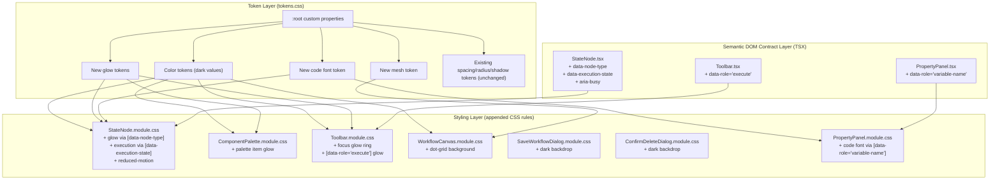

# Design Document: Dark Futuristic Theme

## Overview

This feature transforms the Chatbot Workflow Builder from a light glassmorphism theme to a dark, futuristic, developer IDE aesthetic. The implementation uses a three-layer architecture:

1. **Token Layer** (`tokens.css`) — overwrites existing CSS custom property values with dark-adapted colors, adds new tokens for glow/code/mesh effects
2. **Semantic DOM Contract Layer** (TSX changes) — adds `data-*` and `aria-*` attributes to existing JSX elements, encoding node type, execution state, and UI role as stable selectors
3. **Styling Layer** (`.module.css` appended rules) — appends CSS rules using attribute selectors (`[data-node-type="..."]`, `[data-execution-state="..."]`, `[data-role="..."]`) for neon glow interactions, execution animations, and code typography

**Key constraints:**
- TSX file modifications are limited to adding `data-*` attributes (data-node-type, data-execution-state, data-role) and `aria-*` attributes (aria-busy) — no logic changes
- No new files are created or deleted
- Only `tokens.css` values change and new CSS rules are appended to existing module files
- All new CSS rules use semantic attribute selectors rather than class-based selectors

**Design rationale:** The Semantic DOM Contract Layer provides a stable interface between React components and CSS styling. By selecting elements via `[data-node-type="apiCall"]` instead of `.apiCall`, the CSS is decoupled from the internal class naming scheme. Existing class-based selectors (used by the light theme for base gradients/borders) remain untouched — the dark theme's new rules exclusively use attribute selectors. This guarantees zero risk of breaking existing styles, React component logic, tests, or TypeScript compilation.

## Architecture



### Change Strategy

| Layer | File(s) | Action | Risk |
|-------|---------|--------|------|
| Token | `tokens.css` `:root` | Overwrite color values in-place | None — same property names |
| Token | `tokens.css` `:root` | Add new properties (glow, code font, mesh) | None — additive |
| DOM Contract | `StateNode.tsx`, `Toolbar.tsx`, `PropertyPanel.tsx` | Add `data-*`/`aria-*` attributes | None — no logic change |
| Styling | `*.module.css` files | Append new rules using attribute selectors | None — additive, no overwrites of existing selectors |

## Components and Interfaces

### 1. Token System (`tokens.css`)

The single source of truth for all visual values. Components never use hardcoded colors — they reference `var(--token-name)`.

**Modified files:** `frontend/src/styles/tokens.css`

**Interface contract:** All existing custom property names remain unchanged. Components that reference `var(--color-background)`, `var(--glass-bg)`, etc. will automatically pick up dark values without code changes.

### 2. Semantic DOM Contract

A minimal set of `data-*` and `aria-*` attributes added to existing JSX elements. These attributes encode semantic meaning (node type, execution state, UI role) that CSS selectors target for styling.

**Modified files:** `StateNode.tsx`, `Toolbar.tsx`, `PropertyPanel.tsx`

**Constraint:** Only attributes are added — no changes to component logic, event handlers, state management, hooks, props interfaces, or data flow.

#### StateNode.tsx — Added Attributes

The root `<div>` of each StateNode receives:

```tsx
<div
  className={nodeClasses}
  data-testid={`state-node-${data.stateType}`}
  data-node-type={data.stateType.toLowerCase().replace('_', '')}
  data-execution-state={selected ? 'selected' : 'idle'}
  aria-busy={false}
>
```

| Attribute | Value | Purpose |
|-----------|-------|---------|
| `data-node-type` | `"apicall"` \| `"condition"` \| `"response"` \| `"input"` \| `"wait"` \| `"parallel"` \| `"end"` | CSS targets node-type-specific glow colors |
| `data-execution-state` | `"idle"` \| `"selected"` \| `"executing"` \| `"completed"` \| `"errored"` | CSS targets execution/selection visual states |
| `aria-busy` | `true` when executing, `false` otherwise | Accessibility: screen readers announce busy state |

#### Toolbar.tsx — Added Attributes

The execute button receives:

```tsx
<button className={styles.executeButton} data-role="execute">
  Execute
</button>
```

| Attribute | Value | Purpose |
|-----------|-------|---------|
| `data-role` | `"execute"` | CSS targets the execute button for success-colored glow on focus |

#### PropertyPanel.tsx — Added Attributes

Variable name input fields receive:

```tsx
<input className={styles.input} data-role="variable-name" ... />
```

| Attribute | Value | Purpose |
|-----------|-------|---------|
| `data-role` | `"variable-name"` | CSS targets variable name inputs for code font |

### 3. StateNode Glow & Animation Layer (`StateNode.module.css`)

Appended rules that add:
- Neon glow on `[data-execution-state="selected"]` (type-specific via `[data-node-type]`)
- Hover border shift via `[data-node-type="..."]:hover`
- `@keyframes` for execution pulsing animation
- `[data-execution-state="executing"]`, `[data-execution-state="completed"]`, `[data-execution-state="errored"]` selectors
- `@media (prefers-reduced-motion: reduce)` block to disable animations

### 4. Palette Glow Layer (`ComponentPalette.module.css`)

Appended rules that add neon glow `box-shadow` on `.item:hover` using state-type accent colors.

### 5. Toolbar Focus Glow Layer (`Toolbar.module.css`)

Appended rules that replace the existing `:focus-visible` outline with a neon glow ring using the primary accent. The execute button is additionally targeted via `[data-role="execute"]:focus-visible`.

### 6. Canvas Background Layer (`WorkflowCanvas.module.css`)

Appended rules that add a CSS `radial-gradient` dot-grid pattern and mesh overlay to the canvas wrapper.

### 7. Dialog Backdrop Layer (`SaveWorkflowDialog.module.css`, `ConfirmDeleteDialog.module.css`)

Appended rules that darken the `.overlay` backdrop to match the dark theme (rgba(0,0,0,0.7)).

### 8. Property Panel Code Font (`PropertyPanel.module.css`)

Appended rules that apply `--font-family-code` to variable name inputs via `[data-role="variable-name"]` selector.

## Data Models

### Token Structure — Dark Theme Values

The `:root` block in `tokens.css` is the data model. Below is the complete before → after mapping:

#### Color Tokens (overwritten in-place)

```css
:root {
  /* --- Colors: Primary (adjusted for dark background contrast) --- */
  --color-primary-lightest: #1a3a5c;
  --color-primary-light: #4da8e8;
  --color-primary-base: #58b4f0;
  --color-primary-dark: #7ec8f0;
  --color-primary-darkest: #a8dcf8;

  /* --- Colors: Secondary --- */
  --color-secondary-lightest: #2a1f4e;
  --color-secondary-light: #a78bfa;
  --color-secondary-base: #8b5cf6;
  --color-secondary-dark: #b794f6;
  --color-secondary-darkest: #d4bcfa;

  /* --- Colors: Success --- */
  --color-success-lightest: #0d3328;
  --color-success-light: #34d399;
  --color-success-base: #10b981;
  --color-success-dark: #6ee7b7;
  --color-success-darkest: #a7f3d0;

  /* --- Colors: Warning --- */
  --color-warning-lightest: #3d2800;
  --color-warning-light: #fbbf24;
  --color-warning-base: #f59e0b;
  --color-warning-dark: #fcd34d;
  --color-warning-darkest: #fde68a;

  /* --- Colors: Error --- */
  --color-error-lightest: #3b1111;
  --color-error-light: #f87171;
  --color-error-base: #ef4444;
  --color-error-dark: #fca5a5;
  --color-error-darkest: #fecaca;

  /* --- Colors: Neutral (inverted for dark theme) --- */
  --color-neutral-lightest: #1e293b;
  --color-neutral-light: #334155;
  --color-neutral-base: #94a3b8;
  --color-neutral-dark: #cbd5e1;
  --color-neutral-darkest: #f1f5f9;

  /* --- Glass effect (dark frosted glass) --- */
  --glass-bg: rgba(22, 27, 34, 0.72);
  --glass-bg-strong: rgba(22, 27, 34, 0.88);
  --glass-border: rgba(255, 255, 255, 0.10);
  --glass-border-subtle: rgba(255, 255, 255, 0.06);
  --glass-blur: blur(12px);
  --glass-blur-strong: blur(20px);

  /* --- Surface colors (dark) --- */
  --color-surface: rgba(22, 27, 34, 0.80);
  --color-surface-solid: #1a1f2e;
  --color-background: #0d1117;
  --color-background-mesh: linear-gradient(135deg, rgba(88, 180, 240, 0.03) 0%, rgba(139, 92, 246, 0.03) 100%);
  --color-border: rgba(255, 255, 255, 0.08);
  --color-border-strong: rgba(255, 255, 255, 0.12);
  --color-canvas-bg: #161b22;
  --color-canvas-dot: #30363d;

  /* --- NEW: Glow accent tokens --- */
  --glow-primary: 0 0 12px 2px rgba(88, 180, 240, 0.20);
  --glow-secondary: 0 0 12px 2px rgba(139, 92, 246, 0.20);
  --glow-success: 0 0 12px 2px rgba(16, 185, 129, 0.20);
  --glow-warning: 0 0 12px 2px rgba(245, 158, 11, 0.20);
  --glow-error: 0 0 12px 2px rgba(239, 68, 68, 0.20);

  /* --- NEW: Code typography --- */
  --font-family-code: 'JetBrains Mono', 'Fira Code', 'Cascadia Code', monospace;

  /* --- Shadows (adjusted for dark surfaces) --- */
  --shadow-low: 0 1px 3px rgba(0, 0, 0, 0.3), 0 1px 2px rgba(0, 0, 0, 0.2);
  --shadow-medium: 0 4px 12px rgba(0, 0, 0, 0.4), 0 2px 4px rgba(0, 0, 0, 0.2);
  --shadow-high: 0 8px 24px rgba(0, 0, 0, 0.5), 0 4px 8px rgba(0, 0, 0, 0.3);
}
```

#### New Token Additions Summary

| Token | Value | Purpose |
|-------|-------|---------|
| `--glow-primary` | `0 0 12px 2px rgba(88, 180, 240, 0.20)` | Primary accent glow (selection, focus) |
| `--glow-secondary` | `0 0 12px 2px rgba(139, 92, 246, 0.20)` | Secondary/Input node glow |
| `--glow-success` | `0 0 12px 2px rgba(16, 185, 129, 0.20)` | Success/completed glow |
| `--glow-warning` | `0 0 12px 2px rgba(245, 158, 11, 0.20)` | Warning/condition glow |
| `--glow-error` | `0 0 12px 2px rgba(239, 68, 68, 0.20)` | Error/end node glow |
| `--font-family-code` | `'JetBrains Mono', ...monospace` | Code typography for state labels |
| `--color-background-mesh` | `linear-gradient(...)` | Subtle mesh overlay for canvas |

### Contrast Verification

| Pair | Ratio | Requirement |
|------|-------|-------------|
| `--color-neutral-darkest` (#f1f5f9) on `--color-background` (#0d1117) | ~15.3:1 | ≥ 7:1 ✓ |
| `--color-neutral-base` (#94a3b8) on `--color-background` (#0d1117) | ~7.2:1 | ≥ 4.5:1 ✓ |
| `--color-canvas-dot` (#30363d) on `--color-canvas-bg` (#161b22) | ~1.7:1 | 1.5–3:1 ✓ |
| `--color-canvas-bg` (#161b22) vs `--glass-bg` composited (~#161b22•0.72 over #000) | ~1.4:1 | ≥ 1.3:1 ✓ |
| All accent `base` shades on `--color-background` | ≥ 3.5:1 | ≥ 3:1 ✓ |

## Detailed Component CSS Specifications

### StateNode.module.css — Appended Rules

```css
/* --- Neon glow: selected state (type-specific) via attribute selectors --- */
.node[data-node-type="apicall"][data-execution-state="selected"] {
  box-shadow: 0 0 12px 2px rgba(88, 180, 240, 0.22), 0 0 0 3px rgba(88, 180, 240, 0.15);
}
.node[data-node-type="condition"][data-execution-state="selected"] {
  box-shadow: 0 0 12px 2px rgba(245, 158, 11, 0.22), 0 0 0 3px rgba(245, 158, 11, 0.15);
}
.node[data-node-type="response"][data-execution-state="selected"] {
  box-shadow: 0 0 12px 2px rgba(16, 185, 129, 0.22), 0 0 0 3px rgba(16, 185, 129, 0.15);
}
.node[data-node-type="input"][data-execution-state="selected"] {
  box-shadow: 0 0 12px 2px rgba(139, 92, 246, 0.22), 0 0 0 3px rgba(139, 92, 246, 0.15);
}
.node[data-node-type="wait"][data-execution-state="selected"] {
  box-shadow: 0 0 12px 2px rgba(217, 119, 6, 0.22), 0 0 0 3px rgba(217, 119, 6, 0.15);
}
.node[data-node-type="parallel"][data-execution-state="selected"] {
  box-shadow: 0 0 12px 2px rgba(5, 150, 105, 0.22), 0 0 0 3px rgba(5, 150, 105, 0.15);
}
.node[data-node-type="end"][data-execution-state="selected"] {
  box-shadow: 0 0 12px 2px rgba(239, 68, 68, 0.22), 0 0 0 3px rgba(239, 68, 68, 0.15);
}

/* --- Neon glow: hover (type-specific border shift) via attribute selectors --- */
.node[data-node-type="apicall"]:hover { border-color: rgba(88, 180, 240, 0.40); }
.node[data-node-type="condition"]:hover { border-color: rgba(245, 158, 11, 0.40); }
.node[data-node-type="response"]:hover { border-color: rgba(16, 185, 129, 0.40); }
.node[data-node-type="input"]:hover { border-color: rgba(139, 92, 246, 0.40); }
.node[data-node-type="wait"]:hover { border-color: rgba(217, 119, 6, 0.40); }
.node[data-node-type="parallel"]:hover { border-color: rgba(5, 150, 105, 0.40); }
.node[data-node-type="end"]:hover { border-color: rgba(239, 68, 68, 0.40); }

/* --- Code font for state type label --- */
.type {
  font-family: var(--font-family-code);
}

/* --- Execution animations via attribute selectors --- */
@keyframes executionPulse {
  0%, 100% { box-shadow: var(--glow-primary); }
  50% { box-shadow: 0 0 20px 4px rgba(88, 180, 240, 0.35); }
}

@keyframes completionFade {
  0% { box-shadow: 0 0 16px 4px rgba(16, 185, 129, 0.30); }
  100% { box-shadow: 0 0 0 0 rgba(16, 185, 129, 0); }
}

.node[data-execution-state="executing"] {
  animation: executionPulse 2.5s ease-in-out infinite;
}

.node[data-execution-state="completed"] {
  animation: completionFade 500ms ease-out forwards;
}

.node[data-execution-state="errored"] {
  box-shadow: 0 0 12px 2px rgba(239, 68, 68, 0.22);
  border-color: rgba(239, 68, 68, 0.40);
}

/* --- Reduced motion --- */
@media (prefers-reduced-motion: reduce) {
  .node {
    transition: none;
  }
  .node[data-execution-state="executing"] {
    animation: none;
    box-shadow: var(--glow-primary);
  }
  .node[data-execution-state="completed"] {
    animation: none;
    box-shadow: var(--glow-success);
  }
}
```

### WorkflowCanvas.module.css — Appended Rules

```css
/* --- Dark dot-grid background via CSS radial-gradient --- */
.canvasWrapper {
  background-color: var(--color-canvas-bg);
  background-image:
    var(--color-background-mesh),
    radial-gradient(circle, var(--color-canvas-dot) 1px, transparent 1px);
  background-size: 100% 100%, 20px 20px;
}
```

**Rationale:** The React Flow `<Background>` component renders its own dot layer, but we reinforce the token-driven approach via CSS so the canvas looks correct even before React Flow's JS runs. The `--color-background-mesh` linear-gradient provides a subtle directional tint overlay.

### ComponentPalette.module.css — Appended Rules

```css
/* --- Neon glow on palette item hover --- */
.item:hover {
  box-shadow: 0 0 8px 2px rgba(88, 180, 240, 0.18);
}
```

### Toolbar.module.css — Appended Rules

```css
/* --- Neon glow focus ring for toolbar buttons --- */
.iconButton:focus-visible {
  outline: none;
  box-shadow: 0 0 0 3px rgba(88, 180, 240, 0.22);
}

.primaryButton:focus-visible {
  outline: none;
  box-shadow: 0 0 0 3px rgba(88, 180, 240, 0.22), 0 4px 12px rgba(88, 180, 240, 0.25);
}

.executeButton:focus-visible,
[data-role="execute"]:focus-visible {
  outline: none;
  box-shadow: 0 0 0 3px rgba(16, 185, 129, 0.22), 0 4px 12px rgba(16, 185, 129, 0.25);
}
```

### SaveWorkflowDialog.module.css — Appended Rules

```css
/* --- Dark backdrop overlay --- */
.overlay {
  background-color: rgba(0, 0, 0, 0.70);
}

/* --- Dark dialog surface --- */
.dialog {
  background-color: var(--color-surface-solid);
  border: 1px solid var(--color-border);
}
```

### ConfirmDeleteDialog.module.css — Appended Rules

```css
/* --- Dark backdrop overlay --- */
.overlay {
  background-color: rgba(0, 0, 0, 0.70);
}

/* --- Dark dialog surface --- */
.dialog {
  background-color: var(--color-surface-solid);
  border: 1px solid var(--color-border);
}
```

### PropertyPanel.module.css — Appended Rules

```css
/* --- Code font for variable name inputs via semantic selector --- */
[data-role="variable-name"] {
  font-family: var(--font-family-code);
  font-size: var(--font-size-base);
}

/* --- Code font for state type label in panel --- */
.stateType {
  font-family: var(--font-family-code);
}
```

## Reduced Motion Strategy

All animated elements use a centralized `@media (prefers-reduced-motion: reduce)` block appended to `StateNode.module.css`:

1. **Execution pulse animation** → replaced with a static glow border (no animation)
2. **Completion fade animation** → replaced with a static success glow (no animation)
3. **Hover transitions** → set to `transition: none` (instant state change)
4. **Glow transitions** → inherits the `transition: none` rule

This approach satisfies Requirement 3.6 and Requirement 5.5 — users with OS-level reduced motion preferences see only static visual indicators with no animation.

## Canvas Background Implementation

The canvas dot-grid is implemented via two layers in `WorkflowCanvas.module.css`:

1. **Mesh overlay**: `var(--color-background-mesh)` — a subtle linear-gradient from primary-tinted to secondary-tinted at 3% opacity
2. **Dot grid**: `radial-gradient(circle, var(--color-canvas-dot) 1px, transparent 1px)` repeated at 20px intervals

These are stacked using `background-image` with corresponding `background-size` values. The React Flow `<Background>` component's color prop should also reference `--color-canvas-dot` to stay consistent, but that is already handled through the existing token reference pattern.

## Correctness Properties

*Not applicable.* This feature is a purely visual CSS transformation with no functions, parsers, serializers, or business logic amenable to property-based testing. Verification relies on build checks, contrast calculations, and visual regression as described in Testing Strategy.

## Error Handling

This feature has minimal error surface since it's primarily CSS with minimal TSX attribute additions:

| Scenario | Handling |
|----------|----------|
| Missing font (JetBrains Mono not installed) | Font stack falls through to Fira Code → Cascadia Code → system monospace |
| Browser lacks `backdrop-filter` support | Glass surfaces degrade to opaque dark backgrounds via the high-alpha RGBA values (0.72–0.88 opacity provides near-opaque fallback) |
| Browser lacks `@keyframes` support | Elements show static state — no glow pulse, completion glow persists |
| Browser lacks attribute selector support | Out of scope — attribute selectors are CSS2 and universally supported in modern browsers |
| CSS custom property not supported (IE11) | Out of scope — app already requires React 18 / modern browser |
| `data-*` attributes on wrong element | No crash — attributes are inert; CSS selectors simply won't match, resulting in no glow (safe degradation) |

## Testing Strategy

**Property-based testing is NOT applicable** for this feature because:
- This is a purely visual/styling change with no functions, parsers, or business logic
- There are no input/output transformations to verify with generated inputs
- CSS value correctness is static — it either meets contrast ratios or it doesn't

### Recommended Testing Approach

**1. Build verification (automated, existing CI):**
- `npm run build` must exit with code 0 — verifies CSS syntax is valid (Vite will fail on CSS parse errors) and TypeScript compiles cleanly (verifies TSX attribute additions are valid)
- `npm test` must exit with code 0 — verifies no component behavior is broken

**2. Contrast ratio verification (manual + tooling):**
- Use a contrast checking tool (e.g., `wcag-contrast` npm package or browser DevTools) to verify:
  - Primary text (#f1f5f9) on background (#0d1117) ≥ 7:1
  - Secondary text (#94a3b8) on background (#0d1117) ≥ 4.5:1
  - All accent colors on background ≥ 3:1
  - Canvas dot (#30363d) on canvas bg (#161b22) between 1.5:1 and 3:1

**3. Visual regression (manual):**
- Verify glass surfaces appear frosted-dark
- Verify glow effects appear on hover/select/focus
- Verify execution animation pulses correctly
- Verify reduced-motion query disables animations (test via OS setting or browser flag)
- Verify code font renders on state type labels
- Verify `data-*` attributes are present in DOM via browser DevTools inspector

**4. DOM Contract verification (manual + DevTools):**
- Inspect StateNode elements: confirm `data-node-type` and `data-execution-state` attributes are present
- Inspect execute button: confirm `data-role="execute"` is present
- Inspect variable name inputs: confirm `data-role="variable-name"` is present
- Select a node: confirm `data-execution-state` changes to `"selected"`

**5. Unit tests (existing, unchanged):**
- All existing Vitest tests continue passing because no component logic was modified
- No new test files needed since the TSX changes are attribute-only additions
