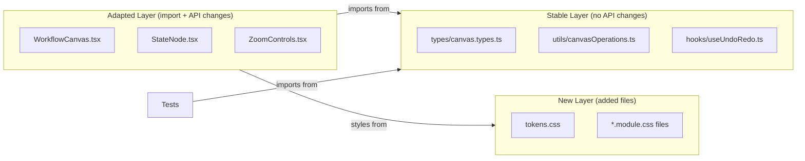

# Design Document: Frontend Modernization

## Overview

This design covers the modernization of the Chatbot Workflow Builder frontend through four interconnected workstreams:

1. **Canvas Library Migration**: Replace `reactflow` v11 with `@xyflow/react` v12, the actively maintained successor package
2. **CSS Module System**: Replace inline styles with co-located CSS modules backed by design tokens
3. **Visual Design Refresh**: Modernize the UI with depth, motion, and contemporary styling patterns
4. **React 18 Best Practices**: Align hooks, memoization, and component patterns with current standards
5. **State Decomposition**: Extract App.tsx state into focused custom hooks for testability and maintainability
6. **Accessibility**: Ensure all interactive controls are properly labeled and keyboard-navigable
7. **Error Resilience**: Add application-level error boundaries for graceful crash recovery

The migration preserves all existing functionality (drag-and-drop node creation, connections, undo/redo, save/load, import/export, execution) while improving maintainability, visual polish, code quality, accessibility, and error resilience. The property-based test infrastructure (`fast-check` with 100 runs per property) continues to validate the same invariants against the updated utility layer.

### Key Design Decisions

| Decision | Choice | Rationale |
|----------|--------|-----------|
| Migration scope | Single pass, all-at-once | The reactflow→@xyflow/react migration is a package rename with targeted API changes; incremental migration would leave conflicting imports |
| Style approach | CSS Modules + design tokens | Scoped styles prevent collisions, tokens enable theming, Vite has built-in CSS module support |
| Token format | CSS custom properties (`:root`) | Native browser support, no build-time tooling needed, works with CSS modules out of the box |
| Node type system | Union types with `Node<Data, Type>` | Matches @xyflow/react v12 TypeScript conventions for type-safe node definitions |
| State management | Keep existing Map-based state + useUndoRedo hook | Proven correct by property tests, no reason to change working infrastructure |
| Hook decomposition | Extract persistence + execution into custom hooks | Keeps App.tsx thin, each hook independently testable via `renderHook` |
| Error boundaries | Class component (React requirement) | Only class components support componentDidCatch; single exception to no-class-component rule |
| Focus trapping | Custom `useFocusTrap` hook | No external dependency needed; standard DOM API pattern |
| Accessible names | aria-label for icon buttons, visible text for text buttons | WCAG 4.1.2 compliance with minimal markup overhead |

## Architecture

### System Context

```mermaid
graph TB
    subgraph Frontend["Frontend (Vite + React 18)"]
        App[App Shell]
        Canvas[WorkflowCanvas<br/>@xyflow/react v12]
        Palette[ComponentPalette<br/>CSS Modules]
        Panel[PropertyPanel<br/>CSS Modules]
        Toolbar[Toolbar<br/>CSS Modules]
        Hooks[Custom Hooks<br/>useUndoRedo<br/>useWorkflowPersistence<br/>useExecutionState]
        Utils[Utilities<br/>canvasOperations]
        Types[Type Definitions<br/>canvas.types.ts]
        Tokens[Design Tokens<br/>tokens.css]
        Errors[Error Boundaries<br/>AppErrorBoundary<br/>CanvasErrorBoundary]
    end

    subgraph Tests["Test Infrastructure"]
        PBT[Property Tests<br/>fast-check]
        Unit[Unit Tests<br/>Vitest + RTL]
    end

    Backend[Backend API<br/>Spring Boot]

    App --> Canvas
    App --> Palette
    App --> Panel
    App --> Toolbar
    App --> Hooks
    Canvas --> Hooks
    Canvas --> Utils
    Canvas --> Types
    Errors --> Canvas
    Errors --> App
    PBT --> Utils
    PBT --> Types
    PBT --> Hooks
    App --> Backend
```

### Migration Architecture

The migration follows a layered approach where the utility/type layer remains stable (preserving test compatibility) while the component layer adapts to the new library API:



**Critical invariant**: The `utils/canvasOperations.ts` and `hooks/useUndoRedo.ts` modules retain identical public API signatures. Property-based tests import from these modules and must continue working without modification.

## Components and Interfaces

### 1. Canvas Library Migration (`reactflow` → `@xyflow/react`)

#### Import Changes

| Before (`reactflow` v11) | After (`@xyflow/react` v12) |
|---|---|
| `import ReactFlow from 'reactflow'` | `import { ReactFlow } from '@xyflow/react'` |
| `import 'reactflow/dist/style.css'` | `import '@xyflow/react/dist/style.css'` |
| `import { useReactFlow } from 'reactflow'` | `import { useReactFlow } from '@xyflow/react'` |
| `import { Node, Edge, ... } from 'reactflow'` | `import { type Node, type Edge, ... } from '@xyflow/react'` |
| `import { Handle, Position } from 'reactflow'` | `import { Handle, Position } from '@xyflow/react'` |
| `import { Background, MiniMap } from 'reactflow'` | `import { Background, MiniMap } from '@xyflow/react'` |

#### API Changes in WorkflowCanvas

1. **Default export → named export**: `ReactFlow` is now a named import
2. **Node type generics**: Use `Node<StateNodeData, 'stateNode'>` union pattern
3. **screenToFlowPosition**: Already using `useReactFlow().screenToFlowPosition` — signature unchanged
4. **Immutable node updates**: Ensure all node changes create new objects (already the case in current code)
5. **Measured dimensions**: Node `width`/`height` are now user-provided dimensions; measured values move to `node.measured`

#### StateNode Component Updates

```typescript
// Before (reactflow v11)
import { Handle, Position, NodeProps } from 'reactflow';
function StateNode({ data, selected }: NodeProps<StateNodeData>) { ... }

// After (@xyflow/react v12)
import { Handle, Position, type NodeProps } from '@xyflow/react';
function StateNode({ data, selected }: NodeProps<StateNodeData>) { ... }
```

The `NodeProps` interface remains compatible. The `xPos`/`yPos` props (if used) become `positionAbsoluteX`/`positionAbsoluteY`, but our StateNode does not use them.

#### ZoomControls Updates

```typescript
// Before
import { useReactFlow } from 'reactflow';

// After
import { useReactFlow } from '@xyflow/react';
```

The `useReactFlow()` hook API (`setViewport`, `getViewport`, `fitView`) is unchanged between v11 and v12.

#### Node Type Registration

```typescript
// Before (v11 NodeTypes)
import { NodeTypes } from 'reactflow';
const nodeTypes: NodeTypes = { stateNode: StateNode };

// After (v12 NodeTypes)  
import { type NodeTypes } from '@xyflow/react';
const nodeTypes: NodeTypes = { stateNode: StateNode };
```

### 2. CSS Module System

#### File Structure

```
frontend/src/
├── styles/
│   └── tokens.css              # Global design tokens (:root custom properties)
├── hooks/
│   ├── useWorkflowPersistence.ts  # Workflow save/load/import/export state + actions
│   ├── useExecutionState.ts       # Execution monitoring state + actions
│   ├── useFocusTrap.ts            # Focus trapping for modal dialogs
│   └── useUndoRedo.ts             # Existing undo/redo hook
├── components/
│   ├── canvas/
│   │   ├── WorkflowCanvas.module.css
│   │   ├── ZoomControls.module.css
│   │   ├── ConfirmDeleteDialog.module.css
│   │   ├── ConnectionToast.module.css
│   │   └── nodes/
│   │       └── StateNode.module.css
│   ├── palette/
│   │   └── ComponentPalette.module.css
│   ├── panel/
│   │   └── PropertyPanel.module.css
│   ├── errors/
│   │   ├── ErrorBoundary.tsx       # Base class component error boundary
│   │   ├── ErrorBoundary.module.css
│   │   ├── CanvasErrorBoundary.tsx # Canvas-specific boundary with Reset
│   │   └── AppErrorBoundary.tsx    # Top-level boundary with Reload
│   ├── execution/
│   │   └── ExecutionMonitor.module.css
│   ├── validation/
│   │   └── ValidationPanel.module.css
│   └── workflow/
│       ├── SaveWorkflowDialog.module.css
│       └── WorkflowListPanel.module.css
├── App.module.css               # App shell layout styles
```

#### Token Architecture (`tokens.css`)

```css
:root {
  /* --- Colors: Primary --- */
  --color-primary-lightest: #e3f2fd;
  --color-primary-light: #90caf9;
  --color-primary-base: #1976d2;
  --color-primary-dark: #1565c0;
  --color-primary-darkest: #0d47a1;

  /* --- Colors: Secondary --- */
  --color-secondary-lightest: #f3e5f5;
  --color-secondary-light: #ce93d8;
  --color-secondary-base: #9c27b0;
  --color-secondary-dark: #7b1fa2;
  --color-secondary-darkest: #4a148c;

  /* --- Colors: Success --- */
  --color-success-lightest: #e8f5e9;
  --color-success-light: #81c784;
  --color-success-base: #388e3c;
  --color-success-dark: #2e7d32;
  --color-success-darkest: #1b5e20;

  /* --- Colors: Warning --- */
  --color-warning-lightest: #fff8e1;
  --color-warning-light: #ffee58;
  --color-warning-base: #f9a825;
  --color-warning-dark: #f57f17;
  --color-warning-darkest: #e65100;

  /* --- Colors: Error --- */
  --color-error-lightest: #fce4ec;
  --color-error-light: #ef9a9a;
  --color-error-base: #d32f2f;
  --color-error-dark: #c62828;
  --color-error-darkest: #b71c1c;

  /* --- Colors: Neutral --- */
  --color-neutral-lightest: #fafafa;
  --color-neutral-light: #e0e0e0;
  --color-neutral-base: #9e9e9e;
  --color-neutral-dark: #616161;
  --color-neutral-darkest: #212121;

  /* --- Spacing (4px base scale) --- */
  --space-1: 4px;
  --space-2: 8px;
  --space-3: 12px;
  --space-4: 16px;
  --space-5: 20px;
  --space-6: 24px;
  --space-8: 32px;
  --space-10: 40px;
  --space-12: 48px;
  --space-16: 64px;

  /* --- Border Radius --- */
  --radius-sm: 4px;
  --radius-md: 8px;
  --radius-lg: 12px;
  --radius-full: 9999px;

  /* --- Elevation (Shadows) --- */
  --shadow-none: none;
  --shadow-low: 0 1px 2px rgba(0, 0, 0, 0.08);
  --shadow-medium: 0 2px 8px rgba(0, 0, 0, 0.12);
  --shadow-high: 0 4px 16px rgba(0, 0, 0, 0.16);

  /* --- Typography --- */
  --font-size-sm: 11px;
  --font-size-base: 13px;
  --font-size-md: 14px;
  --font-size-lg: 16px;
  --font-weight-regular: 400;
  --font-weight-medium: 500;
  --font-weight-semibold: 600;

  /* --- Surface colors --- */
  --color-surface: #ffffff;
  --color-background: #f5f5f5;
  --color-border: var(--color-neutral-light);
  --color-canvas-bg: #fafafa;
  --color-canvas-dot: #d0d0d0;
}
```

#### Component CSS Module Pattern

Each component follows this pattern:

```tsx
// ComponentPalette.tsx
import styles from './ComponentPalette.module.css';

export default function ComponentPalette({ className }: ComponentPaletteProps) {
  return (
    <div className={`${styles.palette} ${className ?? ''}`}>
      <div className={styles.header}>Components</div>
      {STATE_TYPES.map((type) => (
        <PaletteItem key={type} type={type} />
      ))}
    </div>
  );
}
```

```css
/* ComponentPalette.module.css */
.palette {
  width: 220px;
  height: 100%;
  padding: var(--space-3);
  border-right: 1px solid var(--color-border);
  background-color: var(--color-surface);
  overflow-y: auto;
  box-sizing: border-box;
}

.header {
  font-size: var(--font-size-sm);
  font-weight: var(--font-weight-semibold);
  text-transform: uppercase;
  color: var(--color-neutral-base);
  margin-bottom: var(--space-3);
  letter-spacing: 0.5px;
}

.item {
  display: flex;
  align-items: center;
  gap: var(--space-2);
  padding: var(--space-2) var(--space-3);
  margin-bottom: var(--space-1);
  border-radius: var(--radius-md);
  cursor: grab;
  background-color: var(--color-neutral-lightest);
  border: 1px solid var(--color-border);
  transition: background-color 200ms ease, box-shadow 200ms ease;
}

.item:hover {
  background-color: var(--color-neutral-light);
  box-shadow: var(--shadow-low);
}
```

### 3. Toolbar Component (Extracted from App.tsx)

The header toolbar is extracted into its own component with a CSS module:

```typescript
// components/toolbar/Toolbar.tsx
interface ToolbarProps {
  workflowName: string;
  workflowId: string | null;
  onNew: () => void;
  onOpen: () => void;
  onSave: () => void;
  onExport: () => void;
  onImport: () => void;
  onExecute: () => void;
  onShowExecutions: () => void;
}
```

The toolbar uses `backdrop-filter: blur(8px)` for depth, icon buttons with `:hover` and `:focus-visible` states, and all colors reference design tokens.

### 4. App Shell Layout

```typescript
// App.module.css structure
.app { display: flex; flex-direction: column; width: 100vw; height: 100vh; }
.header { /* backdrop-filter, border-bottom via tokens */ }
.main { flex: 1; display: flex; overflow: hidden; }
.canvasArea { flex: 1; overflow: hidden; }
```

### 5. Package Dependency Changes

```json
{
  "dependencies": {
    "react": "^18.2.0",
    "react-dom": "^18.2.0",
    "@xyflow/react": "^12.0.0",
    "axios": "^1.6.0"
  }
}
```

The `reactflow` package is removed entirely. `@xyflow/react` is the single canvas dependency.

### 6. Custom Hooks for State Decomposition (Requirement 7)

The App.tsx component currently manages ~15 `useState` calls. These are decomposed into two focused hooks in `src/hooks/`:

#### `useWorkflowPersistence` Hook

```typescript
// src/hooks/useWorkflowPersistence.ts

interface WorkflowPersistenceState {
  currentWorkflowId: string | null;
  currentWorkflowName: string;
  currentWorkflowDescription: string;
  saveDialogVisible: boolean;
  listPanelVisible: boolean;
}

interface WorkflowPersistenceActions {
  handleSaveClick: () => void;
  handleSaveWorkflow: (name: string, description: string) => Promise<void>;
  handleOpenWorkflow: (id: string) => Promise<void>;
  handleNewWorkflow: () => void;
  handleExport: () => void;
  handleImportFile: (event: React.ChangeEvent<HTMLInputElement>) => Promise<void>;
  setSaveDialogVisible: (visible: boolean) => void;
  setListPanelVisible: (visible: boolean) => void;
}

interface UseWorkflowPersistenceOptions {
  canvasState: CanvasState | null;
  showToast: (message: string, type?: 'success' | 'error') => void;
  setInitialStates: (states: WorkflowState[]) => void;
  setInitialTransitions: (transitions: Transition[]) => void;
  setInitialContextVars: (vars: ContextVariable[]) => void;
  setContextVariables: (vars: ContextVariable[]) => void;
  setCanvasKey: React.Dispatch<React.SetStateAction<number>>;
  setSelectedState: (state: WorkflowState | null) => void;
}

export function useWorkflowPersistence(
  options: UseWorkflowPersistenceOptions
): WorkflowPersistenceState & WorkflowPersistenceActions;
```

The hook encapsulates:
- All workflow identity state (ID, name, description)
- Dialog/panel visibility state (saveDialogVisible, listPanelVisible)
- Save/update/load/import/export callbacks with error handling
- Canvas re-mount coordination (via `setCanvasKey` callback)

#### `useExecutionState` Hook

```typescript
// src/hooks/useExecutionState.ts

interface ExecutionState {
  activeExecutionId: string | null;
  executionListVisible: boolean;
}

interface ExecutionActions {
  handleExecute: () => Promise<void>;
  setActiveExecutionId: (id: string | null) => void;
  setExecutionListVisible: (visible: boolean) => void;
}

interface UseExecutionStateOptions {
  currentWorkflowId: string | null;
  showToast: (message: string, type?: 'success' | 'error') => void;
}

export function useExecutionState(
  options: UseExecutionStateOptions
): ExecutionState & ExecutionActions;
```

The hook encapsulates:
- Execution monitoring state (activeExecutionId, executionListVisible)
- The execute action with API call and error handling

#### App.tsx as Composition Shell

After decomposition, App.tsx becomes a thin composition layer:

```typescript
function App() {
  // Remaining direct state (canvas-specific, not persistence or execution)
  const [selectedState, setSelectedState] = useState<WorkflowState | null>(null);
  const [canvasState, setCanvasState] = useState<CanvasState | null>(null);
  const [contextVariables, setContextVariables] = useState<ContextVariable[]>([]);
  const [deleteStateRequest, setDeleteStateRequest] = useState<string | null>(null);
  const [canvasKey, setCanvasKey] = useState(0);
  // ≤5 direct useState calls

  const { showToast, toastMessage, toastType, dismissToast } = useToast();

  const persistence = useWorkflowPersistence({
    canvasState, showToast, setInitialStates, setInitialTransitions,
    setInitialContextVars, setContextVariables, setCanvasKey, setSelectedState,
  });

  const execution = useExecutionState({
    currentWorkflowId: persistence.currentWorkflowId,
    showToast,
  });

  // ... render with persistence.* and execution.* passed to children
}
```

### 7. Accessibility Design (Requirement 8)

#### ARIA Strategy for Toolbar

Buttons follow a single rule: the accessible name comes from exactly one source.

| Button State | Accessible Name Source | Example |
|---|---|---|
| Has visible text | Text content (no aria-label) | `<button>Save</button>` |
| Icon-only | `aria-label` attribute | `<button aria-label="Undo"><UndoIcon /></button>` |

```tsx
// Toolbar button examples
<button aria-label="New workflow"><PlusIcon /></button>    {/* icon-only */}
<button>Save</button>                                      {/* text visible */}
```

#### Palette ARIA Roles

```tsx
<aside className={styles.palette} role="list" aria-label="Workflow state types">
  {STATE_TYPES.map((type) => (
    <div key={type} role="listitem" className={styles.item} draggable>
      <StateIcon type={type} />
      <span>{type}</span>
    </div>
  ))}
</aside>
```

#### Focus Trapping in Modal Dialogs

Modal dialogs (SaveWorkflowDialog, ConfirmDeleteDialog) implement focus trapping:

```typescript
// Focus trap pattern for dialogs
function useFocusTrap(dialogRef: React.RefObject<HTMLElement>, isOpen: boolean) {
  useEffect(() => {
    if (!isOpen || !dialogRef.current) return;

    const dialog = dialogRef.current;
    const focusableSelector = 'button, [href], input, select, textarea, [tabindex]:not([tabindex="-1"])';
    const focusableElements = dialog.querySelectorAll(focusableSelector);
    const firstFocusable = focusableElements[0] as HTMLElement;
    const lastFocusable = focusableElements[focusableElements.length - 1] as HTMLElement;

    // Store trigger element to return focus on close
    const triggerElement = document.activeElement as HTMLElement;
    firstFocusable?.focus();

    const handleKeyDown = (e: KeyboardEvent) => {
      if (e.key !== 'Tab') return;
      if (e.shiftKey && document.activeElement === firstFocusable) {
        e.preventDefault();
        lastFocusable?.focus();
      } else if (!e.shiftKey && document.activeElement === lastFocusable) {
        e.preventDefault();
        firstFocusable?.focus();
      }
    };

    dialog.addEventListener('keydown', handleKeyDown);
    return () => {
      dialog.removeEventListener('keydown', handleKeyDown);
      triggerElement?.focus(); // Return focus to trigger
    };
  }, [isOpen, dialogRef]);
}
```

#### Canvas ARIA

```tsx
<div role="application" aria-label="Workflow editor canvas" className={styles.canvasArea}>
  <WorkflowCanvas ... />
</div>
```

The `role="application"` signals to screen readers that this area uses custom keyboard interactions (drag, pan, zoom) rather than standard document navigation.

#### PropertyPanel Label Associations

```tsx
// Every form field gets an explicit label association
<div className={styles.field}>
  <label htmlFor={`${stateId}-name`}>State Name</label>
  <input id={`${stateId}-name`} type="text" value={config.name} onChange={...} />
</div>

// For fields where a visible label is impractical
<input aria-label="Condition expression" type="text" value={config.expression} onChange={...} />
```

#### Tab Order

The application follows natural DOM order for tab navigation:
1. Toolbar buttons (left to right)
2. Palette items (top to bottom)
3. Canvas area (role="application" — custom keyboard handling inside)
4. PropertyPanel form fields (top to bottom)

No `tabindex` values greater than 0 are used. All interactive elements use `tabindex="0"` or native focusability.

### 8. Error Boundary Components (Requirement 9)

File location: `src/components/errors/ErrorBoundary.tsx`

#### Base ErrorBoundary (Class Component)

React error boundaries require `componentDidCatch`, so this must be a class component — the single exception to the "no class components" rule (Requirement 4.4):

```typescript
// src/components/errors/ErrorBoundary.tsx
import { Component, type ReactNode, type ErrorInfo } from 'react';

interface ErrorBoundaryProps {
  children: ReactNode;
  fallback: ReactNode | ((error: Error, reset: () => void) => ReactNode);
  onError?: (error: Error, errorInfo: ErrorInfo) => void;
}

interface ErrorBoundaryState {
  hasError: boolean;
  error: Error | null;
}

export class ErrorBoundary extends Component<ErrorBoundaryProps, ErrorBoundaryState> {
  state: ErrorBoundaryState = { hasError: false, error: null };

  static getDerivedStateFromError(error: Error): ErrorBoundaryState {
    return { hasError: true, error };
  }

  componentDidCatch(error: Error, errorInfo: ErrorInfo): void {
    console.error('[ErrorBoundary]', error.message, errorInfo.componentStack);
    this.props.onError?.(error, errorInfo);
  }

  resetErrorBoundary = (): void => {
    this.setState({ hasError: false, error: null });
  };

  render(): ReactNode {
    if (this.state.hasError && this.state.error) {
      const { fallback } = this.props;
      if (typeof fallback === 'function') {
        return fallback(this.state.error, this.resetErrorBoundary);
      }
      return fallback;
    }
    return this.props.children;
  }
}
```

#### CanvasErrorBoundary

Wraps `WorkflowCanvas`. On error, displays a fallback with a "Reset" button that re-mounts the canvas with empty state:

```typescript
// src/components/errors/CanvasErrorBoundary.tsx
import { ErrorBoundary } from './ErrorBoundary';
import styles from './ErrorBoundary.module.css';

interface CanvasErrorBoundaryProps {
  children: ReactNode;
  onReset: () => void; // Called to reset canvas key + clear state
}

export function CanvasErrorBoundary({ children, onReset }: CanvasErrorBoundaryProps) {
  return (
    <ErrorBoundary
      fallback={(error, resetBoundary) => (
        <div className={styles.canvasFallback}>
          <h2>Canvas Error</h2>
          <p>Something went wrong in the workflow canvas.</p>
          <button
            onClick={() => {
              onReset();        // Clear canvas state (re-mount with empty)
              resetBoundary();  // Clear error boundary state
            }}
          >
            Reset Canvas
          </button>
        </div>
      )}
    >
      {children}
    </ErrorBoundary>
  );
}
```

#### AppErrorBoundary

Wraps the entire App shell. Displays a "Reload" button that calls `window.location.reload()`:

```typescript
// src/components/errors/AppErrorBoundary.tsx
import { ErrorBoundary } from './ErrorBoundary';
import styles from './ErrorBoundary.module.css';

export function AppErrorBoundary({ children }: { children: ReactNode }) {
  return (
    <ErrorBoundary
      fallback={
        <div className={styles.appFallback}>
          <h1>Something went wrong</h1>
          <p>An unexpected error occurred. Please reload the application.</p>
          <button onClick={() => window.location.reload()}>
            Reload Application
          </button>
        </div>
      }
    >
      {children}
    </ErrorBoundary>
  );
}
```

#### Integration in App Structure

```tsx
// main.tsx
import { AppErrorBoundary } from './components/errors/AppErrorBoundary';

ReactDOM.createRoot(document.getElementById('root')!).render(
  <React.StrictMode>
    <AppErrorBoundary>
      <App />
    </AppErrorBoundary>
  </React.StrictMode>
);

// Inside App.tsx
import { CanvasErrorBoundary } from './components/errors/CanvasErrorBoundary';

<main className={styles.main}>
  <ComponentPalette />
  <CanvasErrorBoundary onReset={handleNewWorkflow}>
    <WorkflowCanvas ... />
  </CanvasErrorBoundary>
  <PropertyPanel ... />
</main>
```

The `onReset` prop connects to the existing `handleNewWorkflow` function which clears all state and increments the canvas key, effectively re-mounting with empty state.

#### Fallback UI Constraints

- User-friendly error message only (no stack traces, no error.message exposed to UI)
- Error details logged to `console.error` for developer debugging
- Styled via `ErrorBoundary.module.css` using design tokens
- Does NOT catch event handler or async errors (standard React behavior)

## Data Models

### Unchanged Type Definitions

The following types in `types/canvas.types.ts` require **no changes**:

- `Position`, `StateType`, all `*Config` interfaces, `StateConfig` union
- `RetryPolicy`, `ContextVariable`, `TransitionCondition`, `Transition`
- `WorkflowState`, `CanvasOperation`, `CanvasState`

These types are internal domain models and do not depend on the canvas library.

### React Flow Type Adaptations

The following types are used at the component boundary between internal models and the canvas library:

```typescript
// types/reactflow.types.ts (new file for library-specific type aliases)
import type { Node, Edge, NodeTypes } from '@xyflow/react';
import type { StateNodeData } from '../components/canvas/nodes/StateNode';

/** Application-specific node type */
export type AppNode = Node<StateNodeData, 'stateNode'>;

/** Application-specific edge type */  
export type AppEdge = Edge;

/** Converter: WorkflowState → AppNode */
export function workflowStateToNode(state: WorkflowState): AppNode;

/** Converter: Transition → AppEdge */
export function transitionToEdge(transition: Transition): AppEdge;
```

### Conversion Functions

The `workflowStateToNode` and `transitionToEdge` functions remain in `WorkflowCanvas.tsx` but adapt to v12 generics:

```typescript
function workflowStateToNode(state: WorkflowState): AppNode {
  return {
    id: state.id,
    type: 'stateNode',
    position: { x: state.position.x, y: state.position.y },
    data: {
      label: state.name,
      stateType: state.type,
    },
  };
}
```

The structure is identical to v11 — the only change is the stricter generic signature.

### CSS Module Type Support

Vite generates `.d.ts` declarations for CSS modules automatically when using TypeScript. Each `*.module.css` import resolves to `Record<string, string>`:

```typescript
// Auto-generated by Vite CSS module plugin
declare module '*.module.css' {
  const classes: { readonly [key: string]: string };
  export default classes;
}
```


## Correctness Properties

*A property is a characteristic or behavior that should hold true across all valid executions of a system — essentially, a formal statement about what the system should do. Properties serve as the bridge between human-readable specifications and machine-verifiable correctness guarantees.*

### Existing Properties (Preserved Unchanged)

The following property-based tests already exist in `src/__tests__/canvas.properties.test.ts` and validate core invariants that must continue to hold after migration:

- **Existing Property 1**: Self-loop and duplicate transition rejection (validates Req 1.4 / 5.2)
- **Existing Property 2**: Zoom level clamping to [0.25, 4.0] (validates Req 1.6 / 5.14)
- **Existing Property 3**: State deletion removes exactly associated transitions (validates Req 1.7 / 5.13)
- **Existing Property 4**: Undo reverses canvas operations (validates Req 1.8 / 5.3 / 5.4)

These tests import from `utils/canvasOperations` and `types/canvas.types` — modules whose public API signatures remain unchanged by this migration.

### New Properties

### Property 1: CSS modules use design token references for all colors

*For any* CSS module file (`*.module.css`) in `src/components/`, every CSS property declaration that sets a color value (color, background-color, border-color, fill, stroke, box-shadow color component) SHALL use a `var(--*)` reference rather than a hardcoded hex (#xxx), RGB, RGBA, HSL, or HSLA literal.

**Validates: Requirements 2.7**

### Property 2: Color scales contain at least 5 shades

*For any* color scale name in the set {primary, secondary, success, warning, error, neutral}, the design token stylesheet SHALL define at least 5 CSS custom properties for that scale (lightest, light, base, dark, darkest).

**Validates: Requirements 2.3**

### Property 3: Theme contrast ratios meet minimum thresholds

*For any* token pair used as foreground/background in the application theme (canvas dot vs canvas background at ≥1.5:1, shell background vs panel surface at ≥3:1), the WCAG relative luminance contrast ratio SHALL meet the specified minimum threshold.

**Validates: Requirements 3.9, 3.10**

### Property 4: Default state factory produces correct config type

*For any* valid `StateType` value and any valid position, calling `createDefaultState(type, position)` SHALL produce a `WorkflowState` whose `config.type` discriminator matches the input `StateType` and whose config object satisfies the corresponding interface (ApiCallConfig, ConditionConfig, etc.).

**Validates: Requirements 5.1**

### Property 5: Serialization round-trip preserves workflow definition

*For any* valid `CanvasState` containing arbitrary states and transitions, serializing to a `WorkflowDefinition` JSON structure and then deserializing back to a `CanvasState` SHALL produce states and transitions equivalent to the original (same IDs, types, names, positions, configs, and connections).

**Validates: Requirements 5.5, 5.7, 5.8**

### Property 6: Canvas state preserved on failed operations

*For any* valid `CanvasState` and any operation that results in failure (API error during save/load, invalid import file), the canvas state after the failed operation SHALL be identical to the canvas state before the operation was attempted — same states, transitions, zoom, and pan offset.

**Validates: Requirements 5.6, 5.10**

### Property 7: Import validation accepts valid workflows and rejects invalid inputs

*For any* valid `WorkflowDefinition` JSON string under 5MB in size, the import validator SHALL return a success result. *For any* input that is oversized (>5MB), malformed JSON, or structurally invalid (missing required fields, wrong types), the import validator SHALL return a failure result with an error message.

**Validates: Requirements 5.9, 5.10**

### Property 8: Transition condition correctly derived from source handle

*For any* source node state type and source handle identifier, when creating a transition, the condition field SHALL be set to the handle ID value (true, false, error, timeout, fallback) when the source type has multiple outputs, or SHALL be undefined when the source type has a single output.

**Validates: Requirements 5.2**

### Property 9: Hook decomposition preserves App behavior

*For any* sequence of workflow persistence operations (save, load, import, export, new) and execution operations (execute, select execution), the `useWorkflowPersistence` and `useExecutionState` hooks SHALL expose the same state values and produce the same state transitions as the original App.tsx inline implementation — same callbacks, same return types, same side effects on the canvas state.

**Validates: Requirements 7.1, 7.2, 7.5**

### Property 10: All interactive elements have accessible names

*For any* rendered interactive element (button, input, select) in the application, the element SHALL have exactly one accessible name source: either visible text content (for text buttons), an associated `<label>` element (for form fields), or an `aria-label` attribute (for icon-only buttons and unlabeled inputs). No interactive element SHALL lack an accessible name, and no element SHALL have both visible text and a redundant `aria-label`.

**Validates: Requirements 8.1, 8.2, 8.4, 8.5**

## Error Handling

### Migration-Specific Error Scenarios

| Scenario | Handling Strategy |
|----------|-------------------|
| `@xyflow/react` fails to load/initialize | App renders error boundary with message; canvas area shows fallback UI |
| CSS module import fails (build error) | Caught at build time by Vite; `npm run build` fails with descriptive error |
| Invalid node type registered | `@xyflow/react` renders default node with console warning; existing nodeTypes validation prevents this |
| Viewport API returns unexpected values | `clampZoom` utility normalizes values; non-finite inputs default to MIN_ZOOM |
| Drop event has missing dataTransfer data | Existing null-check in drop handler; no node created, no error thrown |

### Preserved Error Handling Patterns

The following error handling remains unchanged:

1. **API errors**: `try/catch` in async handlers → `showToast(message, 'error')` — canvas state untouched
2. **Import validation**: `importWorkflow()` returns `{ success: false, error: string }` — no state mutation on failure
3. **File size check**: Validated before parsing — returns early with error message
4. **JSON parse errors**: Caught in try/catch — returns failure result
5. **Schema validation**: `importValidator.ts` validates structure — returns detailed error on mismatch

### New Error Boundaries

The application shell wraps the canvas in a React error boundary to catch unexpected rendering errors from `@xyflow/react`:

```typescript
// Error boundary catches canvas crashes without losing app state
<CanvasErrorBoundary onReset={handleNewWorkflow}>
  <WorkflowCanvas ... />
</CanvasErrorBoundary>
```

The entire app is wrapped in a top-level error boundary in `main.tsx`:

```typescript
// Top-level boundary catches anything not caught by CanvasErrorBoundary
<AppErrorBoundary>
  <App />
</AppErrorBoundary>
```

| Boundary | Wraps | Fallback Action | Recovery |
|----------|-------|-----------------|----------|
| `CanvasErrorBoundary` | `WorkflowCanvas` | "Reset Canvas" button | Re-mounts canvas with empty state (no page reload) |
| `AppErrorBoundary` | Entire `<App />` | "Reload Application" button | Calls `window.location.reload()` |

Both boundaries:
- Log error details to `console.error` (message + componentStack)
- Display user-friendly messages only (no stack traces in UI)
- Do NOT catch event handler or async errors (standard React limitation)

## Testing Strategy

### Dual Testing Approach

| Test Type | Framework | Location | Purpose |
|-----------|-----------|----------|---------|
| Property-based | fast-check + Vitest | `src/__tests__/*.properties.test.ts` | Universal invariants across all inputs |
| Unit | Vitest + Testing Library | `src/components/**/*.test.tsx`, `src/**/*.test.ts` | Specific examples, edge cases, integration |

### Property-Based Testing Configuration

- **Library**: `fast-check` ^3.15.0 (already in devDependencies)
- **Minimum iterations**: 100 runs per property (`{ numRuns: 100 }`)
- **Tag format**: Comment block with `Feature: frontend-modernization, Property {N}: {text}`
- **File naming**: `*.properties.test.ts`

### Existing Property Tests (No Modification Required)

The following test files import from stable utility modules and require zero changes:

- `src/__tests__/canvas.properties.test.ts` — Tests `canvasOperations` and `canvas.types`
- `src/__tests__/preservation.properties.test.ts` — Tests canvas state preservation
- `src/__tests__/range.properties.test.ts` — Tests value range constraints

### New Property Tests to Add

| Property | Test File | What it validates |
|----------|-----------|-------------------|
| P1: Token-only colors | `src/__tests__/cssModuleCompliance.properties.test.ts` | Scans CSS modules for hardcoded colors |
| P2: Color scale completeness | `src/__tests__/tokenCompleteness.properties.test.ts` | Validates token structure |
| P3: Contrast ratios | `src/__tests__/contrastRatio.properties.test.ts` | WCAG contrast math on token pairs |
| P4: State factory correctness | `src/__tests__/stateFactory.properties.test.ts` | Default config generation |
| P5: Serialization round-trip | `src/__tests__/preservation.properties.test.ts` (extend) | Serialize/deserialize equivalence |
| P6: State preservation on failure | `src/__tests__/preservation.properties.test.ts` (extend) | Failed ops don't mutate state |
| P7: Import validation | `src/__tests__/importValidation.properties.test.ts` | Valid/invalid input classification |
| P8: Transition condition | `src/__tests__/canvas.properties.test.ts` (extend) | Handle→condition mapping |
| P9: Hook decomposition | `src/__tests__/hookDecomposition.properties.test.ts` | useWorkflowPersistence/useExecutionState API equivalence |
| P10: Accessible names | `src/__tests__/accessibility.properties.test.ts` | All interactive elements have accessible names |

### Unit Test Coverage

Unit tests validate specific examples and CSS module integration:

- **Component rendering**: Each component renders without inline styles
- **Token existence**: All declared tokens present in `:root`
- **Visual states**: Selected/hovered nodes apply correct CSS classes
- **Toolbar interactions**: Button click handlers fire correctly
- **Palette drag**: DragStart event sets correct dataTransfer type
- **Property panel forms**: Each state type renders its form
- **Hook isolation**: `useWorkflowPersistence` and `useExecutionState` testable via `renderHook`
- **Accessibility - focus trap**: Modal dialogs trap focus on open and return focus on close
- **Accessibility - canvas role**: Canvas area has `role="application"` and `aria-label`
- **Accessibility - tab order**: All interactive elements reachable via Tab in logical order
- **Error boundary - canvas**: Canvas error renders fallback with Reset button; clicking Reset re-mounts canvas empty
- **Error boundary - app**: App-level error renders fallback with Reload button
- **Error boundary - logging**: Errors logged to console without exposing stack traces in UI

### Migration Verification Checklist (Smoke Tests)

1. `npm run build` exits with code 0, zero TS errors
2. `npm test` exits with code 0, all suites pass
3. No `reactflow` import strings in `src/` directory
4. No `class.*extends.*Component` patterns in `src/` except `ErrorBoundary.tsx`
5. No `: any` type annotations in component props or hook returns
6. App.tsx has ≤5 direct `useState`/`useReducer` calls
7. All toolbar buttons have accessible names (visible text or aria-label)
8. Canvas area has `role="application"` with `aria-label`
9. Error boundaries render fallback UI when child throws during render

### Test Infrastructure Compatibility

The migration maintains test compatibility by:

1. **Stable utility API**: `canvasOperations.ts` exports identical function signatures
2. **Stable type API**: `canvas.types.ts` exports identical type definitions
3. **Stable hook API**: `useUndoRedo.ts` exports identical pure functions
4. **No test file modifications**: Existing tests continue to import and run unchanged
5. **Same test runner**: Vitest with jsdom environment, same configuration
