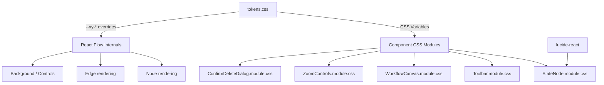

# Design Document: Notion UI Redesign

## Overview

This design transforms the Chatbot Workflow Builder's visual presentation layer from its current dark glassmorphism aesthetic (neon glows, backdrop-filters, translucent surfaces) to a Notion-inspired design language characterized by clean white surfaces, soft neutral colors, subtle borders, and restrained motion.

The redesign is purely presentational — no changes to React component props, event handlers, state management, or application logic. The scope covers:

- **Design tokens** (`tokens.css`): Complete palette, shadow, and transition overhaul
- **Node components**: Remove gradients/glows, apply uniform card styling with type indicators
- **Edges**: Thin neutral bezier lines via custom `BaseEdge` component
- **Toolbar**: Flat white bar with minimal buttons
- **Canvas**: White background with subtle dot grid via React Flow's `<Background />`
- **Icons**: Replace emoji with Lucide React line icons
- **Transitions**: Single motion standard (150ms ease-out) applied uniformly

### Design Philosophy

Notion's UI succeeds by removing visual noise — there are no competing colors, no animations drawing attention away from content. Every element earns its visual weight. The workflow canvas should feel like a calm, organized workspace where the user's workflow structure is the primary focus.

### Key Design Decisions

| Decision | Rationale |
|----------|-----------|
| Uniform node background (#f7f7f5) | Reduces visual noise; type differentiation via small colored indicator instead |
| Single accent color (#2383e2) | Focus rings and selection only — prevents color overload |
| 150ms ease-out everywhere | User's explicit preference; feels instant but smooth |
| Lucide React icons | Clean 1.5px stroke, tree-shakeable, actively maintained, used by Notion-style apps |
| React Flow CSS variables | Official theming approach; future-proof for upgrades and dark mode |
| `base.css` import instead of `style.css` | Avoids React Flow's opinionated theme; gives full control over visual styling |

## Architecture

The redesign follows the existing architecture without structural changes. All modifications are constrained to CSS modules, `tokens.css`, icon imports, and `className` assignments.



### Layering Strategy

1. **Foundation**: `tokens.css` defines all design tokens as CSS custom properties on `:root`
2. **React Flow scope**: A `.react-flow` section in `tokens.css` maps application tokens to `--xy-*` variables
3. **Component modules**: Each CSS module consumes only application-level tokens (never raw values)
4. **Custom components**: `StateNode` and the new custom edge component use the token system for all visual properties

### File Change Scope

| File | Change Type |
|------|-------------|
| `frontend/src/styles/tokens.css` | Full rewrite of token values + new `.react-flow` scope |
| `frontend/src/components/canvas/nodes/StateNode.module.css` | Remove gradients/glows, flat card style |
| `frontend/src/components/canvas/nodes/StateNode.tsx` | Replace emoji with Lucide icons, add indicator dot |
| `frontend/src/components/canvas/WorkflowCanvas.module.css` | White background, remove mesh gradient |
| `frontend/src/components/canvas/WorkflowCanvas.tsx` | Import `base.css`, add custom edge type, define types outside component |
| `frontend/src/components/canvas/edges/NotionEdge.tsx` | New custom edge component using `BaseEdge` |
| `frontend/src/components/toolbar/Toolbar.module.css` | Flat white styling |
| `frontend/src/components/canvas/ZoomControls.module.css` | Match Notion button style |
| `frontend/src/components/canvas/ConfirmDeleteDialog.module.css` | Light surface, soft shadow |
| `frontend/package.json` | Add `lucide-react` dependency |

## Components and Interfaces

### 1. Design Tokens (`tokens.css`)

The token file is restructured into clear sections:

```css
:root {
  /* --- Colors: Surfaces --- */
  --color-surface: #ffffff;
  --color-surface-secondary: #f7f7f5;
  --color-background: #ffffff;

  /* --- Colors: Text --- */
  --color-text-primary: #2f3437;
  --color-text-secondary: #6b6f76;
  --color-text-tertiary: #9b9b9b;

  /* --- Colors: Borders --- */
  --color-border: rgba(0, 0, 0, 0.08);
  --color-border-strong: rgba(0, 0, 0, 0.12);

  /* --- Colors: Accent --- */
  --color-accent: #2383e2;
  --color-accent-light: rgba(35, 131, 226, 0.1);

  /* --- Colors: Semantic (for indicators only) --- */
  --color-indicator-blue: #2383e2;
  --color-indicator-orange: #d97706;
  --color-indicator-green: #059669;
  --color-indicator-purple: #7c3aed;
  --color-indicator-red: #dc2626;

  /* --- Shadows --- */
  --shadow-sm: 0 1px 2px rgba(0, 0, 0, 0.04);
  --shadow-md: 0 2px 4px rgba(0, 0, 0, 0.06), 0 1px 2px rgba(0, 0, 0, 0.04);
  --shadow-lg: 0 4px 8px rgba(0, 0, 0, 0.08), 0 2px 4px rgba(0, 0, 0, 0.04);

  /* --- Typography --- */
  --font-family: 'Inter', -apple-system, BlinkMacSystemFont, 'Segoe UI', system-ui, sans-serif;
  /* (sizes and weights unchanged) */

  /* --- Transitions --- */
  --transition-standard: 150ms ease-out;

  /* --- Canvas --- */
  --color-canvas-bg: #ffffff;
  --color-canvas-dot: rgba(0, 0, 0, 0.06);
}

/* --- React Flow CSS Variable Overrides --- */
.react-flow {
  --xy-node-background-color-default: #f7f7f5;
  --xy-node-border-default: 1px solid rgba(0, 0, 0, 0.08);
  --xy-node-boxshadow-hover-default: 0 2px 4px rgba(0, 0, 0, 0.06);
  --xy-node-boxshadow-selected-default: 0 0 0 1.5px #2383e2;
  --xy-edge-stroke-default: #d0d0d0;
  --xy-edge-stroke-selected-default: #9b9b9b;
  --xy-handle-background-color-default: #ffffff;
  --xy-handle-border-color-default: rgba(0, 0, 0, 0.12);
  --xy-background-pattern-dots-color-default: rgba(0, 0, 0, 0.06);
  --xy-selection-background-color-default: rgba(35, 131, 226, 0.08);
  --xy-selection-border-default: 1px solid rgba(35, 131, 226, 0.4);
  --xy-controls-button-background-color-default: #ffffff;
  --xy-controls-button-background-color-hover-default: #f7f7f5;
  --xy-controls-button-border-color-default: rgba(0, 0, 0, 0.08);
  --xy-controls-box-shadow-default: 0 1px 2px rgba(0, 0, 0, 0.04);
}
```

### 2. StateNode Component

**Visual changes only** — all props, handles, event handlers preserved.

```typescript
// Icon mapping replaces emoji with Lucide React icons
import { Globe, GitBranch, MessageSquare, FileInput, Clock, Layers, CircleStop } from 'lucide-react';

const STATE_TYPE_ICONS: Record<StateType, React.FC<LucideProps>> = {
  API_Call: Globe,
  Condition: GitBranch,
  Response: MessageSquare,
  Input: FileInput,
  Wait: Clock,
  Parallel: Layers,
  End: CircleStop,
};

// Indicator colors for the left-border accent
const STATE_TYPE_INDICATOR: Record<StateType, string> = {
  API_Call: 'var(--color-indicator-blue)',
  Condition: 'var(--color-indicator-orange)',
  Response: 'var(--color-indicator-green)',
  Input: 'var(--color-indicator-purple)',
  Wait: 'var(--color-indicator-orange)',
  Parallel: 'var(--color-indicator-green)',
  End: 'var(--color-indicator-red)',
};
```

The node renders with:
- Uniform `#f7f7f5` background
- 3px left-border in the state type's indicator color
- `border-radius: 10px`
- `padding: 12px`
- Soft shadow (`--shadow-sm`)
- On hover: border darkens from `rgba(0,0,0,0.08)` to `rgba(0,0,0,0.12)`
- On select: 1.5px accent-color outline (layered on `.react-flow__node.selected`)

### 3. Custom Edge Component (`NotionEdge`)

New file: `frontend/src/components/canvas/edges/NotionEdge.tsx`

```typescript
import { BaseEdge, getBezierPath, type EdgeProps } from '@xyflow/react';

export function NotionEdge({ id, sourceX, sourceY, targetX, targetY, sourcePosition, targetPosition, ...props }: EdgeProps) {
  const [edgePath] = getBezierPath({ sourceX, sourceY, targetX, targetY, sourcePosition, targetPosition });
  return <BaseEdge id={id} path={edgePath} {...props} />;
}
```

Styling handled entirely through React Flow CSS variables:
- Default stroke: `#d0d0d0` (1.25px)
- Selected stroke: `#9b9b9b`
- No glow, no highlight colors

The `edgeTypes` object is defined at module level (outside any component):

```typescript
const edgeTypes = { notion: NotionEdge };
```

### 4. Toolbar

CSS-only changes:
- White background, single bottom border
- Buttons: flat, no gradient, no shadow in default state
- Hover: `#f7f7f5` background tint
- Primary buttons (Save, Execute): solid `#2383e2` background, white text, no gradient
- Focus: 2px accent outline, 2px offset

### 5. Canvas Workspace

- Import `@xyflow/react/dist/base.css` (replacing `style.css`)
- White background (`#ffffff`)
- React Flow `<Background variant="dots" gap={20} size={1} />` with dot color from CSS variable
- Remove mesh gradient overlay
- `nodeTypes` and `edgeTypes` defined as module-level constants

### 6. Icon System Integration

New dependency: `lucide-react`

Icon rendering rules:
- Stroke width: 1.5px (Lucide default)
- Default color: `var(--color-text-secondary)` (#6b6f76)
- On hover/selected: `var(--color-text-primary)` (#2f3437)
- Size: 16px for node icons, 18px for toolbar if icon-only buttons are added later
- Outline-only variants by default

## Data Models

No data model changes. This redesign is purely presentational — it modifies CSS tokens, CSS modules, icon imports, and className assignments. The following structures remain unchanged:

- `WorkflowState` interface (type, position, config, retryPolicy)
- `Transition` interface (id, source, target, condition)
- `CanvasState` interface (states Map, transitions Map, zoom, panOffset)
- `StateNodeData` type (label, stateType, selected)
- All component props interfaces (`ToolbarProps`, `WorkflowCanvasProps`, etc.)
- React Flow `Node` and `Edge` data structures

The only new "model" is the mapping objects (icon mapping, indicator color mapping) which are simple `Record<StateType, T>` constants — not data models in the traditional sense.


## Correctness Properties

*A property is a characteristic or behavior that should hold true across all valid executions of a system — essentially, a formal statement about what the system should do. Properties serve as the bridge between human-readable specifications and machine-verifiable correctness guarantees.*

### Property 1: Node visual uniformity with type-specific indicators

*For any* StateType value, rendering a StateNode component SHALL produce a node with a uniform background color of `#f7f7f5` (no type-specific gradient or tinting) AND a visible left-border or indicator element whose color is specific to that StateType, ensuring type differentiation comes solely from the indicator rather than background coloring.

**Validates: Requirements 2.6, 2.7**

### Property 2: Icon system consistency

*For any* StateType value, rendering a StateNode component SHALL produce an icon that is:
- An SVG element (not emoji text content)
- Rendered with `stroke-width` of 1.5
- Rendered with `fill="none"` (outline-only variant)

**Validates: Requirements 4.1, 4.2, 4.4**

### Property 3: Transition standard compliance

*For any* CSS transition declaration in the redesigned component CSS modules (StateNode.module.css, Toolbar.module.css, WorkflowCanvas.module.css, ZoomControls.module.css), the transition duration SHALL be between 120ms and 180ms, and the timing function SHALL be `ease-out`.

**Validates: Requirements 7.1, 7.2**

### Property 4: Component structural preservation

*For any* StateType value, rendering a StateNode component after the redesign SHALL produce:
- All expected `data-testid` and `data-node-type` attributes with the same values as the pre-redesign component
- The same set of React Flow `Handle` elements with identical `id`, `type` (source/target), and `position` props as the pre-redesign component

**Validates: Requirements 8.1, 8.2**

## Error Handling

This redesign introduces no new error states or failure modes since it only modifies the presentation layer. The existing error handling remains unchanged:

- **Missing icon import**: If a Lucide icon fails to load (unlikely with tree-shaking), the component will render without an icon. No runtime error — React will render `undefined` as nothing. Mitigation: TypeScript's `Record<StateType, React.FC>` ensures compile-time completeness.
- **CSS variable fallback**: If a CSS custom property is undefined (e.g., during a partial deployment), browsers use the `initial` value. Mitigation: The token file defines all variables on `:root`, ensuring they're always available.
- **React Flow CSS variable mismatch**: If React Flow's internal variable names change in a future version, the overrides silently fail and React Flow's defaults apply. Mitigation: Pin `@xyflow/react` to `^12.0.0` and document the override list for upgrade checks.
- **`prefers-reduced-motion` handling**: The `@media (prefers-reduced-motion: reduce)` query gracefully disables all transitions/animations. No JavaScript error path needed.

## Testing Strategy

### Approach

This is a UI presentation redesign — testing focuses on verifying visual contracts (correct CSS values, correct DOM structure, correct icon rendering) rather than behavioral logic.

**Primary verification methods:**
1. **Property-based tests** (fast-check): Verify universal visual contracts across all StateType values
2. **Example-based unit tests** (Vitest + Testing Library): Verify specific CSS values, absence of removed styles, structural preservation
3. **Visual inspection**: Manual review of the rendered canvas (not automatable for aesthetic judgment)

### Property-Based Tests

Library: **fast-check** (already in devDependencies)
Configuration: Minimum 100 iterations per property
File: `frontend/src/__tests__/notion-ui-redesign.properties.test.ts`

Each property test will:
1. Generate a random StateType using `fc.constantFrom(...ALL_STATE_TYPES)`
2. Render the corresponding component
3. Assert the universal property holds

Tag format: `Feature: notion-ui-redesign, Property {N}: {description}`

### Unit Tests

File: `frontend/src/__tests__/notion-ui-redesign.test.ts`

Key unit tests:
- Token values match spec (background, border, shadow values)
- Glassmorphism tokens are removed from tokens.css
- Toolbar renders without backdrop-filter or gradient
- Canvas uses `<Background variant="dots">` with correct props
- Selected node has accent-color outline
- Edge component uses `BaseEdge` and `getBezierPath`
- `nodeTypes` and `edgeTypes` are defined at module level (static analysis)
- `prefers-reduced-motion` media query disables transitions
- All toolbar buttons retain their `data-testid` attributes

### What Is NOT Tested

- Subjective aesthetic quality ("does it look like Notion?") — requires human review
- Pixel-perfect color accuracy on different monitors — out of scope
- React Flow internal rendering behavior — trusted as third-party library
- Performance of CSS transitions — browser responsibility
