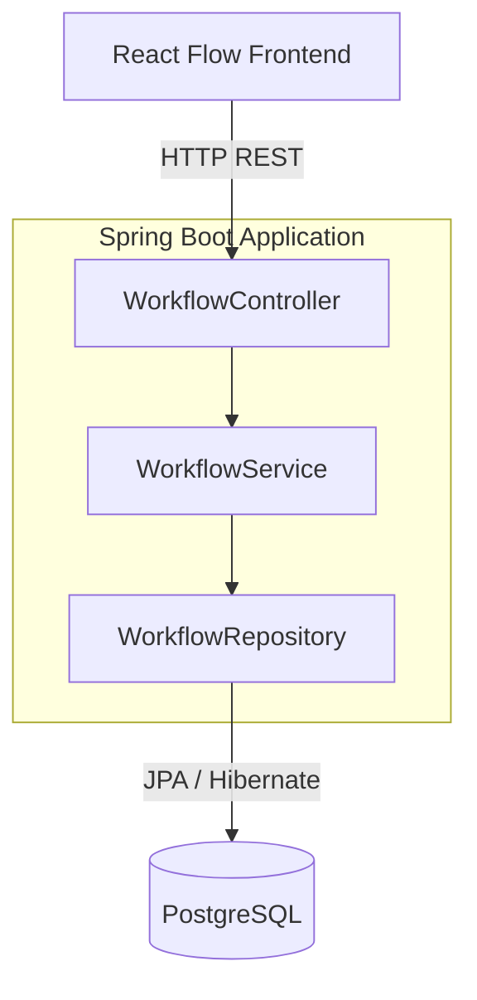

# Design Document: Chatbot Workflow Engine (Phase 1)

## Overview

Phase 1 delivers the foundation for the chatbot workflow engine: a Spring Boot REST API that provides CRUD operations for workflow definitions. Workflows are directed graphs (nodes + transitions) designed in React Flow on the frontend and stored as a single JSONB column in PostgreSQL. This phase intentionally skips payload validation — any JSON is accepted and persisted as-is.

The system follows a standard layered architecture: Controller → Service → Repository → PostgreSQL.

## Architecture



### Layers

| Layer | Responsibility |
|-------|---------------|
| Controller | Accepts HTTP requests, maps DTOs, returns responses with appropriate status codes |
| Service | Business logic (trivial in Phase 1), orchestrates repository calls |
| Repository | JPA interface for database access |
| Entity | JPA entity mapping, JSONB column handling via Hibernate types |

### Key Design Decisions

1. **Single JSONB column** — The entire workflow graph (nodes + transitions) lives in one `workflow_json` JSONB column. This avoids complex joins and lets the frontend own the schema of node/transition payloads.
2. **No validation on write** — Phase 1 accepts any JSON. Validation will be added in a later phase when the execution engine needs structured guarantees.
3. **Auto-increment Long primary key** — Generated by PostgreSQL sequence (BIGSERIAL). Simple, performant, and sufficient for single-tenant use.
4. **Timestamps managed by JPA** — `created_at` and `updated_at` are set automatically via JPA lifecycle annotations.

### SOLID Principles Applied

| Principle | Application |
|-----------|-------------|
| **Single Responsibility (S)** | Each class has one job: `WorkflowController` handles HTTP concerns only, `WorkflowServiceImpl` handles business logic only, `WorkflowRepository` handles data access only, `GlobalExceptionHandler` handles error mapping only. |
| **Open/Closed (O)** | The service layer is defined as an interface (`WorkflowService`). New behavior (e.g., validation, caching) can be added via decorators or new implementations without modifying existing code. DTOs are separate from entities, so API evolution doesn't force entity changes. |
| **Liskov Substitution (L)** | `WorkflowServiceImpl` implements `WorkflowService` and can be substituted with any other implementation (e.g., a mock for testing, a cached version for production) without breaking the controller. |
| **Interface Segregation (I)** | `WorkflowService` exposes only the operations the controller needs. The repository interface is kept minimal (inherits `JpaRepository`, no unnecessary custom methods). DTOs are split into `WorkflowRequest` (input) and `WorkflowResponse` (output) — clients aren't forced to deal with fields they don't need. |
| **Dependency Inversion (D)** | The controller depends on the `WorkflowService` interface, not the concrete `WorkflowServiceImpl`. Spring IoC injects the implementation at runtime. The service depends on the `WorkflowRepository` interface, not a concrete DAO class. High-level modules never depend on low-level modules — both depend on abstractions. |

## Components and Interfaces

### Package Structure

```
com.xpressbees.chatbot
├── controller
│   └── WorkflowController.java
├── service
│   ├── WorkflowService.java (interface)
│   └── WorkflowServiceImpl.java
├── repository
│   └── WorkflowRepository.java
├── entity
│   └── Workflow.java
├── dto
│   ├── WorkflowRequest.java
│   └── WorkflowResponse.java
└── exception
    ├── WorkflowNotFoundException.java
    └── GlobalExceptionHandler.java
```

### WorkflowController

REST controller handling all workflow endpoints.

```java
@RestController
@RequestMapping("/api/workflows")
public class WorkflowController {
    POST   /              → createWorkflow(WorkflowRequest) → 201 Created
    GET    /{id}          → getWorkflow(Long id)            → 200 OK
    GET    /              → listWorkflows()                 → 200 OK
    PUT    /{id}          → updateWorkflow(Long id, WorkflowRequest) → 200 OK
    DELETE /{id}          → deleteWorkflow(Long id)         → 204 No Content
}
```

### WorkflowService

Service interface providing workflow operations.

```java
public interface WorkflowService {
    WorkflowResponse create(WorkflowRequest request);
    WorkflowResponse getById(Long id);
    List<WorkflowResponse> listAll();
    WorkflowResponse update(Long id, WorkflowRequest request);
    void delete(Long id);
}
```

### WorkflowRepository

Spring Data JPA repository — no custom query methods needed for Phase 1.

```java
public interface WorkflowRepository extends JpaRepository<Workflow, Long> {
}
```

### DTOs

**WorkflowRequest** — Incoming payload for create/update:
```java
@Data
public class WorkflowRequest {
    private String name;
    private Object workflowJson;  // Raw JSON, no validation
}
```

**WorkflowResponse** — Outgoing payload:
```java
@Data
public class WorkflowResponse {
    private Long id;
    private String name;
    private Object workflowJson;
    private LocalDateTime createdAt;
    private LocalDateTime updatedAt;
}
```

### Exception Handling

**WorkflowNotFoundException** — Thrown when a workflow ID doesn't exist. Mapped to HTTP 404 by the global exception handler.

**GlobalExceptionHandler** — `@RestControllerAdvice` that catches `WorkflowNotFoundException` and returns a structured error response with 404 status.

## Data Models

### Workflow Entity

```java
@Entity
@Table(name = "workflow")
@Data
@NoArgsConstructor
@AllArgsConstructor
public class Workflow {
    @Id
    @GeneratedValue(strategy = GenerationType.IDENTITY)
    private Long id;

    @Column(name = "name", nullable = false)
    private String name;

    @Type(JsonType.class)
    @Column(name = "workflow_json", columnDefinition = "jsonb")
    private Map<String, Object> workflowJson;

    @Column(name = "created_at", updatable = false)
    private LocalDateTime createdAt;

    @Column(name = "updated_at")
    private LocalDateTime updatedAt;

    @PrePersist
    protected void onCreate() {
        createdAt = LocalDateTime.now();
        updatedAt = LocalDateTime.now();
    }

    @PreUpdate
    protected void onUpdate() {
        updatedAt = LocalDateTime.now();
    }
}
```

### PostgreSQL Table

```sql
CREATE TABLE workflow (
    id          BIGSERIAL PRIMARY KEY,
    name        VARCHAR(255) NOT NULL,
    workflow_json JSONB,
    created_at  TIMESTAMP NOT NULL DEFAULT NOW(),
    updated_at  TIMESTAMP NOT NULL DEFAULT NOW()
);
```

### Workflow JSON Structure (Informational)

The `workflow_json` column stores a JSON object with this expected shape (not validated in Phase 1):

```json
{
  "nodes": [
    {
      "id": "node-1",
      "type": "Text | Button | Input",
      "config": { /* type-specific configuration */ }
    }
  ],
  "transitions": [
    {
      "source": "node-1",
      "destination": "node-2",
      "condition": "optional-condition-expression"
    }
  ]
}
```

### REST API Contract

| Method | Endpoint | Request Body | Success Response | Error Response |
|--------|----------|-------------|-----------------|----------------|
| POST | `/api/workflows` | `WorkflowRequest` | 201 + `WorkflowResponse` | — |
| GET | `/api/workflows/{id}` | — | 200 + `WorkflowResponse` | 404 |
| GET | `/api/workflows` | — | 200 + `List<WorkflowResponse>` | — |
| PUT | `/api/workflows/{id}` | `WorkflowRequest` | 200 + `WorkflowResponse` | 404 |
| DELETE | `/api/workflows/{id}` | — | 204 No Content | 404 |

## Correctness Properties

*A property is a characteristic or behavior that should hold true across all valid executions of a system — essentially, a formal statement about what the system should do. Properties serve as the bridge between human-readable specifications and machine-verifiable correctness guarantees.*

### Property 1: Workflow persistence round-trip

*For any* valid workflow JSON payload (containing a nodes array and a transitions array), creating a workflow via POST and then retrieving it by the returned ID via GET SHALL produce a response whose `workflowJson` field is deeply equal to the original payload.

**Validates: Requirements 1.1, 2.1, 5.1, 5.2, 5.3**

### Property 2: Update replaces payload completely

*For any* existing workflow and *for any* new JSON payload, calling PUT with the new payload and then retrieving the workflow SHALL return the new payload (not the original), and the original payload SHALL no longer be retrievable from that record.

**Validates: Requirements 3.1**

### Property 3: Delete removes record

*For any* created workflow, after a successful DELETE request, a subsequent GET for the same ID SHALL return a not-found error.

**Validates: Requirements 4.1**

### Property 4: List returns all created workflows

*For any* set of N created workflows (where N ≥ 0), a GET to the list endpoint SHALL return a collection containing exactly those N workflows (matching by ID and payload).

**Validates: Requirements 2.3**

## Error Handling

| Scenario | HTTP Status | Response Body |
|----------|-------------|---------------|
| Workflow not found (GET/PUT/DELETE) | 404 | `{ "error": "Workflow not found", "id": "<id>" }` |
| Malformed request body (invalid JSON syntax) | 400 | Spring Boot default error response |
| Internal server error | 500 | Spring Boot default error response |

### Error Flow

1. Service layer calls `repository.findById(id)`
2. If `Optional.empty()`, throw `WorkflowNotFoundException(id)`
3. `GlobalExceptionHandler` catches the exception and returns 404 with a structured message

No custom handling for 400/500 — Spring Boot's default behavior is sufficient for Phase 1.

## Testing Strategy

### Unit Tests

- **WorkflowServiceImpl**: Mock `WorkflowRepository`, verify create/get/update/delete logic, verify `WorkflowNotFoundException` is thrown for missing IDs.
- **WorkflowController**: Use `@WebMvcTest` with mocked service to verify request mapping, status codes, and response serialization.
- **GlobalExceptionHandler**: Verify 404 response structure when `WorkflowNotFoundException` is thrown.

### Property-Based Tests (Integration)

Use **jqwik** (Java property-based testing library) with `@SpringBootTest` and an embedded PostgreSQL (Testcontainers) to verify correctness properties.

- **Library**: net.jqwik:jqwik (latest stable)
- **Iterations**: Minimum 100 per property
- **Tag format**: `Feature: chatbot-workflow-engine, Property {N}: {description}`
- Each property generates random workflow JSON payloads (random node counts, types, transition structures, config objects) and exercises the full stack through the REST API.

### Integration Tests

- **Repository layer**: Verify JSONB read/write with Testcontainers PostgreSQL.
- **Full stack**: `@SpringBootTest` with `TestRestTemplate` to validate end-to-end HTTP round trips.

### What Is NOT Covered by PBT

- Not-found error cases (2.2, 3.2, 4.2) — tested as example-based unit tests since the outcome is always 404 regardless of the non-existent ID value.
- JPA entity structure (5.4) — verified by compilation and integration test startup.
