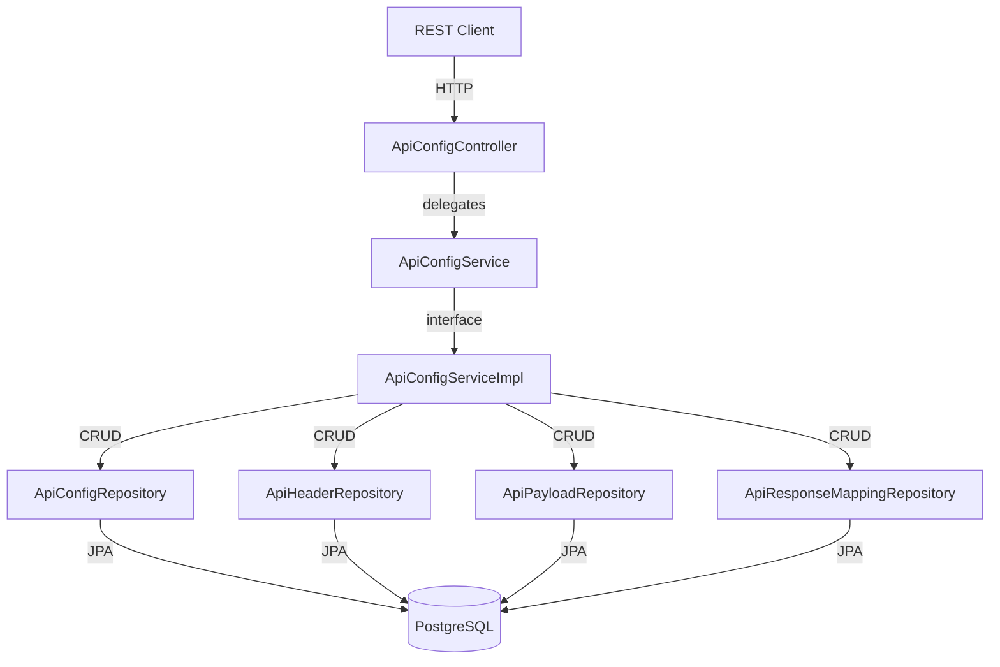
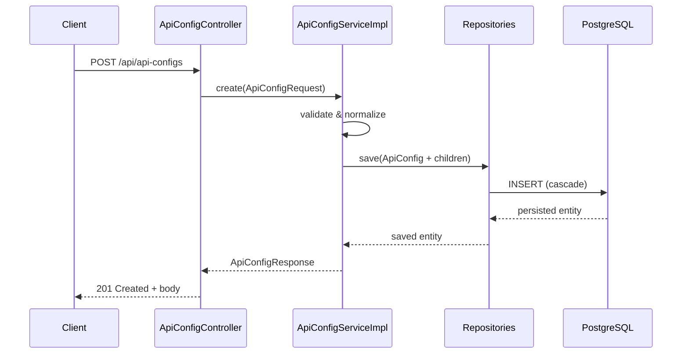

# Design Document: API Node Configuration

## Overview

This feature introduces a complete CRUD system for managing reusable API configurations that define external HTTP API calls. Each configuration stores URL, method, headers, payload templates, and response mappings. The feature is strictly data-management — no HTTP execution or workflow integration is included.

The design follows the project's existing layered architecture (Controller → Service → Repository → Entity) and naming conventions. It adds a new domain (`ApiConfig`) with one-to-many child entities (`ApiHeader`, `ApiPayload`, `ApiResponseMapping`) persisted via JPA with PostgreSQL and ON DELETE CASCADE at the database level.

### Design Decisions

1. **Separate child entities over embedded JSONB**: While the existing `Workflow` entity uses a single JSONB column, API configurations have well-defined child structures with relational integrity needs (unique constraints, foreign keys). Separate tables with JPA `@OneToMany` relationships provide type safety and constraint enforcement.

2. **Replace-all strategy for child collections on update**: When an update includes headers or response mappings, all existing child records are deleted and re-inserted. This avoids complex diff logic and is safe given the small cardinality limits (max 50 headers, max 50 mappings).

3. **Case-insensitive method normalization**: HTTP methods are normalized to uppercase at the service layer before persistence, matching the database CHECK constraint.

4. **Unique name constraint**: Config names are unique system-wide to allow future name-based lookups from workflow nodes.

## Architecture



### Request/Response Flow



## Components and Interfaces

### Controller Layer

**ApiConfigController** (`/api/api-configs`)

| Method | Path | Description | Response |
|--------|------|-------------|----------|
| POST | `/api/api-configs` | Create a new API configuration | 201 + body |
| GET | `/api/api-configs/{id}` | Get a configuration by ID | 200 + body |
| GET | `/api/api-configs` | List all configurations | 200 + list |
| PUT | `/api/api-configs/{id}` | Update a configuration | 200 + body |
| DELETE | `/api/api-configs/{id}` | Delete a configuration | 204 no body |

### Service Layer

**ApiConfigService** (interface)

```java
public interface ApiConfigService {
    ApiConfigResponse create(ApiConfigRequest request);
    ApiConfigResponse getById(Long id);
    List<ApiConfigResponse> listAll();
    ApiConfigResponse update(Long id, ApiConfigRequest request);
    void delete(Long id);
}
```

**ApiConfigServiceImpl** (implementation)

Responsibilities:
- Validates required fields (name, url, method)
- Validates numeric ranges (timeout_ms: 1–300000, retry_count: 0–10)
- Normalizes HTTP method to uppercase
- Checks for duplicate names (unique constraint)
- Manages child entity lifecycle (replace-all on update when collection present, retain when absent)
- Maps between DTOs and entities

### Repository Layer

| Repository | Entity | Notes |
|------------|--------|-------|
| ApiConfigRepository | ApiConfig | Extends JpaRepository<ApiConfig, Long>, custom `existsByName`, `existsByNameAndIdNot` |
| ApiHeaderRepository | ApiHeader | Extends JpaRepository<ApiHeader, Long>, `deleteAllByApiConfig` |
| ApiPayloadRepository | ApiPayload | Extends JpaRepository<ApiPayload, Long>, `findByApiConfig`, `deleteByApiConfig` |
| ApiResponseMappingRepository | ApiResponseMapping | Extends JpaRepository<ApiResponseMapping, Long>, `deleteAllByApiConfig` |

### DTO Layer

**ApiConfigRequest**
```java
@Data
public class ApiConfigRequest {
    private String name;            // required, max 255
    private String url;             // required, max 1024
    private String method;          // required: GET|POST|PUT|DELETE
    private Integer timeoutMs;      // optional, default 5000, range [1, 300000]
    private Integer retryCount;     // optional, default 1, range [0, 10]
    private String username;        // optional
    private String password;        // optional
    private String clientId;        // optional
    private List<ApiHeaderDto> headers;              // optional
    private Object payloadTemplate;                  // optional (JSONB-compatible)
    private List<ApiResponseMappingDto> responseMappings; // optional
}
```

**ApiHeaderDto**
```java
@Data
public class ApiHeaderDto {
    private String headerName;      // required, max 255
    private String headerValue;     // required, max 1024
}
```

**ApiResponseMappingDto**
```java
@Data
public class ApiResponseMappingDto {
    private String responsePath;    // required, max 512
}
```

**ApiConfigResponse**
```java
@Data
public class ApiConfigResponse {
    private Long id;
    private String name;
    private String url;
    private String method;
    private Integer timeoutMs;
    private Integer retryCount;
    private String username;
    private String password;
    private String clientId;
    private List<ApiHeaderDto> headers;
    private Object payloadTemplate;
    private List<ApiResponseMappingDto> responseMappings;
    private LocalDateTime createdAt;
    private LocalDateTime updatedAt;
}
```

### Exception Handling

New exceptions handled in `GlobalExceptionHandler`:

| Exception | HTTP Status | When |
|-----------|-------------|------|
| ApiConfigNotFoundException | 404 | ID not found |
| DuplicateApiConfigNameException | 409 | Name already exists |
| MethodArgumentNotValidException (Spring) | 400 | Bean validation failures |
| InvalidMethodException | 400 | Unsupported HTTP method |

## Data Models

### Entity: ApiConfig

```java
@Entity
@Table(name = "api_config")
@Data
@NoArgsConstructor
@AllArgsConstructor
public class ApiConfig {
    @Id
    @GeneratedValue(strategy = GenerationType.IDENTITY)
    private Long id;

    @Column(name = "name", nullable = false, unique = true, length = 255)
    private String name;

    @Column(name = "url", nullable = false, length = 1024)
    private String url;

    @Column(name = "method", nullable = false, length = 10)
    private String method;

    @Column(name = "timeout_ms", nullable = false)
    private Integer timeoutMs = 5000;

    @Column(name = "retry_count", nullable = false)
    private Integer retryCount = 1;

    @Column(name = "username", length = 255)
    private String username;

    @Column(name = "password", length = 255)
    private String password;

    @Column(name = "client_id", length = 255)
    private String clientId;

    @OneToMany(mappedBy = "apiConfig", cascade = CascadeType.ALL, orphanRemoval = true)
    private List<ApiHeader> headers = new ArrayList<>();

    @OneToOne(mappedBy = "apiConfig", cascade = CascadeType.ALL, orphanRemoval = true)
    private ApiPayload payload;

    @OneToMany(mappedBy = "apiConfig", cascade = CascadeType.ALL, orphanRemoval = true)
    private List<ApiResponseMapping> responseMappings = new ArrayList<>();

    @Column(name = "created_at", updatable = false)
    private LocalDateTime createdAt;

    @Column(name = "updated_at")
    private LocalDateTime updatedAt;

    @PrePersist
    protected void onCreate() { createdAt = LocalDateTime.now(); updatedAt = LocalDateTime.now(); }

    @PreUpdate
    protected void onUpdate() { updatedAt = LocalDateTime.now(); }
}
```

### Entity: ApiHeader

```java
@Entity
@Table(name = "api_header")
@Data
@NoArgsConstructor
@AllArgsConstructor
public class ApiHeader {
    @Id
    @GeneratedValue(strategy = GenerationType.IDENTITY)
    private Long id;

    @ManyToOne(fetch = FetchType.LAZY)
    @JoinColumn(name = "api_id", nullable = false)
    private ApiConfig apiConfig;

    @Column(name = "header_name", nullable = false, length = 255)
    private String headerName;

    @Column(name = "header_value", nullable = false, length = 1024)
    private String headerValue;
}
```

### Entity: ApiPayload

```java
@Entity
@Table(name = "api_payload")
@Data
@NoArgsConstructor
@AllArgsConstructor
public class ApiPayload {
    @Id
    @GeneratedValue(strategy = GenerationType.IDENTITY)
    private Long id;

    @OneToOne(fetch = FetchType.LAZY)
    @JoinColumn(name = "api_id", nullable = false, unique = true)
    private ApiConfig apiConfig;

    @Type(JsonType.class)
    @Column(name = "payload_template", columnDefinition = "jsonb", nullable = false)
    private Map<String, Object> payloadTemplate;

    @Column(name = "created_at", updatable = false)
    private LocalDateTime createdAt;

    @Column(name = "updated_at")
    private LocalDateTime updatedAt;

    @PrePersist
    protected void onCreate() { createdAt = LocalDateTime.now(); updatedAt = LocalDateTime.now(); }

    @PreUpdate
    protected void onUpdate() { updatedAt = LocalDateTime.now(); }
}
```

### Entity: ApiResponseMapping

```java
@Entity
@Table(name = "api_response_mapping")
@Data
@NoArgsConstructor
@AllArgsConstructor
public class ApiResponseMapping {
    @Id
    @GeneratedValue(strategy = GenerationType.IDENTITY)
    private Long id;

    @ManyToOne(fetch = FetchType.LAZY)
    @JoinColumn(name = "api_id", nullable = false)
    private ApiConfig apiConfig;

    @Column(name = "response_path", nullable = false, length = 512)
    private String responsePath;

    @Column(name = "created_at", updatable = false)
    private LocalDateTime createdAt;

    @PrePersist
    protected void onCreate() { createdAt = LocalDateTime.now(); }
}
```

### Database DDL (additions to schema.sql)

```sql
CREATE TABLE IF NOT EXISTS api_config (
    id          BIGSERIAL PRIMARY KEY,
    name        VARCHAR(255) NOT NULL UNIQUE,
    url         VARCHAR(1024) NOT NULL,
    method      VARCHAR(10) NOT NULL CHECK (method IN ('GET','POST','PUT','DELETE')),
    timeout_ms  INTEGER NOT NULL DEFAULT 5000 CHECK (timeout_ms >= 1 AND timeout_ms <= 300000),
    retry_count INTEGER NOT NULL DEFAULT 1 CHECK (retry_count >= 0 AND retry_count <= 10),
    username    VARCHAR(255),
    password    VARCHAR(255),
    client_id   VARCHAR(255),
    created_at  TIMESTAMP NOT NULL DEFAULT NOW(),
    updated_at  TIMESTAMP NOT NULL DEFAULT NOW()
);

CREATE TABLE IF NOT EXISTS api_header (
    id           BIGSERIAL PRIMARY KEY,
    api_id       BIGINT NOT NULL REFERENCES api_config(id) ON DELETE CASCADE,
    header_name  VARCHAR(255) NOT NULL,
    header_value VARCHAR(1024) NOT NULL
);

CREATE TABLE IF NOT EXISTS api_payload (
    id               BIGSERIAL PRIMARY KEY,
    api_id           BIGINT NOT NULL UNIQUE REFERENCES api_config(id) ON DELETE CASCADE,
    payload_template JSONB NOT NULL,
    created_at       TIMESTAMP NOT NULL DEFAULT NOW(),
    updated_at       TIMESTAMP NOT NULL DEFAULT NOW()
);

CREATE TABLE IF NOT EXISTS api_response_mapping (
    id            BIGSERIAL PRIMARY KEY,
    api_id        BIGINT NOT NULL REFERENCES api_config(id) ON DELETE CASCADE,
    response_path VARCHAR(512) NOT NULL,
    created_at    TIMESTAMP NOT NULL DEFAULT NOW()
);

CREATE INDEX IF NOT EXISTS idx_api_header_api_id ON api_header(api_id);
CREATE INDEX IF NOT EXISTS idx_api_payload_api_id ON api_payload(api_id);
CREATE INDEX IF NOT EXISTS idx_api_response_mapping_api_id ON api_response_mapping(api_id);
```

### ER Diagram

```mermaid
erDiagram
    API_CONFIG ||--o{ API_HEADER : has
    API_CONFIG ||--o| API_PAYLOAD : has
    API_CONFIG ||--o{ API_RESPONSE_MAPPING : has

    API_CONFIG {
        bigserial id PK
        varchar name UK
        varchar url
        varchar method
        integer timeout_ms
        integer retry_count
        varchar username
        varchar password
        varchar client_id
        timestamp created_at
        timestamp updated_at
    }

    API_HEADER {
        bigserial id PK
        bigint api_id FK
        varchar header_name
        varchar header_value
    }

    API_PAYLOAD {
        bigserial id PK
        bigint api_id FK_UK
        jsonb payload_template
        timestamp created_at
        timestamp updated_at
    }

    API_RESPONSE_MAPPING {
        bigserial id PK
        bigint api_id FK
        varchar response_path
        timestamp created_at
    }
```


## Correctness Properties

*A property is a characteristic or behavior that should hold true across all valid executions of a system — essentially, a formal statement about what the system should do. Properties serve as the bridge between human-readable specifications and machine-verifiable correctness guarantees.*

### Property 1: Create Round-Trip

*For any* valid ApiConfigRequest containing a name, url, method, optional timeout_ms, optional retry_count, optional credentials, a list of headers (0–50), an optional payload template, and a list of response mappings (0–50), creating the configuration and then retrieving it by its returned ID SHALL produce a response where every field matches the original request (with timeout_ms defaulting to 5000 and retry_count defaulting to 1 when not provided).

**Validates: Requirements 1.1, 1.2, 1.3, 1.4, 2.1**

### Property 2: Update Replace

*For any* existing ApiConfig and any valid update request that includes headers and/or response mappings and/or a payload template, after the update the retrieved configuration SHALL contain exactly the new children from the update request and none of the previously existing children.

**Validates: Requirements 3.1, 3.2, 3.4, 3.5**

### Property 3: Update Retention

*For any* existing ApiConfig with headers and response mappings, if an update request omits the headers field and/or the response mappings field, the corresponding children SHALL remain unchanged after the update.

**Validates: Requirements 3.3, 3.6**

### Property 4: Required Field Validation

*For any* create or update request where at least one of the required fields (name, url, method) is null or blank, the service SHALL reject the request with a 400 status and NOT persist or modify any data.

**Validates: Requirements 1.6, 3.9, 6.4**

### Property 5: Numeric Range Validation

*For any* create or update request where timeout_ms is outside [1, 300000] or retry_count is outside [0, 10], the service SHALL reject the request with a 400 status.

**Validates: Requirements 1.8**

### Property 6: Cascade Delete

*For any* ApiConfig that has associated headers, payload, and response mappings, after deleting the parent by ID, retrieving the same ID SHALL return 404 and no orphaned child records SHALL remain in the database.

**Validates: Requirements 4.1, 5.5**

### Property 7: Method Normalization

*For any* valid HTTP method string that matches GET, POST, PUT, or DELETE in any case combination (e.g., "get", "Post", "pUt"), the persisted and returned method value SHALL be the uppercase form of that method.

**Validates: Requirements 6.1, 6.2**

### Property 8: Invalid Method Rejection

*For any* string that is not one of GET, POST, PUT, DELETE (after case normalization), a create or update request with that method value SHALL be rejected with HTTP 400.

**Validates: Requirements 6.3**

### Property 9: List Count Invariant

*For any* sequence of N successful create operations (each with a unique name), a subsequent list-all request SHALL return a collection containing at least N items, and every created config's ID SHALL appear in the list.

**Validates: Requirements 2.3**

### Property 10: Payload Uniqueness

*For any* ApiConfig, regardless of how many create or update operations include a payload template, the configuration SHALL have at most one payload associated with it at any time.

**Validates: Requirements 7.1, 7.2**

## Error Handling

### Validation Errors (400 Bad Request)

| Condition | Error Message Pattern |
|-----------|----------------------|
| Missing required field | `"Field '{fieldName}' is required"` |
| timeout_ms out of range | `"timeout_ms must be between 1 and 300000"` |
| retry_count out of range | `"retry_count must be between 0 and 10"` |
| Invalid HTTP method | `"method must be one of: GET, POST, PUT, DELETE"` |
| Invalid ID format | `"id must be a positive integer"` |
| Too many headers (>50) | `"Maximum of 50 headers allowed"` |
| Too many response mappings (>50) | `"Maximum of 50 response mappings allowed"` |

### Not Found Errors (404)

| Condition | Error Message Pattern |
|-----------|----------------------|
| ID not found on GET/PUT/DELETE | `"ApiConfig not found with id: {id}"` |

### Conflict Errors (409)

| Condition | Error Message Pattern |
|-----------|----------------------|
| Duplicate name on create | `"ApiConfig with name '{name}' already exists"` |

### Error Response Format

Consistent with existing `GlobalExceptionHandler` pattern:

```java
// 404 response body
{
    "error": "ApiConfig not found",
    "id": 123
}

// 400 response body
{
    "error": "Validation failed",
    "message": "Field 'name' is required"
}

// 409 response body
{
    "error": "Conflict",
    "message": "ApiConfig with name 'my-api' already exists"
}
```

### Exception Classes

- **ApiConfigNotFoundException**: Extends `RuntimeException`, holds the requested ID.
- **DuplicateApiConfigNameException**: Extends `RuntimeException`, holds the conflicting name.
- **InvalidMethodException**: Extends `RuntimeException`, holds the invalid method value.

All handled by `GlobalExceptionHandler` with `@ExceptionHandler` methods returning structured JSON responses.

## Testing Strategy

### Property-Based Testing (jqwik)

The project already uses **jqwik 1.8.2** for property-based testing. Each correctness property above maps to one or more jqwik property test methods.

**Configuration:**
- Minimum 100 tries per property (jqwik default is 1000, which is fine)
- Tag format: `@Label("Feature: api-node-configuration, Property {N}: {title}")`
- Tests go in `src/test/java/com/xpressbees/chatbot/service/ApiConfigServicePropertyTest.java`

**Generator Strategy:**
- `@Provide` methods for valid `ApiConfigRequest` objects with random names, URLs, methods, and optional children
- Separate generators for invalid requests (missing fields, out-of-range values, invalid methods)
- Header lists generated with size [0, 50], response mappings with size [0, 50]
- Method variants generated from `{"get", "GET", "Get", "gEt", ...}` for normalization tests

### Unit Tests (JUnit 5)

Focus areas:
- Controller endpoint integration tests (MockMvc) for HTTP status codes
- Specific examples: duplicate name returns 409, non-existent ID returns 404
- Edge cases: empty payload, zero headers, boundary values (timeout_ms=1, timeout_ms=300000)
- ID format validation (negative numbers, zero, non-numeric)

### Test Organization

```
src/test/java/com/xpressbees/chatbot/
├── service/
│   └── ApiConfigServicePropertyTest.java    # Property-based tests (jqwik)
├── controller/
│   └── ApiConfigControllerTest.java         # MockMvc integration tests
└── repository/
    └── ApiConfigRepositoryTest.java         # Repository-level tests (optional)
```

### Dual Testing Balance

- **Property tests** cover: round-trips, normalization, validation rejection, retention semantics, cascade behavior
- **Unit tests** cover: specific HTTP status codes, error message format, duplicate name detection, boundary values
- Property tests eliminate the need for exhaustive example-based input coverage — the generators handle that
