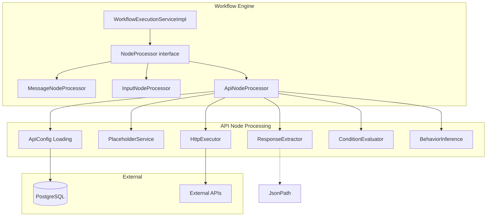
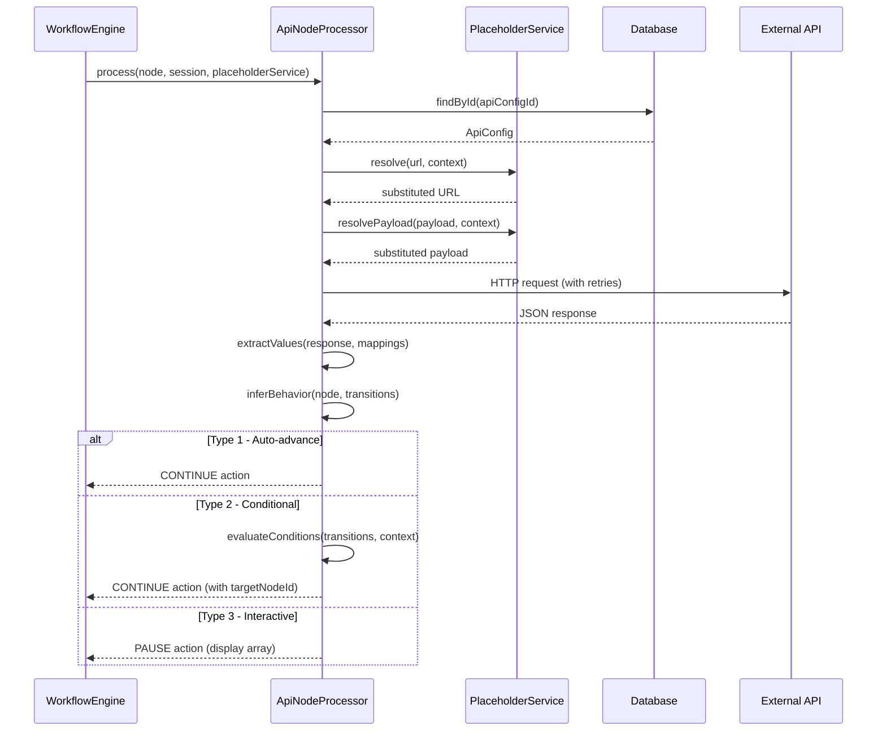

# Design Document: API Node Processor

## Overview

The API Node Processor extends the chatbot workflow engine with the ability to execute external HTTP calls during conversation flows. It introduces a new `NodeProcessor` implementation (`ApiNodeProcessor`) that handles nodes of type `"api"` in the workflow graph. The processor loads API configuration from the database, substitutes session context variables into request templates, executes HTTP calls with retry logic, extracts response values using JsonPath, and determines next-step behavior based on transition structure (auto-advance, conditional branching, or interactive array selection).

This feature integrates with the existing workflow engine loop in `WorkflowExecutionServiceImpl`, the `PlaceholderService` for variable substitution, and the `ApiConfig` entity family for endpoint configuration.

### Key Design Decisions

1. **Behavior inference from graph structure** — No explicit `responseType` field. The processor determines behavior (Type 1/2/3) by examining the `displayVariable` field and transition conditions.
2. **Spring RestClient for HTTP** — Uses Spring 6.1's `RestClient` (synchronous, fluent API) for external calls, configured per-request with timeouts from `ApiConfig`.
3. **JsonPath via Jayway** — Response extraction uses `com.jayway.jsonpath:json-path` library rather than custom parsing.
4. **PlaceholderService enhancement** — The existing `PlaceholderService` is refactored to use regex-based `{{variable}}` pattern matching instead of the current hardcoded `<mobile_no>` replacement.
5. **Condition parser as pure function** — Condition expression evaluation is implemented as a stateless utility class for testability.

## Architecture



### Processing Flow



## Components and Interfaces

### 1. ApiNodeProcessor

**Package:** `com.xpressbees.chatbot.processor`

**Responsibilities:**
- Recognizes API nodes via `canHandle()`
- Orchestrates the full processing pipeline: load config → substitute placeholders → execute HTTP → extract response → determine behavior

```java
@Component
@Order(3)
public class ApiNodeProcessor implements NodeProcessor {

    private final ApiConfigRepository apiConfigRepository;
    private final HttpExecutor httpExecutor;
    private final ResponseExtractor responseExtractor;
    private final ConditionEvaluator conditionEvaluator;
    private final SimpMessagingTemplate messagingTemplate;

    @Override
    public boolean canHandle(Map<String, Object> node) { ... }

    @Override
    public NodeProcessingResult process(Map<String, Object> node, ChatSession session,
                                         PlaceholderService placeholderService) { ... }
}
```

### 2. HttpExecutor

**Package:** `com.xpressbees.chatbot.service`

**Responsibilities:**
- Executes HTTP requests using Spring's `RestClient`
- Applies timeout, headers, and body from `ApiConfig`
- Implements retry logic with fixed delay

```java
@Component
public class HttpExecutor {

    public HttpExecutionResult execute(ApiConfig config, String resolvedUrl,
                                        Map<String, String> resolvedHeaders,
                                        String resolvedBody) { ... }
}
```

**Returns:** `HttpExecutionResult` containing status code, response body (String), and error info if failed.

### 3. ResponseExtractor

**Package:** `com.xpressbees.chatbot.service`

**Responsibilities:**
- Evaluates JsonPath expressions against JSON response bodies
- Converts primitives to strings, joins arrays with `\n` (skipping nulls)
- Reports extraction errors with path and variable name context

```java
@Component
public class ResponseExtractor {

    public ExtractionResult extract(String jsonBody,
                                     List<ApiResponseMapping> mappings) { ... }
}
```

**Returns:** `ExtractionResult` containing a map of extracted key-value pairs or an error message.

### 4. ConditionEvaluator

**Package:** `com.xpressbees.chatbot.service`

**Responsibilities:**
- Parses condition expression strings into structured comparisons
- Evaluates simple conditions (`variable operator value`)
- Supports compound conditions with `and`/`or` (with `and` having higher precedence)
- Pure function — no side effects, fully testable

```java
@Component
public class ConditionEvaluator {

    public boolean evaluate(String expression, Map<String, Object> context) { ... }

    // Internal: parse into sub-conditions, apply operator logic
}
```

### 5. PlaceholderService (Enhanced)

**Package:** `com.xpressbees.chatbot.service`

**Enhancement:** Refactor from hardcoded `<mobile_no>` replacement to regex-based `{{variable}}` pattern matching using `[a-zA-Z0-9_]+`.

```java
@Service
public class PlaceholderService {

    private static final Pattern PLACEHOLDER_PATTERN =
        Pattern.compile("\\{\\{([a-zA-Z0-9_]+)\\}\\}");

    public String resolve(String template, Map<String, Object> context) { ... }

    public Map<String, Object> resolvePayload(Map<String, Object> payloadTemplate,
                                               Map<String, Object> context) { ... }
}
```

### 6. BehaviorInference (internal to ApiNodeProcessor)

**Logic embedded in `ApiNodeProcessor.process()`:**

| Condition | Behavior | Result |
|-----------|----------|--------|
| Node has `displayVariable` field | Type 3 (Interactive) | PAUSE |
| Multiple transitions with conditions | Type 2 (Conditional) | CONTINUE to matched target |
| Single transition without condition | Type 1 (Auto-advance) | CONTINUE |
| Multiple transitions without conditions | Button Node | PAUSE with button options |

### 7. WorkflowExecutionServiceImpl (Modified)

**Changes:**
- `handleUserInput()` extended to handle `currentNodeType == "api"` (resume from interactive selection)
- `resolveNextNode()` enhanced to accept a specific `targetNodeId` for conditional branching
- Button node detection added to `processNodes()` loop

## Data Models

### New DTOs

```java
@Data
@AllArgsConstructor
public class HttpExecutionResult {
    private boolean success;
    private int statusCode;
    private String responseBody;
    private String errorMessage;
}
```

```java
@Data
@AllArgsConstructor
public class ExtractionResult {
    private boolean success;
    private Map<String, String> extractedValues;
    private String errorMessage;
}
```

### Existing Entities (No Schema Changes)

| Entity | Relevant Fields | Usage |
|--------|-----------------|-------|
| `ApiConfig` | url, method, timeoutMs, retryCount, headers, payload, responseMappings | Full API call configuration |
| `ApiHeader` | headerName, headerValue | HTTP request headers |
| `ApiPayload` | payloadTemplate (JSONB Map) | Request body template |
| `ApiResponseMapping` | responsePath, contextVariableName | JsonPath → context variable mapping |
| `ChatSession` | context (JSONB Map), currentNodeId, currentNodeType, status | Session state persistence |

### Workflow JSON Structure (API Node)

```json
{
  "id": "node-uuid",
  "name": "Fetch Shipment Status",
  "type": "api",
  "config": {
    "nodeType": "api",
    "apiConfigId": "42"
  },
  "displayVariable": "shipment_options"
}
```

### Transition Structure

```json
{
  "sourceNodeId": "node-uuid",
  "targetNodeId": "target-uuid",
  "condition": "status == active"
}
```

## Correctness Properties

*A property is a characteristic or behavior that should hold true across all valid executions of a system — essentially, a formal statement about what the system should do. Properties serve as the bridge between human-readable specifications and machine-verifiable correctness guarantees.*

### Property 1: canHandle Type Equivalence

*For any* node map, `canHandle` SHALL return `true` if and only if the node's `type` value is the exact string `"api"`. For all other type values (including null and absent keys), it SHALL return `false`.

**Validates: Requirements 1.1, 1.2, 1.3**

### Property 2: Placeholder Substitution Correctness

*For any* template string containing `{{variable}}` tokens and any context map, after substitution: (a) every token whose variable name exists as a key in the context SHALL be replaced with `String.valueOf()` of the corresponding value, and (b) every token whose variable name does NOT exist in the context SHALL remain unchanged as the literal `{{variable}}` text.

**Validates: Requirements 3.1, 3.2, 3.3, 3.4, 3.5**

### Property 3: Placeholder Pattern Strictness

*For any* string, the placeholder service SHALL only match tokens conforming to the exact pattern `{{` followed by one or more `[a-zA-Z0-9_]` characters followed by `}}`. Substrings that resemble tokens but contain invalid characters (e.g., `{{a-b}}`, `{{}}`, `{{ x }}`) SHALL NOT be substituted.

**Validates: Requirements 3.5**

### Property 4: Retry Count Correctness

*For any* `ApiConfig` with `retryCount` = N and a request that fails on every attempt with a retryable error (timeout, connection error, or 5xx status), the `HttpExecutor` SHALL make exactly N + 1 total attempts (1 initial + N retries) before returning a failure result.

**Validates: Requirements 4.5**

### Property 5: JsonPath Primitive Extraction Stores String Representation

*For any* valid JSON document containing a primitive value (String, Number, or Boolean) at a given path, the `ResponseExtractor` SHALL store `String.valueOf()` of that primitive value in the extraction result under the mapped context variable name.

**Validates: Requirements 5.1, 5.2**

### Property 6: JsonPath Array Extraction Joins Non-Null Elements

*For any* valid JSON document containing an array at a given path, the `ResponseExtractor` SHALL produce a string equal to the non-null elements joined by `\n`. Null elements SHALL be excluded from the result. An empty array after null filtering SHALL produce an empty string.

**Validates: Requirements 5.3**

### Property 7: Condition Expression Evaluation Correctness

*For any* simple condition expression in the format `"variable operator value"` and any context map: (a) when the operator is `==` or `!=`, evaluation SHALL use case-sensitive string comparison between the context variable's string value and the literal; (b) when the operator is `<`, `>`, `<=`, or `>=`, evaluation SHALL parse both sides as doubles and compare numerically; (c) if either side is not a valid number for numeric operators, the result SHALL be `false`; (d) if the variable is not in the context, the result SHALL be `false`.

**Validates: Requirements 7.2, 7.3, 8.1, 8.2, 8.3, 8.4, 8.9**

### Property 8: Compound Condition Precedence

*For any* compound condition expression containing `and` and `or` connectors, `and` SHALL bind with higher precedence than `or`. Specifically, `A or B and C` SHALL evaluate as `A or (B and C)`, and `A and B or C and D` SHALL evaluate as `(A and B) or (C and D)`.

**Validates: Requirements 8.5, 8.6, 8.7, 8.8**

### Property 9: First-Match-Wins for Conditional Transitions

*For any* ordered list of transitions with condition expressions and any context map where multiple conditions evaluate to true, the processor SHALL select the transition at the lowest array index among those with true conditions.

**Validates: Requirements 7.1, 7.4**

### Property 10: Interactive Selection Validation

*For any* array of displayed values and any user reply string, the selection SHALL be accepted (stored in context) if and only if the reply exactly equals (case-sensitive) one of the array elements. All non-matching replies SHALL be rejected with an error message.

**Validates: Requirements 9.5, 9.7**

### Property 11: Button Node Routing Correctness

*For any* set of target node names and any user reply string, the workflow engine SHALL route to the matching target node if and only if the reply exactly equals (case-sensitive) one of the target node names. Non-matching replies SHALL be rejected.

**Validates: Requirements 12.4, 12.5**

## Error Handling

| Scenario | Behavior | User Feedback |
|----------|----------|---------------|
| Missing `apiConfigId` in node config | Return CONTINUE with error | "API configuration reference is missing from the node" |
| `apiConfigId` not parseable as Long | Return CONTINUE with error | "API configuration identifier is invalid" |
| `ApiConfig` not found in DB | Return CONTINUE with error | "No API configuration found for ID: {id}" |
| HTTP timeout after retries | Send `ChatErrorResponse`, halt | "External API is unreachable (timeout)" |
| HTTP 5xx after retries | Send `ChatErrorResponse`, halt | "External API call failed with status: {code}" |
| HTTP 4xx (no retry) | Send `ChatErrorResponse`, halt | "External API call failed with status: {code}" |
| Invalid JSON response body | Send `ChatErrorResponse`, halt (no retry) | "Invalid response format: body is not valid JSON" |
| JsonPath evaluation error | Send `ChatErrorResponse`, halt | "Failed to extract '{contextVar}' using path '{path}'" |
| No condition matches (Type 2) | Send `ChatErrorResponse`, halt | "No matching transition found for current context" |
| Invalid user selection (Type 3) | Send error, remain paused | "'{value}' is not in the available options" |
| Invalid button selection | Send error, remain paused | "'{value}' is not a valid selection" |
| Empty array for displayVariable | Send error, advance | "No options available" |

### Error Propagation Strategy

- **Configuration errors** (missing ID, invalid ID, not found): Return `CONTINUE` with error response so the workflow engine sends the message and halts naturally at end-of-chain.
- **Runtime errors** (HTTP failures, JSON parse, JsonPath): Return `PAUSE` action with error, setting `currentNodeType` to indicate the halted state. The error message is sent via `ChatErrorResponse` to the WebSocket topic.
- **Validation errors** (invalid selection): Send error to topic but keep session paused on the same node for retry.

## Testing Strategy

### Property-Based Testing (jqwik 1.8.2)

Property-based testing is well-suited for this feature because the core processing logic involves pure functions (placeholder substitution, condition evaluation, response extraction, selection validation) where behavior varies meaningfully across a wide input space.

**Configuration:**
- Library: `net.jqwik:jqwik:1.8.2` (already in pom.xml)
- Minimum iterations: 100 per property (`@Property(tries = 100)`)
- Each test tagged with: `// Feature: api-node-processor, Property {N}: {title}`

**Property tests to implement:**

| Property | Target Class | Generator Strategy |
|----------|--------------|-------------------|
| 1: canHandle Type Equivalence | `ApiNodeProcessor` | Random node maps with various `type` values (including null, absent, "api", other strings) |
| 2: Placeholder Substitution | `PlaceholderService` | Random templates with `{{var}}` tokens, random context maps |
| 3: Placeholder Pattern Strictness | `PlaceholderService` | Strings with valid and invalid token patterns |
| 4: Retry Count | `HttpExecutor` | Random retryCount (0-5), always-failing HTTP calls |
| 5: Primitive Extraction | `ResponseExtractor` | Random JSON with primitives at known paths |
| 6: Array Extraction | `ResponseExtractor` | Random JSON arrays with mixed nulls |
| 7: Condition Evaluation | `ConditionEvaluator` | Random variable/operator/value triples with known context |
| 8: Compound Precedence | `ConditionEvaluator` | Random compound expressions with known truth values |
| 9: First-Match-Wins | `ConditionEvaluator` + transitions | Random ordered conditions where multiple match |
| 10: Selection Validation | selection logic | Random string arrays and user input strings |
| 11: Button Routing | button logic | Random node name sets and user input strings |

### Unit Tests (Example-Based)

- API config loading: missing ID, invalid ID, not found
- HTTP execution: 2xx success, 4xx error, 5xx with retry
- JsonPath: invalid path syntax, null result, non-JSON body
- Condition evaluation: malformed expressions (not 3 tokens)
- Type 2 behavior: no condition matches → error
- Type 3 behavior: empty array → advance, missing mapping → error
- Button node: display correct names, invalid selection error

### Integration Tests

- Full API node processing flow (Type 1): mock external API, verify context updated and CONTINUE returned
- Full API node processing flow (Type 2): mock API, verify correct branch taken
- Full API node processing flow (Type 3): mock API, verify PAUSE and resume with valid selection
- Session persistence: verify `currentNodeId`, `currentNodeType`, and context saved on PAUSE
- Button node: verify session state and message sent with options
- WorkflowExecutionServiceImpl: end-to-end with multiple node types chained

### Dependencies Required

```xml
<!-- JsonPath (add to pom.xml) -->
<dependency>
    <groupId>com.jayway.jsonpath</groupId>
    <artifactId>json-path</artifactId>
    <version>2.9.0</version>
</dependency>
```

Spring's `RestClient` is available in Spring Boot 3.3.5 (Spring Framework 6.1+) — no additional dependency needed.
