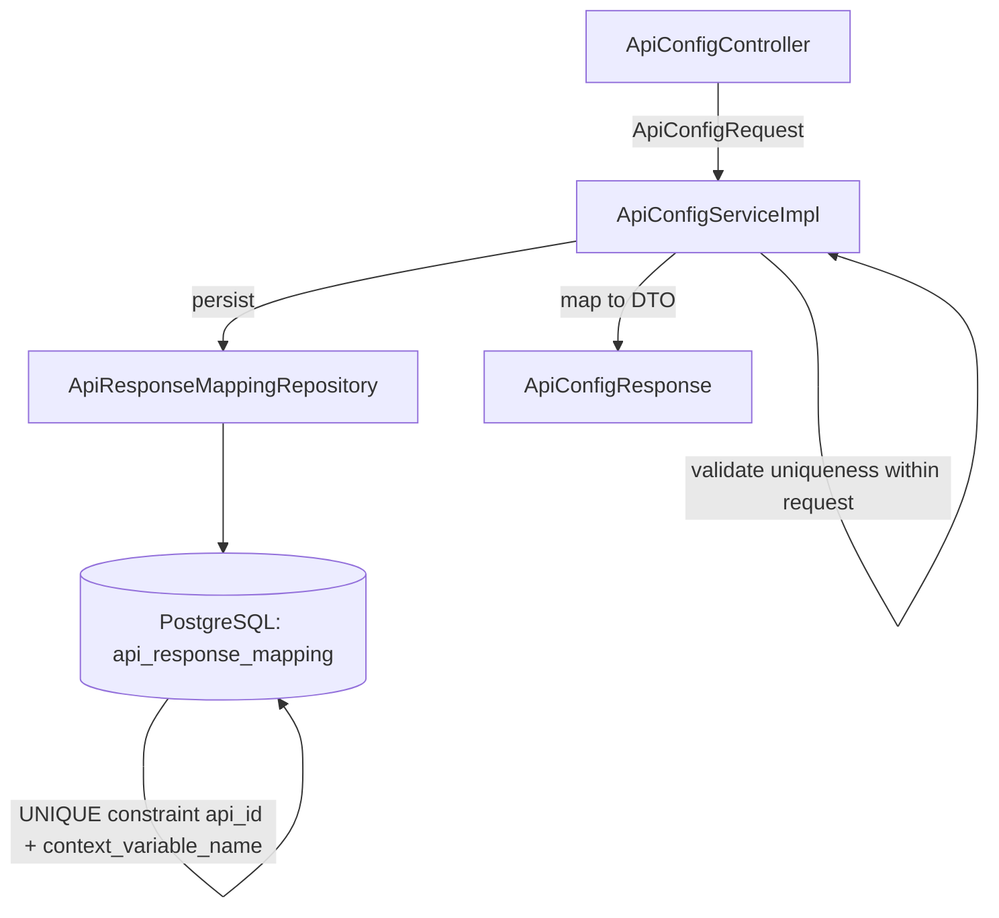

# Design Document: API Response Context Variable

## Overview

This feature extends the `api_response_mapping` table and its associated layers (entity, DTO, service, schema) with a new `context_variable_name` column. The column stores a validated identifier name under which an extracted API response value will be persisted in the chat session context during workflow execution.

The change is purely structural — it adds a field, validates it, enforces uniqueness within a parent `ApiConfig`, and propagates it through the existing CRUD flow. No new endpoints or services are introduced.

### Key Design Decisions

1. **Validation at the service layer** — Format and uniqueness validation occurs in `ApiConfigServiceImpl` before persistence, consistent with existing validation patterns (e.g., method validation, collection size checks).
2. **Database-level constraints as a safety net** — A CHECK constraint for the regex pattern and a UNIQUE constraint on `(api_id, context_variable_name)` protect data integrity even if application-level validation is bypassed.
3. **Replace-all strategy preserved** — The existing update pattern (delete all response mappings, then re-insert) is preserved. Uniqueness validation only considers the incoming set, not previously stored records.
4. **Guarded ALTER TABLE for existing databases** — A `DO` block in `schema.sql` adds the column and constraints only when absent, ensuring idempotent startup.

## Architecture

The feature follows the existing layered architecture with no new layers or cross-cutting concerns:



### Data Flow

1. **Inbound**: Client sends `ApiConfigRequest` with `responseMappings[].contextVariableName`.
2. **Validation**: Service validates each `contextVariableName` is non-blank, matches `^[a-zA-Z_][a-zA-Z0-9_]*$`, ≤255 chars, and unique within the list.
3. **Persistence**: `ApiResponseMapping` entity now carries `contextVariableName`; JPA maps it to the `context_variable_name` column.
4. **Outbound**: `mapToResponse()` populates `ApiResponseMappingDto.contextVariableName` in the response.

## Components and Interfaces

### Modified Components

| Component | Change |
|-----------|--------|
| `ApiResponseMapping` (entity) | Add `contextVariableName` field with `@Column(name = "context_variable_name", nullable = false, length = 255)` |
| `ApiResponseMappingDto` (DTO) | Add `private String contextVariableName` |
| `ApiConfigServiceImpl` (service) | Add validation logic for format, blank check, length, and intra-request uniqueness; set field during create/update mapping |
| `schema.sql` | Add column to CREATE TABLE, add CHECK + UNIQUE constraints, add guarded ALTER TABLE block |

### Validation Interface

Validation is implemented as private helper methods in `ApiConfigServiceImpl`, consistent with `validateRequiredFields`, `validateNumericRanges`, and `validateCollectionSizes`:

```java
private void validateResponseMappings(List<ApiResponseMappingDto> mappings) {
    // 1. For each mapping, validate contextVariableName is non-blank
    // 2. Validate format matches ^[a-zA-Z_][a-zA-Z0-9_]*$
    // 3. Validate length <= 255
    // 4. Collect names; detect duplicates (case-sensitive)
    // 5. Throw IllegalArgumentException with specific message on failure
}
```

### Error Responses

| Scenario | HTTP Status | Error Message Pattern |
|----------|-------------|----------------------|
| Null / blank / whitespace | 400 | `"Field 'context_variable_name' is required"` |
| Invalid format | 400 | `"context_variable_name must start with a letter or underscore and contain only alphanumeric characters and underscores"` |
| Exceeds 255 chars | 400 | `"context_variable_name must not exceed 255 characters"` |
| Duplicate within request | 400 | `"Duplicate context_variable_name: '{value}'"` |
| DB unique constraint violation | 400 | `"Duplicate context_variable_name: '{value}' for this API configuration"` |

## Data Models

### Entity: `ApiResponseMapping`

```java
@Entity
@Table(name = "api_response_mapping",
       uniqueConstraints = @UniqueConstraint(columnNames = {"api_id", "context_variable_name"}))
@Data
@NoArgsConstructor
@AllArgsConstructor
public class ApiResponseMapping {

    @Id
    @GeneratedValue(strategy = GenerationType.IDENTITY)
    private Long id;

    @ManyToOne(fetch = FetchType.LAZY)
    @JoinColumn(name = "api_id", nullable = false)
    private ApiConfig apiConfig;

    @Column(name = "response_path", nullable = false, length = 512)
    private String responsePath;

    @Column(name = "context_variable_name", nullable = false, length = 255)
    private String contextVariableName;   // NEW FIELD

    @Column(name = "created_at", updatable = false)
    private LocalDateTime createdAt;

    @PrePersist
    protected void onCreate() {
        createdAt = LocalDateTime.now();
    }
}
```

### DTO: `ApiResponseMappingDto`

```java
@Data
public class ApiResponseMappingDto {
    private String responsePath;
    private String contextVariableName;  // NEW FIELD
}
```

### Database Schema Addition

```sql
-- In CREATE TABLE IF NOT EXISTS api_response_mapping:
    context_variable_name VARCHAR(255) NOT NULL
        CHECK (context_variable_name ~ '^[a-zA-Z_][a-zA-Z0-9_]*$'),
    UNIQUE (api_id, context_variable_name)

-- Guarded ALTER for existing databases:
DO $$
BEGIN
    IF NOT EXISTS (
        SELECT 1 FROM information_schema.columns
        WHERE table_name = 'api_response_mapping'
          AND column_name = 'context_variable_name'
    ) THEN
        ALTER TABLE api_response_mapping
            ADD COLUMN context_variable_name VARCHAR(255) NOT NULL
                DEFAULT '__migration_placeholder';
        ALTER TABLE api_response_mapping
            ADD CONSTRAINT chk_context_variable_name_format
                CHECK (context_variable_name ~ '^[a-zA-Z_][a-zA-Z0-9_]*$');
        ALTER TABLE api_response_mapping
            ADD CONSTRAINT uq_api_response_mapping_api_id_ctx_var
                UNIQUE (api_id, context_variable_name);
        ALTER TABLE api_response_mapping
            ALTER COLUMN context_variable_name DROP DEFAULT;
    END IF;
END $$;
```

## Correctness Properties

*A property is a characteristic or behavior that should hold true across all valid executions of a system — essentially, a formal statement about what the system should do. Properties serve as the bridge between human-readable specifications and machine-verifiable correctness guarantees.*

### Property 1: Context variable name round-trip preservation

*For any* valid `context_variable_name` value (matching `^[a-zA-Z_][a-zA-Z0-9_]*$`, length 1–255), when an `ApiConfig` is created with a response mapping containing that name, retrieving the `ApiConfig` by ID SHALL return a response DTO whose corresponding response mapping contains the identical `context_variable_name` value.

**Validates: Requirements 1.2, 1.3**

### Property 2: Valid context variable names are accepted

*For any* string that matches the pattern `^[a-zA-Z_][a-zA-Z0-9_]*$` and has length between 1 and 255 inclusive, submitting it as a `context_variable_name` in a response mapping SHALL NOT produce a validation error.

**Validates: Requirements 2.1**

### Property 3: Invalid context variable names are rejected

*For any* string that is null, empty, consists only of whitespace, exceeds 255 characters, or does not match the pattern `^[a-zA-Z_][a-zA-Z0-9_]*$` (e.g., starts with a digit, contains special characters), submitting it as a `context_variable_name` SHALL be rejected with an HTTP 400 response.

**Validates: Requirements 1.4, 2.2, 2.3**

### Property 4: Duplicate context variable names within a request are rejected

*For any* list of response mappings containing two or more entries with the same `context_variable_name` (compared case-sensitively), the system SHALL reject the entire request with an error message identifying the duplicated name, regardless of whether the operation is create or update.

**Validates: Requirements 3.1, 3.2, 3.3**

## Error Handling

### Validation Errors (HTTP 400)

All validation failures are handled via `IllegalArgumentException` thrown from the service layer and caught by the existing `@ExceptionHandler(IllegalArgumentException.class)` in `ApiConfigController`, which returns:

```json
{
  "error": "Validation failed",
  "message": "<specific message>"
}
```

Specific messages:
- `"Field 'context_variable_name' is required"` — null/blank/whitespace
- `"context_variable_name must start with a letter or underscore and contain only alphanumeric characters and underscores"` — regex mismatch
- `"context_variable_name must not exceed 255 characters"` — length exceeded
- `"Duplicate context_variable_name: '{value}'"` — duplicates within the request

### Database Constraint Violation (HTTP 400)

If a `DataIntegrityViolationException` propagates from the persistence layer (e.g., due to a race condition where application validation passes but DB constraint catches a duplicate), the `GlobalExceptionHandler` should catch it and return:

```json
{
  "error": "Validation failed",
  "message": "Duplicate context_variable_name: '{value}' for this API configuration"
}
```

This requires adding a new `@ExceptionHandler` for `DataIntegrityViolationException` in `GlobalExceptionHandler` that inspects the constraint name to provide a user-friendly message.

### Existing Error Paths Unchanged

- `ApiConfigNotFoundException` (404) — unchanged
- `DuplicateApiConfigNameException` (409) — unchanged
- `InvalidMethodException` (400) — unchanged

## Testing Strategy

### Property-Based Tests (jqwik 1.8.2)

The project already uses jqwik. Each correctness property maps to a single property-based test with minimum 100 iterations.

**Library**: `net.jqwik:jqwik:1.8.2` (already in `pom.xml`)

**Test class**: `ApiResponseMappingValidationProperties.java`

| Test | Property | Generator Strategy |
|------|----------|--------------------|
| `validNamesAreAccepted` | Property 2 | Generate strings matching `[a-zA-Z_][a-zA-Z0-9_]{0,254}` |
| `invalidNamesAreRejected` | Property 3 | Generate strings starting with digits, containing special chars, whitespace-only, empty, or > 255 chars |
| `duplicateNamesAreRejected` | Property 4 | Generate lists of valid names with at least one duplicate inserted at random positions |
| `roundTripPreservesContextVariableName` | Property 1 | Generate valid names, persist via service, retrieve, compare |

**Configuration**:
- Each test annotated with `@Property(tries = 100)` minimum
- Each test tagged: `// Feature: api-response-context-variable, Property N: <property text>`

### Unit Tests (JUnit 5)

Unit tests complement property tests with specific examples and edge cases:

- Verify the entity field exists and maps to the correct column (smoke)
- Verify `schema.sql` contains column definition, CHECK, UNIQUE, and DO block (smoke)
- Verify replace-all update strategy doesn't conflict with reused names (example — Req 3.4)
- Verify `DataIntegrityViolationException` handling returns user-friendly message (edge case — Req 3.5)
- Verify exact error message wording for each validation failure type

### Integration Tests

- Full create → read → update → delete cycle with valid `context_variable_name` values
- Verify database CHECK constraint rejects invalid values at DB level
- Verify database UNIQUE constraint rejects duplicates at DB level

