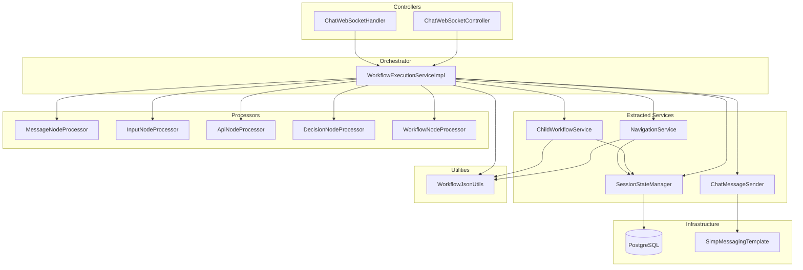
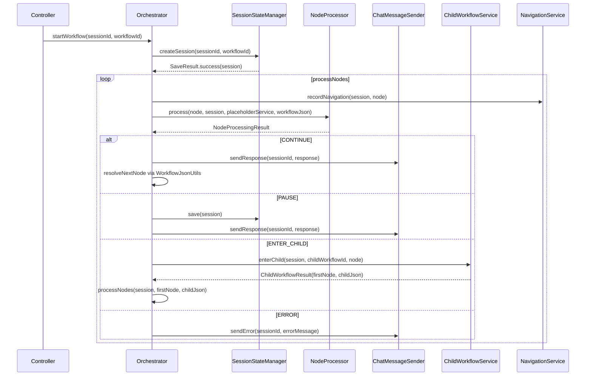
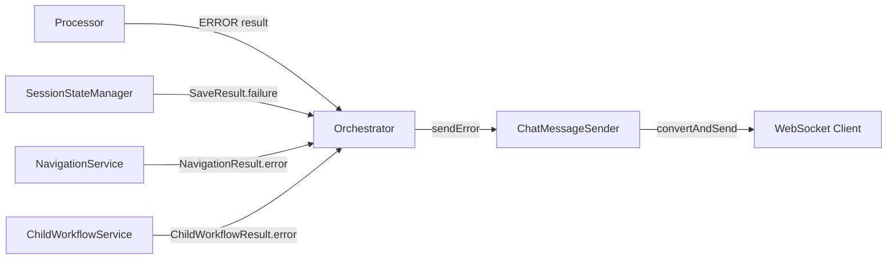

# Design Document: Architecture Refactoring

## Overview

This design decomposes the monolithic `WorkflowExecutionServiceImpl` (~900 lines, 20+ methods) into focused, testable services with clear responsibility boundaries. The refactoring preserves complete behavioral equivalence while enabling independent testing of navigation, child workflows, session persistence, and message sending.

**Design Principles:**
- Single Responsibility: each service owns one concern
- Result-based communication: services return result objects, never throw for expected outcomes
- Infrastructure isolation: processors become pure processing units; only the orchestrator touches infrastructure
- Shared utilities: pure static functions in `WorkflowJsonUtils` eliminate duplicated node resolution logic

**Implementation Order:**
1. Phase 1: Dead code removal (Req 7) + ChatMessageSender (Req 5)
2. Phase 2: workflowJson parameter (Req 6) + decouple processors (Req 8)
3. Phase 3: WorkflowJsonUtils (Req 11) + SessionStateManager (Req 4)
4. Phase 4: NavigationService (Req 2) + ChildWorkflowService (Req 3)
5. Phase 5: Orchestrator slim-down (Req 1) + confirmations (Req 10/12/13/14)
6. Phase 6: Behavioral equivalence verification (Req 9)

## Architecture

### High-Level Component Diagram



### Data Flow: Node Processing Loop



## Components and Interfaces

### 1. WorkflowJsonUtils (Static Utility)

**Package:** `com.xpressbees.chatbot.util`

Pure static utility class containing all node resolution logic extracted from the orchestrator. No dependencies, no mutable state.

```java
public final class WorkflowJsonUtils {

    private WorkflowJsonUtils() {} // prevent instantiation

    /**
     * Finds the target node for a given source node via the first matching transition.
     * @return the target node map, or null if no transition exists
     */
    public static Map<String, Object> resolveNextNode(
            String currentNodeId, Map<String, Object> workflowJson);

    /**
     * Finds a specific target node by its ID (for conditional/targeted routing).
     * Falls back to resolveNextNode(currentNodeId, workflowJson) if targetNodeId is null.
     * @return the target node map, or null if not found
     */
    public static Map<String, Object> resolveNextNode(
            String currentNodeId, String targetNodeId, Map<String, Object> workflowJson);

    /**
     * Returns the first node in a workflow based on the first transition's sourceNodeId.
     * @return the first node map, or null if workflow has no transitions
     */
    public static Map<String, Object> findFirstNode(Map<String, Object> workflowJson);

    /**
     * Locates a node by its ID within the workflow's nodes array.
     * @return the node map, or null if not found
     */
    public static Map<String, Object> findNodeById(
            String nodeId, Map<String, Object> workflowJson);

    /**
     * Finds a target node connected to currentNodeId whose name matches targetName.
     * @return the matching target node map, or null if no match
     */
    public static Map<String, Object> findTargetNodeByName(
            String currentNodeId, String targetName, Map<String, Object> workflowJson);

    /**
     * Extracts the nodeType from a node's config map.
     * @return the nodeType string, or null
     */
    public static String extractNodeType(Map<String, Object> node);
}
```

### 2. ChatMessageSender

**Package:** `com.xpressbees.chatbot.service`

Unified WebSocket message delivery. The sole point of access to `SimpMessagingTemplate` for chat messages.

```java
@Service
public class ChatMessageSender {

    private final SimpMessagingTemplate messagingTemplate;

    public ChatMessageSender(SimpMessagingTemplate messagingTemplate) {
        this.messagingTemplate = messagingTemplate;
    }

    /**
     * Sends a ChatResponse to the session's topic.
     */
    public void sendResponse(String sessionId, ChatResponse response) {
        messagingTemplate.convertAndSend("/topic/chat/" + sessionId, response);
    }

    /**
     * Sends a ChatErrorResponse to the session's topic.
     */
    public void sendError(String sessionId, String errorMessage) {
        ChatErrorResponse error = new ChatErrorResponse(errorMessage, sessionId);
        messagingTemplate.convertAndSend("/topic/chat/" + sessionId, error);
    }
}
```

### 3. SessionStateManager

**Package:** `com.xpressbees.chatbot.service`

Encapsulates all `ChatSessionRepository` access. Returns result objects instead of throwing on DB errors.

```java
@Service
public class SessionStateManager {

    private final ChatSessionRepository chatSessionRepository;

    public SessionStateManager(ChatSessionRepository chatSessionRepository) {
        this.chatSessionRepository = chatSessionRepository;
    }

    /**
     * Persists a ChatSession. Returns SaveResult indicating success or failure.
     */
    public SaveResult save(ChatSession session) {
        try {
            ChatSession saved = chatSessionRepository.save(session);
            return SaveResult.success(saved);
        } catch (DataAccessException e) {
            return SaveResult.failure("Failed to persist session state");
        }
    }

    /**
     * Loads a ChatSession by sessionId.
     * @return Optional containing the session, or empty if not found
     */
    public Optional<ChatSession> findBySessionId(String sessionId) {
        return chatSessionRepository.findBySessionId(sessionId);
    }

    /**
     * Creates and persists a new ChatSession with initial state.
     */
    public SaveResult createSession(String sessionId, Long workflowId) {
        ChatSession session = new ChatSession();
        session.setSessionId(sessionId);
        session.setWorkflowId(workflowId);
        session.setStatus("active");
        session.setContext(new HashMap<>());
        return save(session);
    }
}
```

**SaveResult (inner or separate DTO):**

```java
@Data
public class SaveResult {
    private final boolean success;
    private final ChatSession session;
    private final String errorMessage;

    public static SaveResult success(ChatSession session) {
        return new SaveResult(true, session, null);
    }

    public static SaveResult failure(String errorMessage) {
        return new SaveResult(false, null, errorMessage);
    }
}
```

### 4. NavigationService

**Package:** `com.xpressbees.chatbot.service`

Handles back navigation, restart, and navigation history recording. Returns `NavigationResult` — never throws for expected outcomes.

```java
@Service
public class NavigationService {

    private final WorkflowRepository workflowRepository;
    private final PlaceholderService placeholderService;

    public NavigationService(WorkflowRepository workflowRepository,
                             PlaceholderService placeholderService) {
        this.workflowRepository = workflowRepository;
        this.placeholderService = placeholderService;
    }

    /**
     * Scans navigation history for most recent awaitsInput entry.
     * Restores session state (node position, workflow ID, stack).
     * Resolves the prompt text for the target node.
     *
     * @return NavigationResult with target node info, or unavailable signal
     */
    public NavigationResult handleBack(ChatSession session);

    /**
     * Clears user context variables (non-underscore keys), resets navigation
     * history and workflow stack, restores root workflow ID.
     *
     * @return NavigationResult with first node and workflowJson to resume
     */
    public NavigationResult handleRestart(ChatSession session);

    /**
     * Appends a navigation entry to the session's _navigationHistory.
     * Entry contains: workflowId, nodeId, nodeType, timestamp.
     */
    public void recordNavigationEntry(ChatSession session, Map<String, Object> node);

    /**
     * Marks the last navigation history entry as awaitsInput=true.
     * Called when a processor returns PAUSE.
     */
    public void markLastEntryAwaitsInput(ChatSession session);
}
```

**NavigationResult:**

```java
@Data
public class NavigationResult {

    public enum Outcome { RESUME_NODE, UNAVAILABLE, ERROR }

    private final Outcome outcome;
    private final Map<String, Object> targetNode;     // node to re-send prompt for (handleBack)
    private final Map<String, Object> workflowJson;   // workflow JSON for resumed processing
    private final String prompt;                       // resolved prompt text (handleBack)
    private final String errorMessage;                 // error description if ERROR

    public static NavigationResult resumeNode(Map<String, Object> targetNode,
                                               Map<String, Object> workflowJson,
                                               String prompt) {
        return new NavigationResult(Outcome.RESUME_NODE, targetNode, workflowJson, prompt, null);
    }

    public static NavigationResult unavailable() {
        return new NavigationResult(Outcome.UNAVAILABLE, null, null, null, null);
    }

    public static NavigationResult error(String message) {
        return new NavigationResult(Outcome.ERROR, null, null, null, message);
    }
}
```

### 5. ChildWorkflowService

**Package:** `com.xpressbees.chatbot.service`

Manages child workflow entry and exit. Returns `ChildWorkflowResult` — never throws for expected outcomes.

```java
@Service
public class ChildWorkflowService {

    private final WorkflowRepository workflowRepository;

    public ChildWorkflowService(WorkflowRepository workflowRepository) {
        this.workflowRepository = workflowRepository;
    }

    /**
     * Pushes parent workflow onto stack, switches session to child workflow,
     * clears transient context keys, and returns the child's first node.
     *
     * @return ChildWorkflowResult with first node + child workflowJson, or error
     */
    public ChildWorkflowResult enterChild(ChatSession session,
                                           Long childWorkflowId,
                                           Map<String, Object> workflowNode);

    /**
     * Pops the workflow stack, restores parent workflow ID, resolves next node
     * in parent after the workflow node. Recursively unwinds if parent also has
     * no next node.
     *
     * @return ChildWorkflowResult with next node + parent workflowJson,
     *         or COMPLETE signal, or error
     */
    public ChildWorkflowResult handleChildEnd(ChatSession session);
}
```

**ChildWorkflowResult:**

```java
@Data
public class ChildWorkflowResult {

    public enum Outcome { NEXT_NODE, COMPLETE, ERROR }

    private final Outcome outcome;
    private final Map<String, Object> nextNode;       // node to process next
    private final Map<String, Object> workflowJson;   // active workflow JSON
    private final String errorMessage;

    public static ChildWorkflowResult nextNode(Map<String, Object> node,
                                                Map<String, Object> workflowJson) {
        return new ChildWorkflowResult(Outcome.NEXT_NODE, node, workflowJson, null);
    }

    public static ChildWorkflowResult complete() {
        return new ChildWorkflowResult(Outcome.COMPLETE, null, null, null);
    }

    public static ChildWorkflowResult error(String message) {
        return new ChildWorkflowResult(Outcome.ERROR, null, null, message);
    }
}
```

### 6. Updated NodeProcessor Interface

**Package:** `com.xpressbees.chatbot.processor`

The interface gains a `workflowJson` parameter so processors don't need to query the database for workflow structure.

```java
public interface NodeProcessor {
    boolean canHandle(Map<String, Object> node);

    NodeProcessingResult process(Map<String, Object> node,
                                  ChatSession session,
                                  PlaceholderService placeholderService,
                                  Map<String, Object> workflowJson);
}
```

### 7. Updated NodeProcessingResult

**Package:** `com.xpressbees.chatbot.dto`

Adds an `ERROR` action so processors can signal errors without sending WebSocket messages directly.

```java
@Data
@AllArgsConstructor
public class NodeProcessingResult {

    private Action action;
    private ChatResponse response;
    private String errorMessage;  // populated when action == ERROR

    public enum Action {
        CONTINUE,
        PAUSE,
        COMPLETE,
        ENTER_CHILD,
        ERROR
    }

    // Convenience constructors (backwards-compatible)
    public NodeProcessingResult(Action action, ChatResponse response) {
        this(action, response, null);
    }

    public static NodeProcessingResult error(String message) {
        return new NodeProcessingResult(Action.ERROR, null, message);
    }
}
```

### 8. Refactored Orchestrator (WorkflowExecutionServiceImpl)

After extraction, the orchestrator retains only:

| Method | Responsibility |
|--------|---------------|
| `startWorkflow(sessionId, workflowId)` | Validate pending session, load workflow, create session, begin processing |
| `handleUserInput(sessionId, message)` | Route to resume handler based on nodeType |
| `handleBack(sessionId)` | Delegate to NavigationService, interpret result |
| `handleRestart(sessionId)` | Delegate to NavigationService, interpret result |
| `processNodes(session, node, workflowJson)` | Main loop: invoke processor, interpret action, coordinate services |
| `handleInputNodeResume(session, sessionId, message)` | Validate input, store in context, resolve next node |
| `handleApiNodeResume(session, sessionId, message)` | Validate selection, update context, resolve next node |

**Dependencies (constructor-injected):**

```java
public WorkflowExecutionServiceImpl(
    WorkflowRepository workflowRepository,
    List<NodeProcessor> nodeProcessors,
    PlaceholderService placeholderService,
    InputValidationService inputValidationService,
    ChatWebSocketHandler chatWebSocketHandler,
    NavigationService navigationService,
    ChildWorkflowService childWorkflowService,
    SessionStateManager sessionStateManager,
    ChatMessageSender chatMessageSender
)
```

**Key design decisions:**
- `consumePendingSession` stays here as request validation (Req 12)
- Resume logic stays here because processors are single-pass (Req 10)
- Input validation gate stays here before storing input (Req 14)
- `findProcessor(node)` remains a private helper — it's orchestration logic

### 9. Refactored Processors (Post-Phase 2)

After decoupling, processors have these characteristics:

**ApiNodeProcessor dependencies (after):**
- `ApiConfigRepository` — loads API config
- `HttpExecutor` — executes HTTP calls
- `ResponseExtractor` — extracts JSONPath values
- `ObjectMapper` — serializes payloads

Removed: `WorkflowRepository`, `SimpMessagingTemplate`, `ConditionEvaluator`

Errors previously sent via `messagingTemplate.convertAndSend(...)` now return:
```java
return NodeProcessingResult.error("External API is unreachable (timeout)");
```

Transitions previously resolved via `workflowRepository.findById(...)` now use:
```java
// workflowJson is passed as parameter
List<Map<String, Object>> transitions = (List<Map<String, Object>>) workflowJson.get("transitions");
```

**DecisionNodeProcessor dependencies (after):**
- `ConditionEvaluator` — evaluates condition expressions

Removed: `WorkflowRepository`, `SimpMessagingTemplate`

Errors now return `NodeProcessingResult.error(...)` instead of sending directly.

**MessageNodeProcessor, InputNodeProcessor:** No changes needed — already pure.

**WorkflowNodeProcessor:** Retains `WorkflowRepository` only for the existence check (`findById(childWorkflowId).isPresent()`). This is acceptable because the check prevents pushing invalid IDs onto the stack.

## Data Models

### Result Types

| Type | Outcomes | Fields |
|------|----------|--------|
| `SaveResult` | success, failure | session (on success), errorMessage (on failure) |
| `NavigationResult` | RESUME_NODE, UNAVAILABLE, ERROR | targetNode, workflowJson, prompt, errorMessage |
| `ChildWorkflowResult` | NEXT_NODE, COMPLETE, ERROR | nextNode, workflowJson, errorMessage |
| `NodeProcessingResult` | CONTINUE, PAUSE, ENTER_CHILD, ERROR, COMPLETE | response, errorMessage |

### Session Context Keys (Internal)

| Key | Type | Purpose |
|-----|------|---------|
| `_rootWorkflowId` | Long | Root workflow ID for restart |
| `_navigationHistory` | List<Map> | Navigation entries for back nav |
| `_workflowStack` | List<Map> | Parent workflow stack for child workflows |
| `_targetNodeId` | String | Transient: targeted routing from decision nodes |
| `_inputVariableName` | String | Transient: variable name for next user input |
| `_displayVariable` | String | Transient: array display variable for API node |
| `_buttonOptions` | String | Transient: newline-separated button options |
| `_childWorkflowId` | Long | Transient: child workflow ID for ENTER_CHILD |

### Navigation History Entry

```java
Map<String, Object> entry = Map.of(
    "workflowId", session.getWorkflowId(),
    "nodeId", node.get("id"),
    "nodeType", WorkflowJsonUtils.extractNodeType(node),
    "timestamp", Instant.now().toString(),
    "awaitsInput", false  // set to true on PAUSE
);
```

### Workflow Stack Entry

```java
Map<String, Object> stackEntry = Map.of(
    "parentWorkflowId", session.getWorkflowId(),
    "workflowNodeId", workflowNode.get("id")
);
```

## Correctness Properties

*A property is a characteristic or behavior that should hold true across all valid executions of a system — essentially, a formal statement about what the system should do. Properties serve as the bridge between human-readable specifications and machine-verifiable correctness guarantees.*

### Property 1: resolveNextNode returns the correct target

*For any* workflow JSON containing a nodes array and transitions array, and any node ID that appears as a `sourceNodeId` in a transition, `WorkflowJsonUtils.resolveNextNode(nodeId, workflowJson)` SHALL return the node whose ID matches the transition's `targetNodeId`, or null if no matching transition exists.

**Validates: Requirements 11.1**

### Property 2: findFirstNode returns the source of the first transition

*For any* workflow JSON with a non-empty transitions array, `WorkflowJsonUtils.findFirstNode(workflowJson)` SHALL return the node whose ID equals the first transition's `sourceNodeId`. For empty or null transitions, it SHALL return null.

**Validates: Requirements 11.2**

### Property 3: findNodeById locates exactly the node with the given ID

*For any* workflow JSON with a nodes array and any string ID, `WorkflowJsonUtils.findNodeById(id, workflowJson)` SHALL return the node map where `node.get("id").equals(id)`, or null if no such node exists.

**Validates: Requirements 11.3**

### Property 4: findTargetNodeByName finds the correctly named target

*For any* workflow JSON, source node ID, and target name string, `WorkflowJsonUtils.findTargetNodeByName(sourceId, targetName, workflowJson)` SHALL return a node that is (a) connected to sourceId via a transition AND (b) has a `name` field equal to targetName, or null if no such connected node exists.

**Validates: Requirements 11.4**

### Property 5: handleBack finds the correct target or signals unavailable

*For any* ChatSession with a navigation history (possibly empty, possibly spanning multiple workflows), `NavigationService.handleBack(session)` SHALL return a NavigationResult where: if at least one entry has `awaitsInput == true`, the result is RESUME_NODE targeting the most recent such entry; otherwise the result is UNAVAILABLE. Cross-workflow entries SHALL trigger correct stack unwinding so that `session.getWorkflowId()` matches the target entry's workflowId.

**Validates: Requirements 2.1, 2.4, 2.5**

### Property 6: handleRestart clears user context and resets structural keys

*For any* ChatSession context containing user variables (keys not prefixed with `_`) and internal keys (`_rootWorkflowId`, `_navigationHistory`, `_workflowStack`), after `NavigationService.handleRestart(session)`: all non-underscore keys SHALL be removed, `_navigationHistory` SHALL be an empty list, `_workflowStack` SHALL be an empty list, and the session's workflowId SHALL equal the value of `_rootWorkflowId`.

**Validates: Requirements 2.2, 2.3**

### Property 7: recordNavigationEntry appends a correct entry

*For any* ChatSession and node map, after `NavigationService.recordNavigationEntry(session, node)`, the last element of `session.getContext().get("_navigationHistory")` SHALL contain `workflowId` equal to session's current workflowId, `nodeId` equal to `node.get("id")`, `nodeType` equal to the node's config nodeType, and a non-null `timestamp`.

**Validates: Requirements 2.3**

### Property 8: ChildWorkflowService enter/end produces correct results

*For any* ChatSession and valid child workflow ID, `ChildWorkflowService.enterChild(session, childWorkflowId, node)` SHALL return a ChildWorkflowResult with outcome NEXT_NODE containing the child workflow's first node and workflowJson, the workflow stack SHALL have grown by one entry with `parentWorkflowId` and `workflowNodeId`, and session's workflowId SHALL be updated to childWorkflowId. *For any* ChatSession with a non-empty workflow stack, `handleChildEnd(session)` SHALL pop the stack, restore the parent workflow ID, and return the next node after the workflow node in the parent — or COMPLETE if the stack is empty and no next node exists.

**Validates: Requirements 3.1, 3.2, 3.4**

### Property 9: Processors return ERROR result for error conditions

*For any* error condition within a processor (missing API config, invalid ID, HTTP failure, no matching condition, extraction failure), the processor SHALL return `NodeProcessingResult` with action `ERROR` and a non-null `errorMessage`, and SHALL NOT invoke `SimpMessagingTemplate` directly.

**Validates: Requirements 8.1, 8.2, 8.3, 8.4, 8.5**

### Property 10: Behavioral equivalence of WebSocket message sequences

*For any* valid workflow definition (with nodes and transitions) and any valid sequence of user inputs, the refactored system SHALL produce the same ordered sequence of WebSocket messages (both ChatResponse and ChatErrorResponse objects with identical field values) as the current implementation.

**Validates: Requirements 9.1, 9.2, 9.3, 9.4, 9.5**

### Property 11: Input validation failure blocks node advancement

*For any* user input that fails the configured validation rules for the current input node, the orchestrator SHALL send an error response and the session's current node position SHALL remain unchanged (the next node SHALL NOT be processed).

**Validates: Requirements 14.1, 14.2**

### Property 12: Orchestrator dispatches correctly per NodeProcessingResult action

*For any* NodeProcessingResult returned by a processor, the orchestrator SHALL: send the response via ChatMessageSender and resolve the next node when action is CONTINUE; save session and send response when action is PAUSE; delegate to ChildWorkflowService when action is ENTER_CHILD; send error via ChatMessageSender when action is ERROR.

**Validates: Requirements 1.6, 10.3, 10.4**

## Error Handling

### Error Strategy by Layer

| Layer | Strategy |
|-------|----------|
| **Processors** | Return `NodeProcessingResult.error(message)` — never throw, never send directly |
| **SessionStateManager** | Catch `DataAccessException`, return `SaveResult.failure(message)` |
| **NavigationService** | Return `NavigationResult.error(message)` or `NavigationResult.unavailable()` |
| **ChildWorkflowService** | Return `ChildWorkflowResult.error(message)` or `ChildWorkflowResult.complete()` |
| **Orchestrator** | Interprets result objects, calls `chatMessageSender.sendError(...)` for all error paths |
| **Unexpected failures** | Runtime exceptions propagate to Spring's global exception handler |

### Error Propagation Flow



### Specific Error Conditions

| Condition | Current Behavior | Refactored Behavior |
|-----------|-----------------|---------------------|
| API config not found | Processor returns CONTINUE with error message | Processor returns ERROR with message |
| HTTP timeout | Processor sends error via messagingTemplate, returns PAUSE | Processor returns ERROR with message |
| No matching condition (decision) | Processor sends error via messagingTemplate, returns PAUSE | Processor returns ERROR with message |
| DB save fails | Orchestrator catches DataAccessException, sends error | SessionStateManager returns failure, orchestrator sends error |
| Child workflow not found | Orchestrator sends error directly | ChildWorkflowService returns error result, orchestrator sends error |
| Back navigation unavailable | Orchestrator sends error directly | NavigationService returns UNAVAILABLE, orchestrator sends error |

## Testing Strategy

### Property-Based Testing (jqwik 1.8.2)

Property-based testing is appropriate for this refactoring because:
- `WorkflowJsonUtils` contains pure functions with clear input/output (graph traversal)
- NavigationService handles varied navigation histories (varying length, positions, cross-workflow)
- ChildWorkflowService manages stacks of varying depth
- Behavioral equivalence must hold across all possible workflow structures

**Configuration:** Minimum 100 iterations per property test.

**Library:** jqwik 1.8.2 (already in project dependencies)

**Property tests to implement:**

| Property | Generator Strategy |
|----------|--------------------|
| 1–4 (WorkflowJsonUtils) | Generate random workflow JSON maps with 1–20 nodes and 0–25 transitions, random IDs and names |
| 5 (handleBack) | Generate navigation histories with 0–30 entries, random `awaitsInput` placement, multi-workflow entries |
| 6 (handleRestart) | Generate session contexts with 0–10 user keys and internal keys, random `_rootWorkflowId` |
| 7 (recordNavigationEntry) | Generate random nodes with config maps and random session state |
| 8 (ChildWorkflowService) | Generate workflow stacks of depth 0–10, child workflows with 1–10 nodes |
| 9 (Processors ERROR) | Generate invalid API configs, unreachable URLs, missing conditions |
| 10 (Behavioral equivalence) | Generate linear and branching workflows with 2–15 nodes, simulate user input sequences |
| 11 (Validation blocks) | Generate input strings and validation configs that should fail |
| 12 (Orchestrator dispatch) | Generate all NodeProcessingResult action variants with random payloads |

### Unit Tests (JUnit 5)

Unit tests cover specific examples and integration points:

- **ChatMessageSender:** Verify `convertAndSend` called with `/topic/chat/{sessionId}`
- **SessionStateManager:** Verify create, save success, save failure (mock DataAccessException)
- **Dead code removal (Req 7):** Compilation test — removed fields should not exist
- **consumePendingSession (Req 12):** Test `startWorkflow` with pending=true and pending=false
- **Infinite loop threshold:** Test with 51 message nodes, verify error at threshold

### Integration Tests

- **End-to-end workflow execution:** Start workflow via WebSocket, send inputs, verify response sequence
- **Cross-workflow back navigation:** Enter child, navigate back to parent node
- **Restart mid-workflow:** Verify session resets and execution restarts from first node

### Behavioral Equivalence Verification (Phase 6)

Strategy: Capture golden output from the current implementation before refactoring, then replay the same inputs against the refactored implementation and diff the WebSocket message sequences.

1. Define a set of representative workflow definitions (linear, branching, nested child, error cases)
2. Record the exact sequence of `ChatResponse` and `ChatErrorResponse` messages for each scenario
3. After refactoring, replay identical inputs and assert identical output sequences
4. Use jqwik to generate additional random workflows for broader coverage
