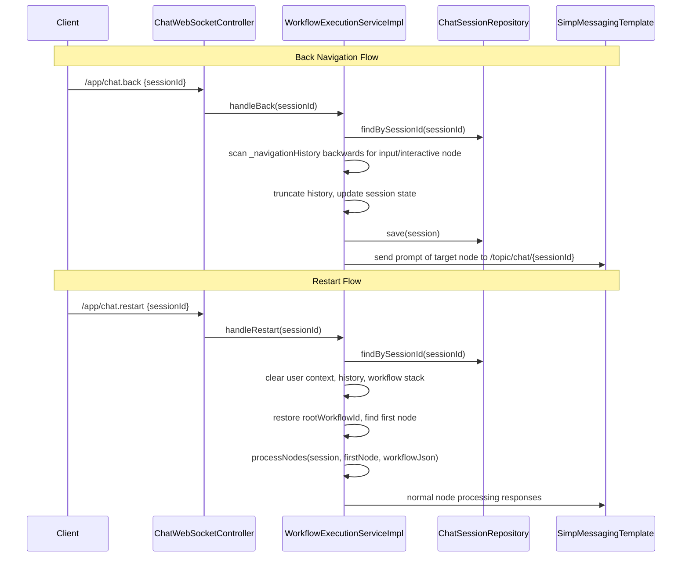

# Design Document: Chat Back Navigation

## Overview

This design adds two new WebSocket message handlers (`chat.back` and `chat.restart`) to the chatbot workflow engine. These handlers allow users to navigate backwards to a previous input node or restart the entire conversation from the beginning — without closing the WebSocket session.

The implementation extends the existing layered architecture: new STOMP message mappings in the controller delegate to new methods on `WorkflowExecutionService`, which manipulate the session's `_navigationHistory` and `_workflowStack` context structures to reposition execution.

**Key Design Decisions:**
- Reuse the existing `_navigationHistory` list (already recorded per node visit) rather than introducing a new data structure. The history entries are enhanced with `nodeType` metadata to enable efficient backward scanning.
- Back-navigation targets the most recent "input" or interactive API node — skipping message/api-auto-advance nodes — because those are the only nodes where the user provided a response.
- Restart reuses the existing `processNodes` method after clearing context, ensuring the restarted flow behaves identically to a fresh `chat.start`.
- A new `_rootWorkflowId` key is stored in context at workflow start to ensure restart always returns to the correct root workflow, even after child workflow entries.

## Architecture



### Layer Responsibilities

| Layer | Responsibility |
|-------|---------------|
| Controller (`ChatWebSocketController`) | Accept `/app/chat.back` and `/app/chat.restart` STOMP messages, delegate to service |
| DTO (`ChatBackRequest`) | Carry `sessionId` from client to controller |
| Service Interface (`WorkflowExecutionService`) | Declare `handleBack(String)` and `handleRestart(String)` |
| Service Impl (`WorkflowExecutionServiceImpl`) | Implement navigation history scanning, context manipulation, session state updates |
| Entity (`ChatSession`) | No schema change — existing `context` JSONB column stores all navigation state |
| Repository (`ChatSessionRepository`) | No change — existing `findBySessionId` is sufficient |

## Components and Interfaces

### New DTO: `ChatBackRequest`

A minimal request DTO matching the existing pattern (`ChatStartRequest`, `ChatMessageRequest`).

```java
@Data
public class ChatBackRequest {
    private String sessionId;
}
```

This single DTO serves both `chat.back` and `chat.restart` since both require only a `sessionId`.

### Controller Changes: `ChatWebSocketController`

Two new `@MessageMapping` methods:

```java
@MessageMapping("/chat.back")
public void handleBack(ChatBackRequest request) {
    workflowExecutionService.handleBack(request.getSessionId());
}

@MessageMapping("/chat.restart")
public void handleRestart(ChatBackRequest request) {
    workflowExecutionService.handleRestart(request.getSessionId());
}
```

### Service Interface Extension: `WorkflowExecutionService`

```java
void handleBack(String sessionId);
void handleRestart(String sessionId);
```

### Service Implementation: `WorkflowExecutionServiceImpl`

#### `handleBack(String sessionId)` Algorithm

1. Validate session exists and is not completed.
2. Retrieve `_navigationHistory` from session context.
3. Scan backwards through history entries looking for the most recent entry where `nodeType` is `"input"` or the node is an interactive API node (has `_displayVariable` or `_buttonOptions` — detected by `nodeType` being `"api"` with a pause indicator).
   - For simplicity: scan for entries with `nodeType == "input"`. Interactive API nodes also set `currentNodeType` to `"api"` but they pause. We augment the navigation entry with `nodeType` from the node config to distinguish.
4. If no target found → send error "No previous input to go back to".
5. If target found:
   a. Truncate `_navigationHistory` to remove the target entry and everything after it.
   b. If the target's `workflowId` differs from the session's current `workflowId`, unwind the `_workflowStack` until the session's workflow matches.
   c. Update `session.currentNodeId`, `session.currentNodeType`, `session.workflowId`.
   d. Load the target workflow, find the target node, and send its prompt (`name` field after placeholder resolution) as a `ChatResponse` via WebSocket.
   e. Persist session.

#### `handleRestart(String sessionId)` Algorithm

1. Validate session exists.
2. Retrieve `_rootWorkflowId` from context (stored during `startWorkflow`).
3. Clear all user context variables (keys not prefixed with `_`).
4. Clear `_navigationHistory` (set to empty list).
5. Clear `_workflowStack` (set to empty list).
6. Set `session.workflowId` to root workflow ID.
7. If session status is "completed", reset to "active".
8. Load root workflow, find first node.
9. Call `processNodes(session, firstNode, workflowJson)` — this reuses all existing execution logic.

#### Enhanced `recordNavigationEntry`

The existing method already records `workflowId`, `nodeId`, and `timestamp`. It will be extended to also record `nodeType` extracted from the node's config:

```java
private void recordNavigationEntry(ChatSession session, Map<String, Object> node) {
    // ... existing code ...
    entry.put("nodeType", extractNodeType(node)); // NEW
    navigationHistory.add(entry);
}

private String extractNodeType(Map<String, Object> node) {
    Map<String, Object> config = (Map<String, Object>) node.get("config");
    if (config != null && config.get("nodeType") != null) {
        return (String) config.get("nodeType");
    }
    return null; // message nodes have no nodeType in config
}
```

#### Enhanced `startWorkflow`

Store the root workflow ID in context so `handleRestart` can always find it:

```java
// After session is loaded and before processNodes:
context.put("_rootWorkflowId", workflowId);
```

### Detecting Interactive API Nodes in Back Navigation

An interactive API node is one that causes a PAUSE action. During `recordNavigationEntry`, we don't know if the API node will pause. Instead, when scanning backwards in `handleBack`, we check if the history entry's `nodeType` is `"api"` AND the entry's `nodeId` matches the session's `currentNodeId` when it was paused (i.e., the last entry before the current position).

Simpler approach: also record whether the node caused a pause. We add an `"awaitsInput"` boolean field to the navigation entry, set to `true` when the node processor returns `PAUSE`. This is set after processing:

```java
// In processNodes, after PAUSE:
List<Map<String, Object>> history = getNavigationHistory(session.getContext());
if (!history.isEmpty()) {
    history.get(history.size() - 1).put("awaitsInput", true);
}
```

This makes the back-scan straightforward: find the last entry where `awaitsInput == true`.

## Data Models

### Navigation Entry (Enhanced)

```json
{
  "workflowId": 1,
  "nodeId": "node-abc-123",
  "nodeType": "input",
  "awaitsInput": true,
  "timestamp": "2024-01-15T10:30:00Z"
}
```

| Field | Type | Description |
|-------|------|-------------|
| `workflowId` | Long | The workflow containing this node |
| `nodeId` | String | The node's unique ID within the workflow |
| `nodeType` | String/null | From `config.nodeType`: "input", "api", "workflow", or null for message |
| `awaitsInput` | Boolean | `true` if this node paused for user input |
| `timestamp` | String (ISO) | When the node was visited |

### Context Keys (New)

| Key | Type | Set By | Purpose |
|-----|------|--------|---------|
| `_rootWorkflowId` | Long | `startWorkflow` | Identifies the root workflow for restart |
| `_navigationHistory[].nodeType` | String | `recordNavigationEntry` | Enables back-scan filtering |
| `_navigationHistory[].awaitsInput` | Boolean | `processNodes` (after PAUSE) | Marks entries eligible for back-navigation |

### No Database Schema Changes

All new data lives in the existing `context` JSONB column on `chat_session`. No DDL migration is required.

## Correctness Properties

*A property is a characteristic or behavior that should hold true across all valid executions of a system — essentially, a formal statement about what the system should do. Properties serve as the bridge between human-readable specifications and machine-verifiable correctness guarantees.*

### Property 1: Navigation entry structure preservation

*For any* workflow node (with any combination of nodeType config — "input", "api", "workflow", or absent), when `recordNavigationEntry` is called, the resulting entry SHALL contain all required fields (`workflowId` as Long, `nodeId` as String, `nodeType` as String or null, `timestamp` as non-empty String) and `nodeType` SHALL equal the node's `config.nodeType` value.

**Validates: Requirements 1.1, 1.2**

### Property 2: Back-scan correctness

*For any* navigation history containing a mix of node entries (message, input, api with and without awaitsInput), the back-scan algorithm SHALL return the most recent entry where `awaitsInput == true`, and after applying it, the session's `currentNodeId` SHALL equal the target entry's `nodeId`, and `currentNodeType` SHALL equal the target entry's `nodeType`. This holds regardless of whether the target is in the current workflow or a parent workflow.

**Validates: Requirements 3.1, 3.2, 3.3, 4.1**

### Property 3: History truncation on back-navigation

*For any* navigation history of length N with a target entry at index K (0-based), after back-navigation the history SHALL contain exactly K entries (indices 0 through K-1), and no entry at index >= K SHALL remain.

**Validates: Requirements 3.4**

### Property 4: Workflow stack unwinding on cross-workflow back

*For any* workflow stack of depth D and a target navigation entry whose `workflowId` differs from the session's current workflow, the stack SHALL be unwound (entries removed from the top) until the session's `workflowId` matches the target entry's `workflowId`, and the session's `workflowId` SHALL be updated to the target's `workflowId`.

**Validates: Requirements 4.2, 4.3**

### Property 5: Single-step back granularity

*For any* navigation history containing multiple entries with `awaitsInput == true`, a single `handleBack` invocation SHALL target exactly one entry — the most recent one — and subsequent `awaitsInput` entries SHALL remain in the (now truncated) history for future back-navigation.

**Validates: Requirements 6.1**

### Property 6: Restart clears user state and restores root workflow

*For any* session context containing a mix of user context variables (keys without underscore prefix) and internal keys (keys with underscore prefix), after `handleRestart`: (a) no user context variable keys SHALL remain, (b) `_navigationHistory` SHALL be an empty list, (c) `_workflowStack` SHALL be an empty list, and (d) the session's `workflowId` SHALL equal the stored `_rootWorkflowId`.

**Validates: Requirements 8.1, 8.2, 8.3, 9.1**

## Error Handling

| Scenario | Error Message | Sent Via |
|----------|---------------|----------|
| `handleBack` with non-existent sessionId | "No active session found" | WebSocket `/topic/chat/{sessionId}` |
| `handleBack` on completed session | "Session is already completed" | WebSocket `/topic/chat/{sessionId}` |
| `handleBack` with no input in history | "No previous input to go back to" | WebSocket `/topic/chat/{sessionId}` |
| `handleRestart` with non-existent sessionId | "No active session found" | WebSocket `/topic/chat/{sessionId}` |
| `handleRestart` when root workflow not found | "Workflow not found" | WebSocket `/topic/chat/{sessionId}` |
| `handleRestart` when root workflow has no first node | "Workflow has no starting node" | WebSocket `/topic/chat/{sessionId}` |
| Database save failure during back/restart | "Failed to persist session state" | WebSocket `/topic/chat/{sessionId}` |

Error responses use the existing `ChatErrorResponse` DTO and `sendError` helper method — no new error handling infrastructure is needed.

### Design Rationale for Error Handling

- Errors are sent via WebSocket (not thrown as exceptions) to match the existing pattern in `handleUserInput` and `startWorkflow`.
- Guard checks (session existence, completion status) are performed before any state mutation to avoid partial updates.
- Database persistence failures are caught and reported without crashing the WebSocket connection.

## Testing Strategy

### Property-Based Tests (jqwik)

The project already uses jqwik 1.8.2. Each correctness property maps to a single property-based test with minimum 100 iterations.

| Property | Test Class | What Varies |
|----------|-----------|-------------|
| 1: Entry structure | `NavigationEntryPropertyTest` | Node config combinations (type, nodeType, id) |
| 2: Back-scan correctness | `BackScanPropertyTest` | History composition (mixed node types, varying lengths, multi-workflow) |
| 3: History truncation | `BackScanPropertyTest` | History length and target position |
| 4: Stack unwinding | `WorkflowStackPropertyTest` | Stack depth, target workflow position |
| 5: Single-step granularity | `BackScanPropertyTest` | Number and position of input entries |
| 6: Restart state clearing | `RestartPropertyTest` | Context key composition (user vs internal), stack depth |

**Property test tagging format:**
```java
// Feature: chat-back-navigation, Property 1: Navigation entry structure preservation
```

### Unit Tests (JUnit 5)

Focus on specific examples and edge cases not covered by property tests:

- Controller delegation (mock service, verify method calls)
- Error paths: completed session, missing session, empty history
- Restart with completed session resets status to "active"
- Back-navigation re-entering input node: verify `handleInputNodeResume` works after back

### Integration Tests

- Full WebSocket flow: connect → start → answer → back → re-answer → verify context updated
- Restart mid-conversation: connect → start → answer several nodes → restart → verify full replay
- Cross-workflow back: start parent → enter child → back to parent input → verify workflow stack unwound

### Test Configuration

- jqwik property tests: `@Property(tries = 100)` minimum
- Unit tests extract the pure logic (scanning, truncation, context clearing) into testable helper methods to enable isolated property testing without Spring context
- Integration tests use `@SpringBootTest` with embedded broker for WebSocket verification

