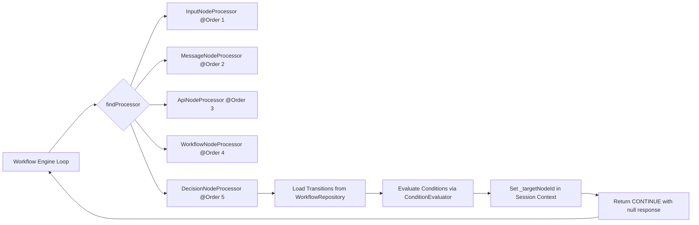
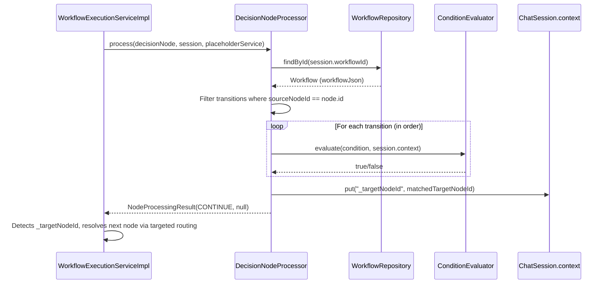

# Design Document: Decision Node Processor

## Overview

The Decision Node Processor introduces a conditional routing node type (`"decision"`) to the chatbot workflow engine. Unlike existing processors that produce user-facing output (message, input) or perform external operations (API), the decision node is a silent pass-through that evaluates conditions on its outgoing transitions against session context and directs execution to the first matching target.

The processor integrates into the existing `NodeProcessor` chain at `@Order(5)` and leverages the engine's existing `_targetNodeId` mechanism for targeted routing — requiring zero changes to `WorkflowExecutionServiceImpl`.



## Architecture

### System Context



### Key Design Decisions

1. **Reuse existing `_targetNodeId` mechanism** — The engine already checks for this key after CONTINUE results. The decision processor simply sets it and returns CONTINUE with a null response. No engine modifications needed.

2. **Type field is `"decision"` at top level** — Unlike input/message/api nodes that use `type: "state"` + `config.nodeType`, decision nodes use `type: "decision"` directly. This distinguishes them structurally since they have no config payload.

3. **Error via WebSocket + PAUSE** — On failure (no workflow, no transitions, no match), the processor sends a `ChatErrorResponse` via `SimpMessagingTemplate` and returns PAUSE. This follows the pattern used by `ApiNodeProcessor` for HTTP failures.

4. **First-match-wins semantics** — Transitions are evaluated in array order. The first condition that evaluates to `true` wins. This gives workflow designers deterministic, predictable routing.

## Components and Interfaces

### DecisionNodeProcessor

```java
package com.xpressbees.chatbot.processor;

@Component
@Order(5)
public class DecisionNodeProcessor implements NodeProcessor {

    private final WorkflowRepository workflowRepository;
    private final ConditionEvaluator conditionEvaluator;
    private final SimpMessagingTemplate messagingTemplate;

    // Constructor injection
    public DecisionNodeProcessor(WorkflowRepository workflowRepository,
                                  ConditionEvaluator conditionEvaluator,
                                  SimpMessagingTemplate messagingTemplate) { ... }

    @Override
    public boolean canHandle(Map<String, Object> node);

    @Override
    public NodeProcessingResult process(Map<String, Object> node,
                                         ChatSession session,
                                         PlaceholderService placeholderService);
}
```

### Method Specifications

#### `canHandle(Map<String, Object> node)`

- Returns `true` if `node.get("type")` equals `"decision"` (case-sensitive)
- Returns `false` for null type, missing type, or any other type value
- Does NOT check config (decision nodes have no config)

#### `process(Map<String, Object> node, ChatSession session, PlaceholderService placeholderService)`

Algorithm:

1. Extract `node.get("id")` as the decision node ID
2. Load workflow from `workflowRepository.findById(session.getWorkflowId())`
   - If not found or workflowJson is null → send error, return PAUSE
3. Extract transitions array from workflowJson
4. Filter transitions where `sourceNodeId` equals the decision node's ID (preserve order)
   - If zero outgoing transitions → send error, return PAUSE
5. Iterate filtered transitions in order:
   - If `condition` is null or empty → skip
   - Call `conditionEvaluator.evaluate(condition, session.getContext())`
   - If true:
     - Validate `targetNodeId` is not null/empty (else send error, return PAUSE)
     - Store `targetNodeId` as `_targetNodeId` in session context
     - Return `new NodeProcessingResult(Action.CONTINUE, null)`
6. If no condition matched → send "No matching condition found for decision node" error, return PAUSE

### Interaction with Existing Components

| Component | Interaction |
|-----------|-------------|
| `WorkflowExecutionServiceImpl` | Discovers processor via `canHandle`, calls `process`, reads `_targetNodeId` from context after CONTINUE |
| `WorkflowRepository` | Provides workflow JSON containing transitions |
| `ConditionEvaluator` | Evaluates condition expressions against session context |
| `SimpMessagingTemplate` | Sends `ChatErrorResponse` on failure cases |
| `ChatSession` | Reads `workflowId`, reads/writes `context` map |

## Data Models

### Decision Node in Workflow JSON

```json
{
  "id": "node-abc-123",
  "type": "decision",
  "name": "Check User Status"
}
```

Key differences from other node types:
- `type` is `"decision"` (not `"state"`)
- No `config` field (routing logic is entirely in transitions)

### Transitions with Conditions

```json
{
  "transitions": [
    {
      "sourceNodeId": "node-abc-123",
      "targetNodeId": "node-active-path",
      "condition": "userStatus == active"
    },
    {
      "sourceNodeId": "node-abc-123",
      "targetNodeId": "node-inactive-path",
      "condition": "userStatus == inactive"
    },
    {
      "sourceNodeId": "node-abc-123",
      "targetNodeId": "node-fallback",
      "condition": "userStatus != active and userStatus != inactive"
    }
  ]
}
```

### Session Context (Runtime)

After successful condition match:
```json
{
  "userStatus": "active",
  "_targetNodeId": "node-active-path"
}
```

The engine consumes and removes `_targetNodeId` immediately after resolution.


## Correctness Properties

*A property is a characteristic or behavior that should hold true across all valid executions of a system — essentially, a formal statement about what the system should do. Properties serve as the bridge between human-readable specifications and machine-verifiable correctness guarantees.*

### Property 1: canHandle Correctness

*For any* node map, `canHandle` shall return `true` if and only if `node.get("type")` equals the string `"decision"` (case-sensitive). For all other type values (including null, empty string, or any other string), it shall return `false`.

**Validates: Requirements 1.1, 1.2**

### Property 2: Transition Filtering Preserves Source Order

*For any* workflow JSON containing a mix of transitions (some with `sourceNodeId` matching the decision node's ID and some not), the processor shall select exactly those transitions whose `sourceNodeId` equals the node's ID, and their relative order shall match their original index order in the JSON array.

**Validates: Requirements 2.2**

### Property 3: First-Match-Wins Routing

*For any* ordered list of outgoing transitions with non-null/non-empty conditions and a session context, the processor shall evaluate conditions in array order, skip transitions with null/empty conditions, and store the `targetNodeId` of the FIRST transition whose condition evaluates to `true` as `_targetNodeId` in session context, returning `CONTINUE` with a `null` response.

**Validates: Requirements 3.1, 3.2, 3.3, 3.4**

### Property 4: No-Match Error Without Context Pollution

*For any* session context and ordered list of outgoing transitions where no condition evaluates to `true`, the processor shall return `PAUSE` with a `null` response, send the error message "No matching condition found for decision node", and SHALL NOT store `_targetNodeId` in session context.

**Validates: Requirements 4.1, 4.2, 4.3**

### Property 5: Silent Success (No WebSocket Messages on Match)

*For any* successful condition match (where a transition's condition evaluates to `true` and the target node ID is valid), the processor shall NOT send any `ChatResponse` or `ChatErrorResponse` via `SimpMessagingTemplate`.

**Validates: Requirements 5.1, 5.2**

### Property 6: Context Isolation on Success

*For any* successful processing of a decision node, the processor shall only add or modify the `_targetNodeId` key in session context. No other internal keys (`_inputVariableName`, `_displayVariable`, `_buttonOptions`, `_childWorkflowId`) shall be added, removed, or modified.

**Validates: Requirements 6.3**

## Error Handling

| Scenario | Error Message | Action | WebSocket? |
|----------|---------------|--------|------------|
| Workflow not found in repository | "Workflow is no longer available" | PAUSE | ChatErrorResponse to `/topic/chat/{sessionId}` |
| workflowJson is null | "Workflow is no longer available" | PAUSE | ChatErrorResponse to `/topic/chat/{sessionId}` |
| Zero outgoing transitions | "Decision node has no outgoing transitions" | PAUSE | ChatErrorResponse to `/topic/chat/{sessionId}` |
| Matched transition has null/empty targetNodeId | "Matched transition has no target node" | PAUSE | ChatErrorResponse to `/topic/chat/{sessionId}` |
| No condition matches | "No matching condition found for decision node" | PAUSE | ChatErrorResponse to `/topic/chat/{sessionId}` |

Error handling follows the same pattern as `ApiNodeProcessor`: send a `ChatErrorResponse` via `SimpMessagingTemplate` and return `new NodeProcessingResult(Action.PAUSE, null)`.

On PAUSE, the engine stops processing the chain. The session remains in its current state (not marked completed), allowing the workflow designer to diagnose the configuration issue.

## Testing Strategy

### Property-Based Tests (jqwik 1.8.2)

Each correctness property is implemented as a single jqwik `@Property` test with a minimum of 100 iterations (jqwik defaults to 1000 tries, exceeding the minimum).

**Test class:** `src/test/java/com/xpressbees/chatbot/processor/DecisionNodeProcessorPropertyTest.java`

**Dependencies under test:**
- `DecisionNodeProcessor` — unit under test
- `ConditionEvaluator` — real instance (pure function, no external deps)
- `WorkflowRepository` — mocked (Mockito)
- `SimpMessagingTemplate` — mocked (Mockito, for verifying no-send on success and correct send on error)

**Generators needed:**
- Arbitrary node maps with `type` field (valid: `"decision"`, invalid: random strings/null)
- Arbitrary transition lists with condition expressions and target node IDs
- Arbitrary session context maps with string keys and string/numeric values
- Condition expressions compatible with `ConditionEvaluator` format (`variable operator value`)

**Property test tags:**
- `// Feature: decision-node-processor, Property 1: canHandle returns true iff type equals "decision"`
- `// Feature: decision-node-processor, Property 2: Filtered transitions preserve source array order`
- `// Feature: decision-node-processor, Property 3: First matching condition's targetNodeId is stored as _targetNodeId`
- `// Feature: decision-node-processor, Property 4: No-match returns PAUSE without storing _targetNodeId`
- `// Feature: decision-node-processor, Property 5: No WebSocket messages sent on successful match`
- `// Feature: decision-node-processor, Property 6: Only _targetNodeId is modified in context on success`

### Unit Tests (JUnit 5)

**Test class:** `src/test/java/com/xpressbees/chatbot/processor/DecisionNodeProcessorTest.java`

Focus on specific examples and edge cases:
- Workflow not found → error + PAUSE
- Null workflowJson → error + PAUSE
- Zero outgoing transitions → error + PAUSE
- Matched transition with null targetNodeId → error + PAUSE
- Single transition match (happy path)
- Multiple transitions, second matches (skip first)
- Transition with null condition is skipped
- `@Order(5)` and `@Component` annotations present (reflection)

### Integration Tests

- Engine processes a workflow containing a decision node and correctly routes to the matched target
- Engine removes `_targetNodeId` from context after consuming it
- Decision node followed by message node produces expected output
