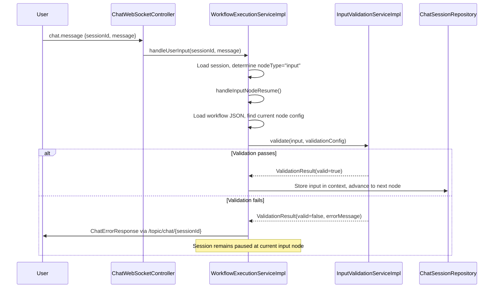

# Design Document: Input Node Validation

## Overview

This feature adds server-side input validation to the chatbot workflow engine's input nodes. When a user submits a reply to an input node, the system evaluates the reply against validation rules defined in the node's `config.validation` object before storing the value in session context. If validation fails, the user receives an error message via WebSocket and can retry without losing session state.

The design introduces a new `InputValidationService` (interface + implementation) that encapsulates all validation logic. This service is injected into `WorkflowExecutionServiceImpl` and invoked from `handleInputNodeResume()` after reading the current node's config but before storing input in the session context.

Key design decisions:
- **Fail-open for invalid regex**: Invalid patterns accept the input rather than blocking users. This trades strictness for availability.
- **Trimmed vs. untrimmed**: Length checks use trimmed input (users shouldn't be penalized for trailing spaces), while pattern matching uses untrimmed input (regex authors control whitespace expectations explicitly).
- **Short-circuit evaluation**: Returns the first error only, keeping the UX simple and predictable.
- **No DB changes**: Validation config lives in the existing JSONB workflow definition.

## Architecture



The validation service is a pure function with no side effects (except logging for invalid patterns). It receives the raw user input string and the `validation` map from node config, returning a result object indicating pass/fail with an optional error message.

## Components and Interfaces

### InputValidationService (Interface)

```java
package com.xpressbees.chatbot.service;

public interface InputValidationService {
    ValidationResult validate(String input, Map<String, Object> validationConfig);
}
```

### ValidationResult (DTO)

```java
package com.xpressbees.chatbot.dto;

import lombok.AllArgsConstructor;
import lombok.Data;

@Data
@AllArgsConstructor
public class ValidationResult {
    private boolean valid;
    private String errorMessage;

    public static ValidationResult success() {
        return new ValidationResult(true, null);
    }

    public static ValidationResult failure(String errorMessage) {
        return new ValidationResult(false, errorMessage);
    }
}
```

### InputValidationServiceImpl (Implementation)

```java
package com.xpressbees.chatbot.service;

import com.xpressbees.chatbot.dto.ValidationResult;
import org.slf4j.Logger;
import org.slf4j.LoggerFactory;
import org.springframework.stereotype.Service;

import java.util.Map;
import java.util.regex.Matcher;
import java.util.regex.Pattern;
import java.util.regex.PatternSyntaxException;

@Service
public class InputValidationServiceImpl implements InputValidationService {

    private static final Logger log = LoggerFactory.getLogger(InputValidationServiceImpl.class);

    // Default error messages
    private static final String DEFAULT_REQUIRED_MSG = "This field is required";
    private static final String DEFAULT_MIN_LENGTH_MSG = "Input must be at least %d characters";
    private static final String DEFAULT_MAX_LENGTH_MSG = "Input must not exceed %d characters";
    private static final String DEFAULT_NUMERIC_ONLY_MSG = "Only numeric characters are allowed";
    private static final String DEFAULT_PATTERN_MSG = "Input must match the required format";

    @Override
    public ValidationResult validate(String input, Map<String, Object> validationConfig) {
        if (validationConfig == null || validationConfig.isEmpty()) {
            return ValidationResult.success();
        }

        Map<String, Object> errorMessages = extractErrorMessages(validationConfig);

        // Rule 1: required
        ValidationResult result = validateRequired(input, validationConfig, errorMessages);
        if (!result.isValid()) return result;

        // Rule 2: minLength (uses trimmed input)
        result = validateMinLength(input, validationConfig, errorMessages);
        if (!result.isValid()) return result;

        // Rule 3: maxLength (uses trimmed input)
        result = validateMaxLength(input, validationConfig, errorMessages);
        if (!result.isValid()) return result;

        // Rule 4: numericOnly
        result = validateNumericOnly(input, validationConfig, errorMessages);
        if (!result.isValid()) return result;

        // Rule 5: pattern (uses untrimmed input)
        result = validatePattern(input, validationConfig, errorMessages);
        if (!result.isValid()) return result;

        return ValidationResult.success();
    }

    // ... individual rule methods
}
```

### Integration Point in WorkflowExecutionServiceImpl

The `handleInputNodeResume()` method is modified to:
1. Load the current node's config from the workflow JSON
2. Extract the `validation` object from the config
3. Call `inputValidationService.validate(message, validationConfig)`
4. If invalid: send `ChatErrorResponse` and return (session stays paused)
5. If valid: proceed with existing logic (store input, advance)

```java
// In handleInputNodeResume(), after loading workflow and finding current node:
Map<String, Object> config = (Map<String, Object>) currentNode.get("config");
Map<String, Object> validationConfig = null;
if (config != null) {
    validationConfig = (Map<String, Object>) config.get("validation");
}

if (validationConfig != null) {
    ValidationResult validationResult = inputValidationService.validate(message, validationConfig);
    if (!validationResult.isValid()) {
        sendError(sessionId, validationResult.getErrorMessage());
        return;
    }
}
// ... existing logic to store input and advance
```

## Data Models

### Validation Configuration Schema (within node config JSONB)

No new database tables or columns are introduced. The validation configuration is embedded within the existing node `config` map in the workflow JSONB:

```json
{
  "validation": {
    "required": true,
    "minLength": 3,
    "maxLength": 100,
    "numericOnly": false,
    "pattern": "^[A-Za-z0-9]+$",
    "errorMessages": {
      "required": "Please enter a value",
      "minLength": "Too short, minimum 3 characters",
      "maxLength": "Too long, maximum 100 characters",
      "numericOnly": "Digits only please",
      "pattern": "Alphanumeric characters only"
    }
  }
}
```

**Field specifications:**

| Field | Type | Required | Constraints | Default behavior when absent |
|-------|------|----------|-------------|------------------------------|
| `required` | boolean | No | `true` or `false` | Not enforced (any input accepted) |
| `minLength` | integer | No | 0–10000 | No minimum length check |
| `maxLength` | integer | No | 1–10000, ≥ minLength if both present | No maximum length check |
| `numericOnly` | boolean | No | `true` or `false` | Not enforced |
| `pattern` | string | No | Valid Java regex, max 500 chars | No pattern check |
| `errorMessages` | object | No | Keys = rule names, values = strings (max 500 chars) | Hardcoded defaults used |

### ValidationResult DTO

| Field | Type | Description |
|-------|------|-------------|
| `valid` | boolean | Whether the input passed all validation rules |
| `errorMessage` | String | Error message for the first failing rule (null when valid) |

### Rule Evaluation Behavior Summary

| Rule | Input Used | Pass Condition | Fail-Open Cases |
|------|-----------|----------------|-----------------|
| required | raw input | Has ≥1 non-whitespace char | Malformed config value → skip |
| minLength | trimmed input | `trimmed.length() >= minLength` | — |
| maxLength | trimmed input | `trimmed.length() <= maxLength` | — |
| numericOnly | trimmed input | Empty OR all chars are ASCII digits [0-9] | — |
| pattern | untrimmed input | `Matcher.matches()` returns true | Invalid regex → accept |

## Correctness Properties

*A property is a characteristic or behavior that should hold true across all valid executions of a system — essentially, a formal statement about what the system should do. Properties serve as the bridge between human-readable specifications and machine-verifiable correctness guarantees.*

### Property 1: Required rule correctness

*For any* input string and any `required` setting (true/false/absent), the required validation rule SHALL pass if and only if `required` is not `true` OR the input contains at least one non-whitespace character.

**Validates: Requirements 2.1, 2.2, 2.3**

### Property 2: Length validation correctness

*For any* input string and any valid `minLength`/`maxLength` configuration, the length validation SHALL pass if and only if the trimmed input length is within the range `[minLength, maxLength]` (where absent bounds are treated as unbounded).

**Validates: Requirements 3.1, 3.2, 3.3, 3.4, 3.5**

### Property 3: Pattern validation agrees with Java regex

*For any* input string and any valid Java regex pattern, the pattern validation rule SHALL produce the same result as calling `Pattern.compile(pattern).matcher(input).matches()` directly on the untrimmed input.

**Validates: Requirements 4.1, 4.2**

### Property 4: Invalid pattern fail-open

*For any* string that is not a valid Java regular expression, when used as a `pattern` value, the validation service SHALL accept any input (return valid=true for the pattern rule).

**Validates: Requirements 4.3**

### Property 5: NumericOnly validation correctness

*For any* input string with `numericOnly` set to `true`, the numericOnly rule SHALL pass if and only if the trimmed input is empty OR every character in the trimmed input is an ASCII digit (0-9).

**Validates: Requirements 5.1, 5.2, 5.3**

### Property 6: Error message resolution

*For any* failing validation rule and any `errorMessages` configuration, the returned error message SHALL equal the custom message from `errorMessages` for that rule name if the key is present, otherwise the hardcoded default message for that rule type.

**Validates: Requirements 6.2, 6.3**

### Property 7: Short-circuit evaluation order

*For any* input that fails multiple validation rules, the returned error message SHALL correspond to the earliest failing rule in the fixed evaluation order (required → minLength → maxLength → numericOnly → pattern).

**Validates: Requirements 6.5, 7.1, 7.2**

### Property 8: Composition AND logic

*For any* input and any combination of validation rules, the overall validation SHALL pass if and only if every individually-enabled rule passes for that input.

**Validates: Requirements 1.5, 7.3, 7.5**

### Property 9: Session state preservation on failure

*For any* input that fails validation, the session's `currentNodeId`, `currentNodeType`, and `context` SHALL remain unchanged after the validation call (no input stored, no node advancement).

**Validates: Requirements 6.4**

## Error Handling

| Scenario | Behavior | Rationale |
|----------|----------|-----------|
| `validation` object absent from node config | Skip validation entirely, accept input | Backward compatibility |
| `required` field is non-boolean (e.g., string "yes", integer 1) | Treat as not-required, skip rule | Fail-open for malformed config |
| `minLength` or `maxLength` is non-integer or negative | Skip that length rule, log warning | Avoid blocking users due to bad config |
| `pattern` is invalid regex (`PatternSyntaxException`) | Log warning with pattern + node ID, accept input | Fail-open — bad config shouldn't lock users out |
| `errorMessages` value is null or non-string | Use hardcoded default message for that rule | Graceful degradation |
| Exception during validation (unexpected) | Log error, accept input, continue workflow | Never block users due to validation bugs |

The pattern validation simply calls `compiledPattern.matcher(input).matches()` directly — no timeout wrapper needed since patterns are authored by the internal team.

## Testing Strategy

### Unit Tests (JUnit 5 + Mockito)

Unit tests verify specific examples, edge cases, and integration wiring:

- **InputValidationServiceImpl**: Each rule method tested with concrete examples
  - Required: null, empty string, whitespace variants, valid string
  - MinLength/MaxLength: boundary values (exact min, exact max, off-by-one)
  - NumericOnly: digits, letters, special chars, Unicode digits, decimal point
  - Pattern: simple regex, complex regex, invalid regex
  - Error messages: custom present, custom absent, mixed
- **WorkflowExecutionServiceImpl integration**: Verify `handleInputNodeResume()` calls validation service and routes errors correctly (mock the validation service)
- **Edge cases**: Malformed config values, null validation map, empty errorMessages

### Property-Based Tests (jqwik 1.8.2)

Property-based tests verify universal correctness properties across randomized inputs. Each property test runs a minimum of 100 iterations.

**Library**: jqwik 1.8.2 (already in pom.xml)

**Test class**: `InputValidationPropertyTest.java`

Each test is tagged with a comment referencing the design property:
- **Feature: input-node-validation, Property 1: Required rule correctness**
- **Feature: input-node-validation, Property 2: Length validation correctness**
- **Feature: input-node-validation, Property 3: Pattern validation agrees with Java regex**
- **Feature: input-node-validation, Property 4: Invalid pattern fail-open**
- **Feature: input-node-validation, Property 5: NumericOnly validation correctness**
- **Feature: input-node-validation, Property 6: Error message resolution**
- **Feature: input-node-validation, Property 7: Short-circuit evaluation order**
- **Feature: input-node-validation, Property 8: Composition AND logic**
- **Feature: input-node-validation, Property 9: Session state preservation on failure**

**Generator strategy**:
- Input strings: arbitrary strings, whitespace-only strings, digit-only strings, strings with Unicode characters
- Validation configs: random combinations of rules with randomized parameters
- Patterns: sampled from known-valid regex patterns (avoid generating arbitrary regex since most random strings aren't valid regex)
- Error messages: arbitrary non-empty strings

### Test Configuration

```java
@Property(tries = 100)
// Feature: input-node-validation, Property N: <description>
void propertyName(@ForAll ... args) { ... }
```

### Coverage Goals

- All 5 validation rules tested individually and in combination
- All error message resolution paths (custom + default)
- All fail-open paths (invalid regex, timeout, malformed config)
- Evaluation order verified with multi-rule failures
- Session state immutability on validation failure
