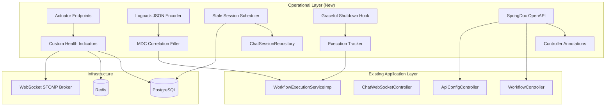

# Design Document: Production Readiness

## Overview

This design covers six production-readiness enhancements to the Chatbot Workflow Engine: health monitoring via Spring Boot Actuator, structured JSON logging with correlation IDs, environment-specific configuration profiles, automated stale session cleanup, graceful shutdown handling, and OpenAPI documentation generation.

All enhancements integrate with the existing Spring Boot 3.3.5 architecture, using standard Spring ecosystem libraries where possible. The goal is zero changes to existing business logic — these are cross-cutting operational concerns layered on top of the current codebase.

## Architecture



### Design Decisions

1. **Custom Health Indicators over generic checks** — The WebSocket connection pool and workflow engine need custom indicators because Spring Boot's auto-configured indicators don't cover these subsystems.
2. **Logback JSON encoder over Log4j2** — The project already uses SLF4J/Logback (Spring Boot default). Adding `logstash-logback-encoder` avoids switching frameworks.
3. **Profile-based property files over YAML** — The project already uses `application.properties`. We'll add `application-{profile}.properties` files to stay consistent.
4. **Spring `@Scheduled` over Quartz** — Stale session cleanup is simple interval-based work. No need for a full-featured scheduler.
5. **SpringDoc over Springfox** — SpringDoc is the actively maintained OpenAPI 3.0 generator for Spring Boot 3.x. Springfox is unmaintained.

## Components and Interfaces

### 1. Health Monitoring Components

#### WebSocketHealthIndicator

```java
@Component
public class WebSocketHealthIndicator implements HealthIndicator {
    private final ConnectionLimitInterceptor connectionLimitInterceptor;
    private final int degradedThreshold; // from config

    @Override
    public Health health() {
        int activeConnections = connectionLimitInterceptor.getActiveConnectionCount();
        if (activeConnections > degradedThreshold) {
            return Health.status("DEGRADED")
                .withDetail("activeConnections", activeConnections)
                .withDetail("threshold", degradedThreshold)
                .build();
        }
        return Health.up()
            .withDetail("activeConnections", activeConnections)
            .build();
    }
}
```

#### WorkflowEngineHealthIndicator

```java
@Component
public class WorkflowEngineHealthIndicator implements HealthIndicator {
    private final ApplicationContext applicationContext;

    @Override
    public Health health() {
        try {
            WorkflowExecutionService service = applicationContext.getBean(WorkflowExecutionService.class);
            return (service != null) ? Health.up().build() : Health.down().build();
        } catch (Exception e) {
            return Health.down().withException(e).build();
        }
    }
}
```

### 2. Structured Logging Components

#### CorrelationIdFilter (MDC Management)

A service-layer aspect/utility that sets and clears MDC around workflow execution boundaries:

```java
@Component
public class CorrelationIdManager {
    private static final String CORRELATION_ID_KEY = "correlationId";

    public void set(String sessionId) {
        MDC.put(CORRELATION_ID_KEY, sessionId);
    }

    public void clear() {
        MDC.remove(CORRELATION_ID_KEY);
    }

    public String get() {
        return MDC.get(CORRELATION_ID_KEY);
    }
}
```

Integration points in `WorkflowExecutionServiceImpl`:
- `startWorkflow()` — call `correlationIdManager.set(sessionId)` at entry, `clear()` at all exit points
- `handleUserInput()` — call `set(sessionId)` at entry, `clear()` at all exit points

#### Logback Configuration (logback-spring.xml)

Profile-conditional JSON output using `logstash-logback-encoder`:

```xml
<springProfile name="prod">
    <appender name="JSON" class="ch.qos.logback.core.ConsoleAppender">
        <encoder class="net.logstash.logback.encoder.LogstashEncoder">
            <includeMdcKeyName>correlationId</includeMdcKeyName>
        </encoder>
    </appender>
</springProfile>

<springProfile name="dev,staging">
    <appender name="CONSOLE" class="ch.qos.logback.core.ConsoleAppender">
        <encoder>
            <pattern>%d{HH:mm:ss.SSS} [%thread] [%X{correlationId}] %-5level %logger{36} - %msg%n</pattern>
        </encoder>
    </appender>
</springProfile>
```

### 3. Environment Configuration Components

Three profile-specific property files:

| File | Key Settings |
|------|-------------|
| `application-dev.properties` | show-sql=true, HikariCP max=5, text logging |
| `application-staging.properties` | show-sql=false, HikariCP max=10, text logging |
| `application-prod.properties` | show-sql=false, HikariCP max=20, JSON logging, connection timeouts tuned |

### 4. Stale Session Cleanup Components

#### StaleSessionCleanupService

```java
@Service
@ConditionalOnProperty(name = "chatbot.cleanup.enabled", havingValue = "true", matchIfMissing = true)
public class StaleSessionCleanupService {
    private final ChatSessionRepository chatSessionRepository;
    private final long inactivityThresholdHours; // default: 24

    @Scheduled(fixedDelayString = "${chatbot.cleanup.interval-ms:3600000}")
    public void cleanupStaleSessions() {
        LocalDateTime cutoff = LocalDateTime.now().minusHours(inactivityThresholdHours);
        int expiredCount = chatSessionRepository.expireStaleSessions(cutoff);
        log.info("Stale session cleanup completed: {} sessions expired", expiredCount);
    }
}
```

#### Repository Query

```java
@Modifying
@Query("UPDATE ChatSession c SET c.status = 'expired' WHERE c.status = 'active' AND c.updatedAt < :cutoff")
int expireStaleSessions(@Param("cutoff") LocalDateTime cutoff);
```

### 5. Graceful Shutdown Components

#### Configuration

```properties
server.shutdown=graceful
spring.lifecycle.timeout-per-shutdown-phase=30s
```

#### ExecutionTracker

Tracks in-progress workflow executions for graceful drain:

```java
@Component
public class ExecutionTracker {
    private final AtomicInteger activeExecutions = new AtomicInteger(0);
    private volatile boolean shuttingDown = false;

    public boolean tryStart() {
        if (shuttingDown) return false;
        activeExecutions.incrementAndGet();
        return true;
    }

    public void complete() {
        activeExecutions.decrementAndGet();
    }

    public int getActiveCount() {
        return activeExecutions.get();
    }

    public void beginShutdown() {
        shuttingDown = true;
    }

    public boolean isShuttingDown() {
        return shuttingDown;
    }
}
```

#### GracefulShutdownListener

```java
@Component
public class GracefulShutdownListener implements ApplicationListener<ContextClosedEvent> {
    private final ExecutionTracker executionTracker;
    private final long shutdownTimeoutMs; // from config, default 30000

    @Override
    public void onApplicationEvent(ContextClosedEvent event) {
        executionTracker.beginShutdown();
        long deadline = System.currentTimeMillis() + shutdownTimeoutMs;
        while (executionTracker.getActiveCount() > 0 && System.currentTimeMillis() < deadline) {
            Thread.sleep(500);
        }
        int remaining = executionTracker.getActiveCount();
        if (remaining > 0) {
            log.warn("Force shutdown with {} in-progress executions", remaining);
        }
    }
}
```

### 6. OpenAPI Documentation Components

#### Dependencies

```xml
<dependency>
    <groupId>org.springdoc</groupId>
    <artifactId>springdoc-openapi-starter-webmvc-ui</artifactId>
    <version>2.3.0</version>
</dependency>
```

#### OpenAPI Configuration

```java
@Configuration
public class OpenApiConfig {
    @Bean
    public OpenAPI chatbotOpenAPI() {
        return new OpenAPI()
            .info(new Info()
                .title("Chatbot Workflow Engine API")
                .version("1.0.0")
                .description("REST API for managing chatbot workflows and API configurations"));
    }
}
```

#### Controller Annotations

Each controller gets `@Tag(name = "...")` and each method gets `@Operation(summary = "...", description = "...")`, `@ApiResponse` annotations.

## Data Models

### Health Check Response Model

```json
{
  "status": "UP | DOWN | DEGRADED | OUT_OF_SERVICE",
  "components": {
    "db": { "status": "UP", "details": { "database": "PostgreSQL" } },
    "diskSpace": { "status": "UP", "details": { "total": ..., "free": ... } },
    "webSocketConnections": { "status": "UP", "details": { "activeConnections": 42, "threshold": 800 } },
    "workflowEngine": { "status": "UP" }
  }
}
```

### Structured Log Entry Model (prod profile)

```json
{
  "@timestamp": "2024-01-15T10:30:00.123Z",
  "level": "INFO",
  "logger_name": "c.x.c.s.WorkflowExecutionServiceImpl",
  "message": "Workflow execution started",
  "correlationId": "sess_abc123",
  "thread_name": "http-nio-8080-exec-1"
}
```

### Configuration Properties Model

| Property | Default | Profile | Description |
|----------|---------|---------|-------------|
| `chatbot.health.websocket.degraded-threshold` | 800 | all | Connection count threshold for DEGRADED status |
| `chatbot.cleanup.enabled` | true | all | Enable/disable stale session cleanup |
| `chatbot.cleanup.inactivity-threshold-hours` | 24 | all | Hours of inactivity before a session is stale |
| `chatbot.cleanup.interval-ms` | 3600000 | all | Cleanup job interval in milliseconds |
| `chatbot.shutdown.timeout-seconds` | 30 | all | Graceful shutdown wait time |
| `springdoc.swagger-ui.enabled` | true | dev,staging | Controls Swagger UI availability |

### Database Index Addition

For efficient stale session queries:

```sql
CREATE INDEX IF NOT EXISTS idx_chat_session_status_updated
    ON chat_session(status, updated_at)
    WHERE status = 'active';
```

## Correctness Properties

*A property is a characteristic or behavior that should hold true across all valid executions of a system — essentially, a formal statement about what the system should do. Properties serve as the bridge between human-readable specifications and machine-verifiable correctness guarantees.*

### Property 1: WebSocket health indicator threshold correctness

*For any* non-negative active connection count and any positive degraded threshold, the WebSocketHealthIndicator SHALL report status as DEGRADED when active connections exceed the threshold, and UP when active connections are at or below the threshold.

**Validates: Requirements 1.4**

### Property 2: MDC correlation ID lifecycle round-trip

*For any* valid session ID, when a workflow execution begins the MDC SHALL contain the session ID as the correlation ID, and after the execution completes (normally or via error), the MDC SHALL no longer contain the correlation ID.

**Validates: Requirements 2.2, 2.4**

### Property 3: Stale session cleanup correctness

*For any* set of chat sessions with varying `updated_at` timestamps and any positive inactivity threshold, after the cleanup job executes, exactly those sessions whose `updated_at` is older than `now - threshold` AND whose status was "active" SHALL have their status changed to "expired", and all other sessions SHALL remain unchanged.

**Validates: Requirements 4.1, 4.3**

### Property 4: OpenAPI endpoint documentation completeness

*For any* REST endpoint defined in WorkflowController or ApiConfigController, the generated OpenAPI specification SHALL contain a path entry with a non-empty description, a request body schema (for POST/PUT methods), and a response schema.

**Validates: Requirements 6.4**

## Error Handling

### Health Check Errors
- If a health indicator throws an exception, Spring Boot Actuator automatically reports that component as DOWN with the exception message. No custom error handling needed.
- The aggregate health status follows Spring Boot's default: DOWN if any component is DOWN.

### Logging Errors
- If MDC operations fail (extremely unlikely — they're thread-local Map operations), the log entry is still written but without the correlation ID.
- If the JSON encoder fails, Logback falls back to its error handler which writes to stderr.

### Stale Session Cleanup Errors
- If the database is unreachable during cleanup, the `@Scheduled` method catches the exception, logs it at ERROR level, and the next scheduled run retries.
- The cleanup uses a single UPDATE query — it's atomic. No partial state changes.

### Graceful Shutdown Errors
- If the shutdown wait is interrupted, the listener logs a warning and allows the JVM to proceed with termination.
- Workflow executions that don't complete within the timeout are counted and logged, but not explicitly interrupted (the JVM handles thread cleanup).

### OpenAPI Documentation Errors
- If a controller annotation is malformed, SpringDoc logs a warning and omits that endpoint from the spec. The application still starts.
- If SpringDoc dependency is missing, the app starts without `/v3/api-docs` — no runtime error.

## Testing Strategy

### Property-Based Tests (jqwik 1.8.2)

Each property test runs a minimum of 100 iterations.

| Property | Test Class | Strategy |
|----------|-----------|----------|
| Property 1: Threshold correctness | `WebSocketHealthIndicatorPropertyTest` | Generate random `(connectionCount, threshold)` pairs, verify health status |
| Property 2: MDC lifecycle | `CorrelationIdManagerPropertyTest` | Generate random session IDs, verify MDC set/clear behavior |
| Property 3: Cleanup correctness | `StaleSessionCleanupPropertyTest` | Generate random session lists with varied timestamps and thresholds, verify correct partition |
| Property 4: OpenAPI completeness | `OpenApiCompletenessPropertyTest` | Enumerate all controller endpoints, verify each has documentation in generated spec |

**Tag format:** `Feature: production-readiness, Property {number}: {property_text}`

### Unit Tests (JUnit 5)

| Area | Tests |
|------|-------|
| WebSocketHealthIndicator | Specific scenarios: 0 connections, exactly at threshold, one above threshold |
| CorrelationIdManager | Set/get/clear, thread safety with concurrent access |
| StaleSessionCleanupService | Default threshold verification, disabled via config |
| ExecutionTracker | tryStart when shutting down returns false, concurrent increment/decrement |
| GracefulShutdownListener | Timeout behavior with mock ExecutionTracker |

### Integration Tests (TestContainers + Embedded Redis)

| Area | Tests |
|------|-------|
| Actuator endpoints | Verify /actuator/health, /actuator/metrics, /actuator/info return expected structure |
| Profile loading | Verify each profile activates correct configuration |
| Stale session cleanup | End-to-end with PostgreSQL: insert sessions, run cleanup, verify status changes |
| OpenAPI generation | Verify /v3/api-docs returns valid spec with expected paths |
| Structured logging | Verify JSON log output with prod profile |

### Dependencies Added for Testing

- `logstash-logback-encoder:7.4` — JSON structured logging
- `springdoc-openapi-starter-webmvc-ui:2.3.0` — OpenAPI generation
- No new test dependencies needed (jqwik 1.8.2 and TestContainers already present)
