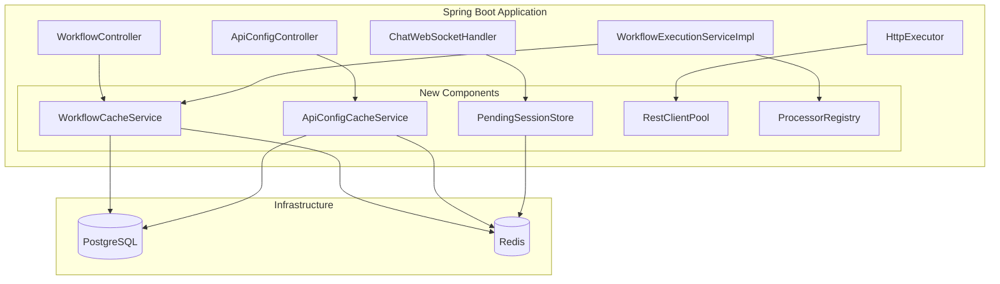
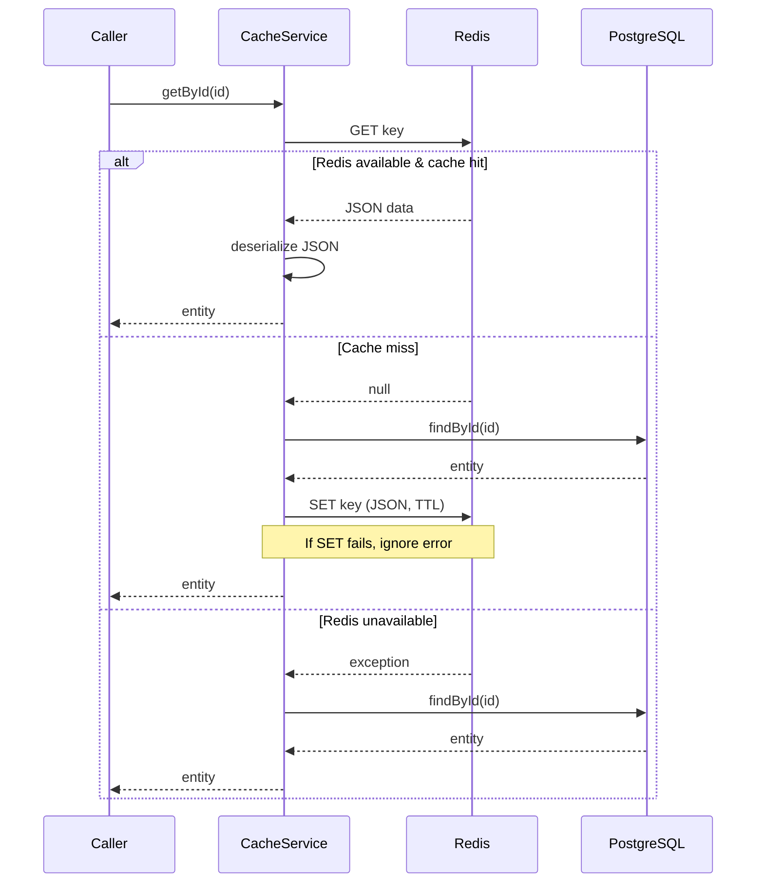
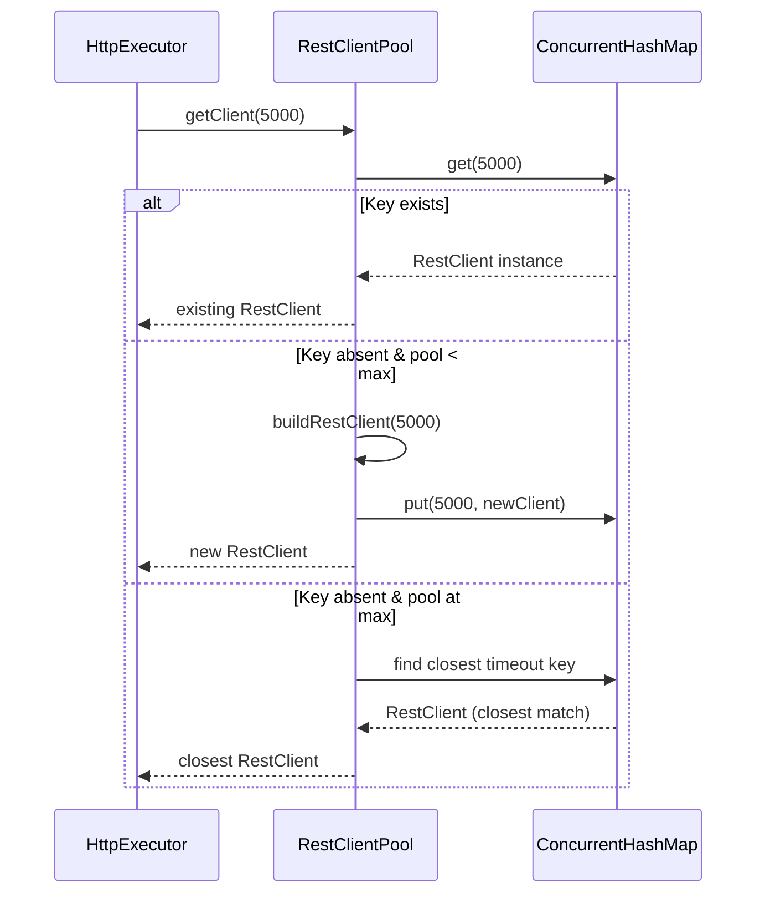

# Design Document: Redis Caching and Performance

## Overview

This design introduces Redis-backed caching, connection pooling, and algorithmic optimizations to the Chatbot Workflow Engine. The changes target six areas:

1. **Workflow Definition Cache** — Eliminates repeated PostgreSQL queries during workflow execution
2. **ApiConfig Cache** — Avoids per-API-node database round-trips with a full entity graph cache
3. **Pending Sessions in Redis** — Replaces the in-memory `ConcurrentHashMap` with Redis, enabling multi-instance deployments and automatic expiration
4. **RestClient Connection Pool** — Reuses HTTP clients by timeout configuration instead of creating one per request
5. **Exponential Backoff** — Replaces fixed 1-second retry delay with doubling delays capped at 10 seconds
6. **Processor Registry** — Replaces O(n) linear iteration with O(1) map-based lookup

All Redis interactions use JSON serialization for debuggability and follow a graceful degradation pattern: if Redis is unavailable, the system falls back to direct PostgreSQL access without raising errors to callers.

## Architecture

### High-Level Component Diagram



### Cache Read Flow (Workflow & ApiConfig)



## Components and Interfaces

### 1. WorkflowCacheService

**Location:** `com.xpressbees.chatbot.service.WorkflowCacheService`

**Responsibility:** Read-through cache for `Workflow` entities with eviction on mutations.

```java
@Service
public class WorkflowCacheService {

    private final WorkflowRepository workflowRepository;
    private final StringRedisTemplate redisTemplate;
    private final ObjectMapper objectMapper;

    @Value("${cache.workflow.ttl-minutes:10}")
    private long ttlMinutes;

    /**
     * Returns the Workflow for the given ID.
     * Checks Redis first; on miss, loads from PostgreSQL and populates cache.
     * On Redis failure, falls back to PostgreSQL silently.
     */
    public Optional<Workflow> findById(Long workflowId);

    /**
     * Evicts the cached workflow entry for the given ID.
     * Called on update/delete operations.
     */
    public void evict(Long workflowId);
}
```

**Redis Key Pattern:** `workflow:{id}` (e.g., `workflow:42`)

**Behavior:**
- `findById(id)` → tries `GET workflow:{id}` from Redis → deserialize JSON → return
- On cache miss → load from `workflowRepository.findById(id)` → serialize to JSON → `SET workflow:{id}` with TTL → return
- On any Redis exception → catch, log at WARN, proceed to PostgreSQL
- `evict(id)` → `DEL workflow:{id}` (best-effort, log and ignore failures)

### 2. ApiConfigCacheService

**Location:** `com.xpressbees.chatbot.service.ApiConfigCacheService`

**Responsibility:** Read-through cache for `ApiConfig` entities (with full graph: headers, payload, response mappings) plus a name-to-ID index.

```java
@Service
public class ApiConfigCacheService {

    private final ApiConfigRepository apiConfigRepository;
    private final StringRedisTemplate redisTemplate;
    private final ObjectMapper objectMapper;

    @Value("${cache.apiconfig.ttl-minutes:10}")
    private long ttlMinutes;

    /**
     * Returns the full ApiConfig entity graph by ID.
     */
    public Optional<ApiConfig> findById(Long apiConfigId);

    /**
     * Returns the full ApiConfig entity graph by name.
     * Uses the name-to-ID index to resolve, then delegates to findById.
     */
    public Optional<ApiConfig> findByName(String name);

    /**
     * Evicts both the ID-based cache entry and the name-to-ID index entry.
     */
    public void evict(Long apiConfigId, String name);
}
```

**Redis Key Patterns:**
- `apiconfig:{id}` — stores the full JSON-serialized ApiConfig graph
- `apiconfig:name:{name}` — stores the numeric ID (string representation)

**Name Lookup Flow:**
1. `GET apiconfig:name:{name}` → if present, parse ID → delegate to `findById(id)`
2. If index miss → `apiConfigRepository.findByName(name)` → populate both `apiconfig:{id}` and `apiconfig:name:{name}`

### 3. PendingSessionStore

**Location:** `com.xpressbees.chatbot.service.PendingSessionStore`

**Responsibility:** Replaces `ConcurrentHashMap<String, Instant>` in `ChatWebSocketHandler` with Redis-backed storage.

```java
@Service
public class PendingSessionStore {

    private final StringRedisTemplate redisTemplate;

    @Value("${session.pending.ttl-minutes:5}")
    private long ttlMinutes;

    /**
     * Registers a session ID in Redis with TTL.
     * Returns true if stored successfully, false if Redis is unavailable.
     */
    public boolean register(String sessionId);

    /**
     * Atomically consumes (removes) a session ID.
     * Returns true if the session existed and was removed, false otherwise.
     * Uses Redis DEL and checks the return value for atomicity.
     */
    public boolean consume(String sessionId);
}
```

**Redis Key Pattern:** `pending-session:{sessionId}`

**Value:** `"1"` (existence-based; the value itself is irrelevant)

**Atomicity:** `consume()` uses `redisTemplate.delete(key)` which returns true if the key existed — this is atomic in Redis (single-threaded command execution).

**Graceful Degradation:** If Redis is unavailable during `register()`, the session cannot be stored. Since there's no PostgreSQL fallback for pending sessions, the system will reject the session start. This is acceptable because sessions are short-lived and the user can retry.

### 4. RestClientPool

**Location:** `com.xpressbees.chatbot.service.RestClientPool`

**Responsibility:** Maintains a thread-safe pool of `RestClient` instances keyed by timeout value.

```java
@Component
public class RestClientPool {

    private final ConcurrentHashMap<Integer, RestClient> pool = new ConcurrentHashMap<>();

    @Value("${http.client.pool.max-size:20}")
    private int maxPoolSize;

    @Value("${http.client.pool.max-connections-per-route:20}")
    private int maxConnectionsPerRoute;

    @Value("${http.client.pool.max-connections-total:100}")
    private int maxConnectionsTotal;

    /**
     * Returns a RestClient configured with the given timeout.
     * Reuses existing instances; creates new ones if pool has capacity.
     * If pool is at max capacity and timeout not found, returns the
     * closest available timeout or creates with eviction of LRU.
     */
    public RestClient getClient(int timeoutMs);
}
```

**Implementation Details:**
- Uses `ConcurrentHashMap<Integer, RestClient>` for O(1) thread-safe lookup
- Each `RestClient` is built with Apache HttpClient 5 `PoolingHttpClientConnectionManager` for TCP connection reuse
- Pool growth is capped at `maxPoolSize` distinct timeout configurations
- When max is reached, existing closest-timeout client is returned (minor timeout deviation is acceptable vs. unbounded growth)



### 5. Exponential Backoff (HttpExecutor enhancement)

**Location:** Modified in existing `com.xpressbees.chatbot.service.HttpExecutor`

**Changes:**
- Replace `sleepBeforeRetry()` with `sleepBeforeRetry(int attemptNumber)`
- Compute delay as `min(baseDelay * 2^(attempt-1), maxDelay)`
- Base delay: 1000ms, max delay: 10000ms

```java
// New method signature
long computeDelay(int attemptNumber) {
    // attemptNumber is 1-based (1st retry, 2nd retry, etc.)
    long delay = BASE_DELAY_MS * (1L << (attemptNumber - 1));
    return Math.min(delay, MAX_DELAY_MS);
}

void sleepBeforeRetry(int attemptNumber) {
    long delay = computeDelay(attemptNumber);
    try {
        Thread.sleep(delay);
    } catch (InterruptedException ie) {
        Thread.currentThread().interrupt();
        // Signal caller to stop retrying
    }
}
```

**Delay Sequence:** 1s → 2s → 4s → 8s → 10s → 10s → ...

### 6. ProcessorRegistry

**Location:** `com.xpressbees.chatbot.service.ProcessorRegistry`

**Responsibility:** O(1) lookup of `NodeProcessor` by node type string.

```java
@Component
public class ProcessorRegistry {

    private final Map<String, NodeProcessor> registry;
    private final NodeProcessor fallbackProcessor;

    /**
     * Built at startup from injected List<NodeProcessor>.
     * Each processor declares what node type it handles via getNodeType().
     */
    public ProcessorRegistry(List<NodeProcessor> processors,
                             MessageNodeProcessor messageNodeProcessor) {
        this.fallbackProcessor = messageNodeProcessor;
        this.registry = new HashMap<>();
        for (NodeProcessor p : processors) {
            String type = p.getNodeType();
            if (type != null) {
                registry.put(type, p);
            }
        }
    }

    /**
     * Returns the processor for the given node type.
     * Falls back to MessageNodeProcessor for unknown types.
     */
    public NodeProcessor getProcessor(String nodeType) {
        return registry.getOrDefault(nodeType, fallbackProcessor);
    }
}
```

**Integration Note:** The `NodeProcessor` interface gains a default method:
```java
default String getNodeType() {
    return null; // Subclasses override to declare their type
}
```

Each processor overrides `getNodeType()` to return its type key:
- `MessageNodeProcessor` → `"message"`
- `InputNodeProcessor` → `"input"`
- `ApiNodeProcessor` → `"api"`
- `DecisionNodeProcessor` → `"decision"`
- `WorkflowNodeProcessor` → `"workflow"`

The `findProcessor()` method in `WorkflowExecutionServiceImpl` is replaced with a call to `processorRegistry.getProcessor(nodeType)`.

## Data Models

### Redis Key Schema

| Key Pattern | Value Type | TTL | Purpose |
|---|---|---|---|
| `workflow:{id}` | JSON string (Workflow entity) | Configurable (default 10 min) | Cached workflow definitions |
| `apiconfig:{id}` | JSON string (ApiConfig + children) | Configurable (default 10 min) | Cached API configurations |
| `apiconfig:name:{name}` | String (numeric ID) | Configurable (default 10 min) | Name-to-ID lookup index |
| `pending-session:{sessionId}` | `"1"` | Configurable (default 5 min) | Pending session existence marker |

### Serialized Workflow JSON Structure

```json
{
  "id": 42,
  "name": "Customer Support Flow",
  "workflowJson": { /* nodes, edges, transitions */ },
  "createdAt": "2024-01-15T10:30:00",
  "updatedAt": "2024-01-15T10:30:00"
}
```

### Serialized ApiConfig JSON Structure

```json
{
  "id": 7,
  "name": "tracking-api",
  "url": "https://api.example.com/track/{{awb}}",
  "method": "POST",
  "timeoutMs": 5000,
  "retryCount": 1,
  "username": null,
  "password": null,
  "clientId": null,
  "headers": [
    { "id": 1, "headerName": "Authorization", "headerValue": "Bearer {{token}}" }
  ],
  "payload": {
    "id": 1,
    "payloadTemplate": { "awb": "{{awb}}", "source": "chatbot" }
  },
  "responseMappings": [
    { "id": 1, "responsePath": "$.data.status", "contextVariableName": "trackingStatus" }
  ],
  "createdAt": "2024-01-15T10:30:00",
  "updatedAt": "2024-01-15T10:30:00"
}
```

**Serialization Notes:**
- Jackson `ObjectMapper` with `JavaTimeModule` for `LocalDateTime` serialization
- `@JsonIgnore` on back-references (`apiConfig` field in child entities) to avoid circular references
- All fields serialized as-is; no custom serializers needed

### Configuration Properties

```properties
# ─── Redis Connection ────────────────────────────────────────
spring.data.redis.host=localhost
spring.data.redis.port=6379
spring.data.redis.timeout=2000ms
spring.data.redis.connect-timeout=1000ms

# ─── Workflow Cache ──────────────────────────────────────────
cache.workflow.ttl-minutes=10

# ─── ApiConfig Cache ─────────────────────────────────────────
cache.apiconfig.ttl-minutes=10

# ─── Pending Session Store ───────────────────────────────────
session.pending.ttl-minutes=5

# ─── RestClient Pool ────────────────────────────────────────
http.client.pool.max-size=20
http.client.pool.max-connections-per-route=20
http.client.pool.max-connections-total=100

# ─── Exponential Backoff ─────────────────────────────────────
http.retry.base-delay-ms=1000
http.retry.max-delay-ms=10000
```

## Correctness Properties

*A property is a characteristic or behavior that should hold true across all valid executions of a system — essentially, a formal statement about what the system should do. Properties serve as the bridge between human-readable specifications and machine-verifiable correctness guarantees.*

### Property 1: Workflow cache serialization round-trip

*For any* valid Workflow entity (with arbitrary ID, name, and workflowJson content), serializing it to JSON and then deserializing it back SHALL produce an equivalent Workflow object with identical field values.

**Validates: Requirements 1.1, 1.2**

### Property 2: Workflow cache eviction on mutation

*For any* workflow ID that is present in the cache, performing an update or delete operation on that workflow SHALL result in the cache no longer containing an entry for that ID (subsequent lookup returns a cache miss).

**Validates: Requirements 1.4, 1.5**

### Property 3: ApiConfig cache serialization round-trip (full entity graph)

*For any* valid ApiConfig entity graph (with arbitrary headers, payload template, and response mappings), serializing the full graph to JSON and deserializing it back SHALL produce an equivalent ApiConfig with all child entities intact and field values matching.

**Validates: Requirements 2.1, 2.2**

### Property 4: ApiConfig name-to-ID index consistency

*For any* ApiConfig with a unique name, after the name-to-ID index is populated, looking up by name SHALL return the same ApiConfig entity as looking up directly by ID.

**Validates: Requirements 2.6**

### Property 5: Pending session atomic consume (exactly-once)

*For any* registered session ID, consuming it SHALL return true exactly once. Any subsequent consume of the same session ID (without re-registration) SHALL return false. For any session ID that was never registered, consuming it SHALL return false.

**Validates: Requirements 3.2, 3.3**

### Property 6: RestClient pool consistency and bounded size

*For any* sequence of timeout value requests, the pool SHALL return the same RestClient instance for repeated requests with the same timeout value. The pool size SHALL never exceed the configured maximum, regardless of how many distinct timeout values are requested.

**Validates: Requirements 4.1, 4.2, 4.3, 4.5**

### Property 7: Exponential backoff delay formula

*For any* attempt number n (where n ≥ 1), the computed retry delay SHALL equal `min(1000 * 2^(n-1), 10000)` milliseconds. The delay SHALL never be negative and SHALL never exceed 10000ms.

**Validates: Requirements 5.1, 5.2, 5.3**

### Property 8: 4xx client errors are never retried

*For any* HTTP response with a 4xx status code (400–499), the HttpExecutor SHALL return the error result immediately after the first attempt without performing any retry or delay.

**Validates: Requirements 5.5**

### Property 9: Processor registry lookup correctness

*For any* known node type string (from the set: "message", "input", "api", "decision", "workflow"), the registry SHALL return the processor that handles that type. *For any* string that is not a known node type, the registry SHALL return the MessageNodeProcessor as fallback.

**Validates: Requirements 6.2, 6.3**

## Error Handling

### Redis Unavailability

All Redis operations are wrapped in try-catch blocks that catch `RedisConnectionException` and its subtypes:

- **Cache reads:** Log at WARN level, proceed to PostgreSQL. Caller is unaware of the failure.
- **Cache writes:** Log at WARN level, return the loaded entity without caching. The next request will also miss.
- **Eviction:** Log at WARN level, continue. Stale data will expire naturally via TTL.
- **Pending session register:** Log at WARN level. If register fails, the session start will also fail (no fallback for this). The user receives a clear error and can retry.
- **Pending session consume:** Log at WARN level, return false. The system rejects the session start as if the session expired.

### Serialization Errors

- `JsonProcessingException` during serialization → Log at ERROR, treat as cache miss (don't cache corrupt data)
- `JsonProcessingException` during deserialization → Log at ERROR, evict the corrupt cache entry, reload from PostgreSQL

### Pool Exhaustion

When `RestClientPool` reaches max size and receives a request for an unregistered timeout:
- Log at INFO level (not an error — expected behavior under high timeout diversity)
- Return the client with the nearest timeout value
- This is acceptable because timeout deviations within a few seconds are rarely impactful

### Thread Interruption (Exponential Backoff)

- `InterruptedException` during `Thread.sleep()` → restore interrupt flag via `Thread.currentThread().interrupt()`, break out of retry loop, return the last failure result

## Testing Strategy

### Property-Based Tests (jqwik 1.8.2)

Each correctness property maps to a jqwik `@Property` test with minimum 100 iterations. The property tests focus on pure logic that can be exercised without external infrastructure:

| Property | Test Class | What's Generated |
|---|---|---|
| 1: Workflow round-trip | `WorkflowCacheSerializationTest` | Random Workflow objects (varying name lengths, nested JSON structures) |
| 2: Eviction on mutation | `WorkflowCacheEvictionTest` | Random workflow IDs, mock cache |
| 3: ApiConfig round-trip | `ApiConfigCacheSerializationTest` | Random ApiConfig graphs (0–10 headers, optional payload, 0–5 mappings) |
| 4: Name-to-ID consistency | `ApiConfigNameIndexTest` | Random name/ID pairs |
| 5: Atomic consume | `PendingSessionConsumeTest` | Random UUIDs, register/consume sequences |
| 6: Pool consistency | `RestClientPoolTest` | Random timeout values, bounded pool sizes |
| 7: Backoff formula | `ExponentialBackoffTest` | Random attempt numbers (1–100) |
| 8: 4xx no retry | `HttpExecutorNoRetryTest` | Random 4xx status codes (400–499) |
| 9: Registry lookup | `ProcessorRegistryTest` | Random node type strings (known + random unknown) |

**Tag Format:** Each test carries a comment:
```java
// Feature: redis-caching-and-performance, Property {N}: {description}
```

**Configuration:** All property tests use `@Property(tries = 100)` minimum.

### Unit Tests (JUnit 5 + Mockito)

- Cache miss → load → store → return flow
- Redis connection failure → graceful fallback
- TTL configuration propagation
- Eviction triggered on controller update/delete endpoints
- Interrupt handling during backoff sleep

### Integration Tests

- End-to-end cache population and retrieval with embedded Redis (Testcontainers)
- Pending session TTL expiry (set short TTL, wait, verify consumed returns false)
- Connection pooling behavior under load

### Dependencies to Add (pom.xml)

```xml
<!-- Spring Data Redis -->
<dependency>
    <groupId>org.springframework.boot</groupId>
    <artifactId>spring-boot-starter-data-redis</artifactId>
</dependency>

<!-- Apache HttpClient 5 for connection pooling -->
<dependency>
    <groupId>org.apache.httpcomponents.client5</groupId>
    <artifactId>httpclient5</artifactId>
</dependency>

<!-- Testcontainers for Redis integration tests (optional) -->
<dependency>
    <groupId>org.testcontainers</groupId>
    <artifactId>testcontainers</artifactId>
    <scope>test</scope>
</dependency>
```
