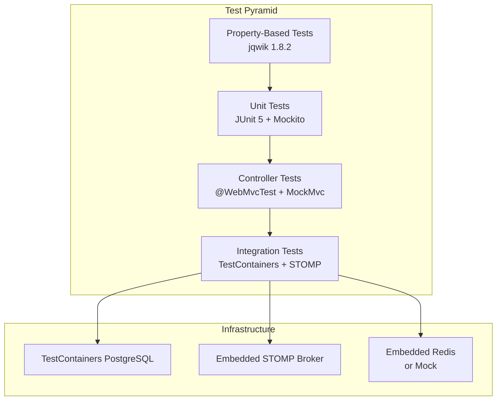

# Design Document: Testing Coverage

## Overview

This design adds comprehensive automated test coverage to the Chatbot Workflow Engine across six testing dimensions: database integration tests (TestContainers + PostgreSQL), REST controller tests (@WebMvcTest), WebSocket STOMP integration tests, ApiConfigServiceImpl validation unit tests, concurrent message handling tests, and extended property-based tests for PlaceholderService, ConditionEvaluator, and UrlValidator.

The testing strategy uses a layered approach:
- **Unit tests** (fast, isolated): Validate individual service logic with mocks
- **Controller tests** (@WebMvcTest): Validate REST layer behavior without full context
- **Integration tests** (TestContainers): Validate real database interactions and WebSocket flows
- **Property-based tests** (jqwik): Validate universal correctness properties across generated inputs
- **Concurrency tests**: Validate thread-safety guarantees under parallel execution

## Architecture



### Test Organization

```
src/test/java/com/xpressbees/chatbot/
├── integration/
│   ├── BaseIntegrationTest.java          (shared TestContainer config)
│   ├── WorkflowRepositoryIntegrationTest.java
│   ├── ChatSessionRepositoryIntegrationTest.java
│   ├── ApiConfigCascadeIntegrationTest.java
│   ├── WorkflowExecutionIntegrationTest.java
│   └── WebSocketStompIntegrationTest.java
├── controller/
│   ├── WorkflowControllerTest.java
│   └── ApiConfigControllerTest.java
├── service/
│   ├── ApiConfigValidationPropertyTest.java
│   ├── PlaceholderServiceExtendedPropertyTest.java
│   ├── ConditionEvaluatorExtendedPropertyTest.java
│   └── UrlValidatorExtendedPropertyTest.java
└── concurrent/
    ├── ConcurrentMessageHandlingTest.java
    └── PendingSessionConcurrencyTest.java
```

## Components and Interfaces

### 1. BaseIntegrationTest (Test Infrastructure)

Shared abstract base class providing TestContainers PostgreSQL lifecycle management.

```java
@SpringBootTest(webEnvironment = SpringBootTest.WebEnvironment.RANDOM_PORT)
@Testcontainers
public abstract class BaseIntegrationTest {

    @Container
    static PostgreSQLContainer<?> postgres = new PostgreSQLContainer<>("postgres:15-alpine")
            .withDatabaseName("chatbot_db_test")
            .withUsername("test")
            .withPassword("test")
            .withInitScript("schema.sql");

    @DynamicPropertySource
    static void configureProperties(DynamicPropertyRegistry registry) {
        registry.add("spring.datasource.url", postgres::getJdbcUrl);
        registry.add("spring.datasource.username", postgres::getUsername);
        registry.add("spring.datasource.password", postgres::getPassword);
        registry.add("spring.jpa.hibernate.ddl-auto", () -> "none");
    }
}
```

**Design Decision**: Using `postgres:15-alpine` for minimal image size and fast startup. The `withInitScript("schema.sql")` applies DDL automatically, mirroring production behavior.

### 2. WebSocket STOMP Test Client

Integration test infrastructure for WebSocket testing using Spring's `WebSocketStompClient`.

```java
public class StompTestClient {
    private final WebSocketStompClient stompClient;
    private StompSession session;

    public StompTestClient(int port) {
        this.stompClient = new WebSocketStompClient(
            new StandardWebSocketClient());
        this.stompClient.setMessageConverter(new MappingJackson2MessageConverter());
    }

    public CompletableFuture<Map<String, Object>> subscribeInit();
    public void sendStart(String sessionId, Long workflowId);
    public void sendMessage(String sessionId, String message);
    public CompletableFuture<ChatResponse> awaitResponse(String sessionId, Duration timeout);
}
```

**Design Decision**: Using `CompletableFuture` for async response collection allows clean timeout-based assertions without blocking test threads indefinitely.

### 3. Controller Test Structure (@WebMvcTest)

Each controller gets a dedicated test class using `@WebMvcTest` with mocked service dependencies.

```java
@WebMvcTest(WorkflowController.class)
class WorkflowControllerTest {
    @Autowired private MockMvc mockMvc;
    @MockBean private WorkflowService workflowService;
    @MockBean private WorkflowCacheService workflowCacheService;
}
```

**Design Decision**: `@WebMvcTest` loads only the web layer (controllers, exception handlers, serialization) keeping tests fast. Service mocks isolate the controller behavior.

### 4. Concurrency Test Infrastructure

Tests use `ExecutorService` and `CountDownLatch` patterns for controlled parallel execution.

```java
private void runConcurrently(int threadCount, Runnable task) throws InterruptedException {
    ExecutorService executor = Executors.newFixedThreadPool(threadCount);
    CountDownLatch latch = new CountDownLatch(1);
    CountDownLatch done = new CountDownLatch(threadCount);

    for (int i = 0; i < threadCount; i++) {
        executor.submit(() -> {
            latch.await();  // All threads start simultaneously
            task.run();
            done.countDown();
        });
    }
    latch.countDown();  // Release all threads
    done.await(10, TimeUnit.SECONDS);
    executor.shutdown();
}
```

## Data Models

### Test Fixtures

| Fixture | Purpose | Used In |
|---------|---------|---------|
| `simple-workflow.json` | Minimal 2-node workflow (message → input) | Integration, WebSocket tests |
| `complete-workflow.json` | Full workflow with all node types | Execution flow tests |
| `api-config-fixture.json` | ApiConfig with headers + mappings | Cascade tests |

### TestContainers Configuration

| Property | Value | Rationale |
|----------|-------|-----------|
| Image | `postgres:15-alpine` | Matches production version, minimal size |
| Database | `chatbot_db_test` | Isolated test database |
| Init Script | `schema.sql` | Same DDL as production |
| Reuse | Enabled via `.withReuse(true)` | Faster test suite on local dev |

### Maven Dependencies Required

```xml
<!-- TestContainers -->
<dependency>
    <groupId>org.testcontainers</groupId>
    <artifactId>testcontainers</artifactId>
    <scope>test</scope>
</dependency>
<dependency>
    <groupId>org.testcontainers</groupId>
    <artifactId>postgresql</artifactId>
    <scope>test</scope>
</dependency>
<dependency>
    <groupId>org.testcontainers</groupId>
    <artifactId>junit-jupiter</artifactId>
    <scope>test</scope>
</dependency>

<!-- TestContainers BOM -->
<dependencyManagement>
    <dependencies>
        <dependency>
            <groupId>org.testcontainers</groupId>
            <artifactId>testcontainers-bom</artifactId>
            <version>1.19.3</version>
            <type>pom</type>
            <scope>import</scope>
        </dependency>
    </dependencies>
</dependencyManagement>

<!-- Embedded Redis for tests (or mock) -->
<dependency>
    <groupId>com.github.codemonstur</groupId>
    <artifactId>embedded-redis</artifactId>
    <version>1.4.3</version>
    <scope>test</scope>
</dependency>
```

## Correctness Properties

*A property is a characteristic or behavior that should hold true across all valid executions of a system — essentially, a formal statement about what the system should do. Properties serve as the bridge between human-readable specifications and machine-verifiable correctness guarantees.*

### Property 1: JSONB Column Round-Trip Preservation

*For any* valid workflow JSON structure (containing nodes and transitions) or any valid ChatSession context map, persisting the entity via JPA and retrieving it SHALL produce an object with identical JSONB content — no data loss, no mutation, no reordering of semantically significant structures.

**Validates: Requirements 1.2, 1.3**

### Property 2: Method Normalization and Invalid Method Rejection

*For any* string that is a case-insensitive match to GET, POST, PUT, or DELETE, the ApiConfigService SHALL normalize it to uppercase and accept it. *For any* string that is NOT one of these four methods (regardless of case), the service SHALL throw InvalidMethodException.

**Validates: Requirements 5.1, 5.2**

### Property 3: Numeric Range Validation

*For any* integer value of timeoutMs outside the range [1, 300000], or any integer value of retryCount outside the range [0, 10], the ApiConfigService SHALL throw IllegalArgumentException. Values within the valid ranges SHALL be accepted without exception.

**Validates: Requirements 5.3, 5.4**

### Property 4: Collection Size Validation

*For any* headers list with size greater than 50, or any response mappings list with size greater than 50, the ApiConfigService SHALL throw IllegalArgumentException. Lists at or below 50 entries SHALL be accepted.

**Validates: Requirements 5.5, 5.6**

### Property 5: Response Mapping Variable Name Validation

*For any* context_variable_name that does not match `^[a-zA-Z_][a-zA-Z0-9_]*$`, OR exceeds 255 characters, OR appears as a duplicate in the mappings list, the ApiConfigService SHALL throw IllegalArgumentException. Names that satisfy all three constraints SHALL be accepted.

**Validates: Requirements 5.7, 5.8, 5.9**

### Property 6: Concurrent Session Registration Isolation

*For any* set of N distinct session IDs registered concurrently via PendingSessionStore, all N session IDs SHALL be successfully stored without any being overwritten or lost.

**Validates: Requirements 6.2**

### Property 7: Exactly-Once Consume Semantics

*For any* registered session ID and any number N of concurrent threads calling `consume(sessionId)`, exactly one thread SHALL receive `true` and all others SHALL receive `false`.

**Validates: Requirements 6.4**

### Property 8: Placeholder Resolution Termination

*For any* context map containing nested placeholder references (where one value contains `{{otherKey}}` patterns) or self-referencing keys (where a key's value contains `{{sameKey}}`), the PlaceholderService SHALL terminate resolution without infinite recursion or infinite loops.

**Validates: Requirements 7.1, 7.3**

### Property 9: No-Placeholder String Preservation (Idempotence)

*For any* string that contains no `{{` and `}}` pairs, the PlaceholderService.resolve() SHALL return the input string byte-for-byte unchanged — no encoding modification, no whitespace alteration, no character transformation.

**Validates: Requirements 7.2**

### Property 10: Complete Resolution When All Keys Present

*For any* template string and context map where every placeholder key referenced in the template exists in the context, the resolved output SHALL contain no unresolved `{{...}}` patterns.

**Validates: Requirements 7.4**

### Property 11: Single Comparison Expression Correctness

*For any* valid single comparison expression (`var == value`, `var != value`, `var < value`, `var > value`, `var <= value`, `var >= value`) and a context containing the referenced variable, the ConditionEvaluator SHALL produce a result consistent with Java's comparison semantics on the context value (string equality for `==`/`!=`, numeric comparison for `<`/`>`/`<=`/`>=`).

**Validates: Requirements 8.1**

### Property 12: Conjunction Semantics (AND)

*For any* compound condition composed of sub-conditions joined by `" and "`, the ConditionEvaluator SHALL return true if and only if every individual sub-condition evaluates to true against the provided context.

**Validates: Requirements 8.2**

### Property 13: Disjunction Semantics (OR)

*For any* compound condition composed of sub-conditions joined by `" or "`, the ConditionEvaluator SHALL return true if and only if at least one individual sub-condition evaluates to true against the provided context.

**Validates: Requirements 8.3**

### Property 14: Missing Variable Evaluates to False

*For any* condition expression referencing a variable that is not present in the context map, the ConditionEvaluator SHALL return false without throwing an exception.

**Validates: Requirements 8.4**

### Property 15: Private IP URL Rejection via Full Validation

*For any* URL containing a host that resolves to a private/internal IP range (10.x.x.x, 172.16-31.x.x, 192.168.x.x, 127.x.x.x), the UrlValidator.validate() SHALL return a blocked result.

**Validates: Requirements 9.1**

### Property 16: HTTP/HTTPS Scheme-Agnostic Acceptance

*For any* URL with a valid public host and either `http` or `https` scheme, the UrlValidator SHALL accept both schemes equally — the validation result SHALL be the same regardless of whether HTTP or HTTPS is used.

**Validates: Requirements 9.2**

### Property 17: Non-HTTP Scheme Rejection

*For any* URL with a scheme other than `http` or `https` (including `file://`, `ftp://`, `gopher://`, `javascript:`, etc.), the UrlValidator SHALL return a blocked result.

**Validates: Requirements 9.3**

## Error Handling

### Test Infrastructure Errors

| Scenario | Handling |
|----------|----------|
| Docker not available for TestContainers | Tests annotated with `@Testcontainers` are skipped with clear message |
| PostgreSQL container fails to start | `@Container` lifecycle throws, test class fails fast |
| WebSocket connection timeout | `CompletableFuture.get(timeout)` throws TimeoutException, test fails with descriptive message |
| Redis unavailable in concurrency tests | Use embedded Redis or mock `StringRedisTemplate` for isolation |
| Flaky concurrency tests | Use `CountDownLatch` for deterministic thread coordination; avoid sleep-based synchronization |

### Test Assertions

- All integration tests use AssertJ for fluent, descriptive assertion failures
- Timeout-based assertions use `Awaitility` or `CompletableFuture.get(Duration)` with clear messages
- Property tests rely on jqwik's built-in shrinking to find minimal failing examples

## Testing Strategy

### Dual Testing Approach

This feature implements a comprehensive testing strategy combining:

1. **Example-based unit tests** — Verify specific REST endpoint behaviors, error cases, and integration flows
2. **Property-based tests** — Verify universal correctness properties across generated inputs using jqwik 1.8.2

### Property-Based Testing Configuration

- **Library**: jqwik 1.8.2 (already in pom.xml)
- **Minimum iterations**: 100 per property test (`@Property(tries = 100)`)
- **Tag format**: `@Tag("Feature: testing-coverage, Property {N}: {title}")`
- **Shrinking**: Enabled by default for minimal counterexample discovery

### Test Categories and Execution

| Category | Annotation/Pattern | Execution Time | Dependencies |
|----------|-------------------|----------------|--------------|
| Unit/Property tests | `*PropertyTest.java`, `*Test.java` | Fast (< 5s each) | None |
| Controller tests | `@WebMvcTest` | Fast (< 3s each) | None |
| Integration tests | `@SpringBootTest` + `@Testcontainers` | Moderate (10-30s) | Docker |
| WebSocket tests | `@SpringBootTest` + STOMP client | Moderate (10-20s) | Docker |
| Concurrency tests | `ExecutorService` + `CountDownLatch` | Fast (< 5s) | Embedded Redis or mock |

### Maven Test Execution

```shell
# Run all tests
mvn test

# Run only property tests
mvn test -Dtest="*PropertyTest"

# Run only integration tests (requires Docker)
mvn test -Dtest="*IntegrationTest"

# Run controller tests
mvn test -Dtest="*ControllerTest"
```

### Key Testing Decisions

1. **TestContainers over H2**: Using real PostgreSQL via TestContainers instead of H2 because the schema uses PostgreSQL-specific features (JSONB columns, regex CHECK constraints, `BIGSERIAL`) that H2 cannot replicate.

2. **Embedded Redis for concurrency tests**: PendingSessionStore depends on Redis. Concurrency tests use embedded Redis (or a mocked `StringRedisTemplate`) to avoid external dependencies while still testing real concurrent behavior.

3. **jqwik for property tests**: The project already uses jqwik 1.8.2. Extended property tests for PlaceholderService, ConditionEvaluator, and UrlValidator continue this pattern with the same library and conventions.

4. **@WebMvcTest over @SpringBootTest for controllers**: Controller tests use the lightweight `@WebMvcTest` slice to test only HTTP layer concerns. This keeps them fast and isolated from database/Redis dependencies.

5. **CompletableFuture for WebSocket assertions**: WebSocket tests use futures with timeout to avoid blocking indefinitely on missed messages, providing clear failure messages.
