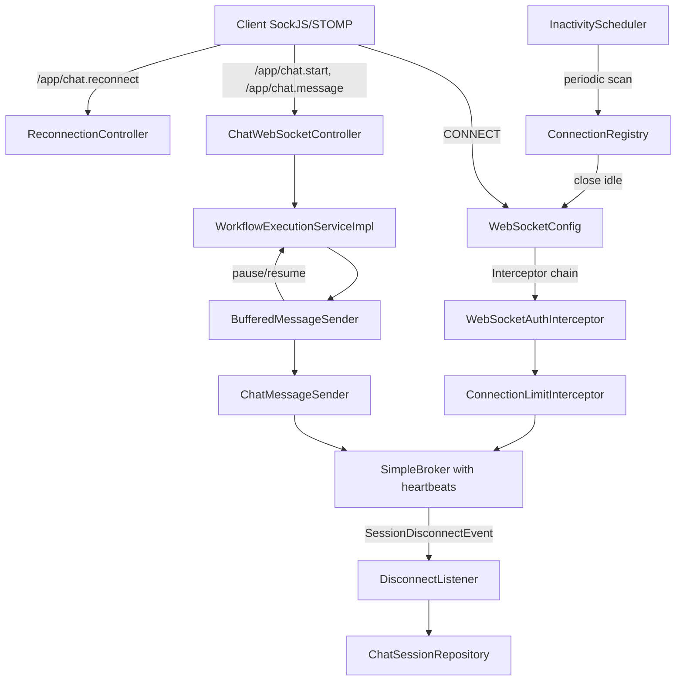

# Design Document: WebSocket Resilience

## Overview

This design adds resilience mechanisms to the existing Spring WebSocket + STOMP layer of the chatbot workflow engine. The system currently has no handling for client disconnections, heartbeats, connection limits, back-pressure, or reconnection. This feature introduces six cross-cutting concerns layered on top of the existing `WebSocketConfig`, `ChatWebSocketController`, `ChatWebSocketHandler`, `ChatMessageSender`, and `WorkflowExecutionServiceImpl` without breaking their current contracts.

The design follows Spring's event-driven and interceptor-based extension points:
- **SessionDisconnectEvent listener** for disconnect detection
- **STOMP broker heartbeat configuration** for dead-connection detection
- **ChannelInterceptor** for connection-limit enforcement
- **Scheduled task** for inactivity timeout
- **Decorator around ChatMessageSender** for send-buffer/back-pressure
- **New STOMP message mapping** for reconnection protocol

## Architecture



### Key Design Decisions

1. **In-memory ConnectionRegistry using ConcurrentHashMap** — Session counts and metadata are kept in-memory for performance. This is acceptable because a single server instance manages its own WebSocket connections; connections are not shared across nodes. If horizontal scaling is needed later, a Redis-backed registry can replace it.

2. **Decorator pattern for BufferedMessageSender** — Instead of modifying `ChatMessageSender` directly, a new `BufferedMessageSender` wraps it to add buffering and back-pressure. This preserves the existing contract and allows the buffer layer to be toggled.

3. **Spring ApplicationEvent for disconnect** — Using `@EventListener` on `SessionDisconnectEvent` keeps the disconnect handler decoupled from the WebSocket config.

4. **ScheduledExecutorService for inactivity timeout** — A scheduled task sweeps the connection registry every 60 seconds. This is simpler than per-connection timers and avoids thread proliferation.

5. **Transactional reconnection with rollback** — The reconnection handler activates the session and re-sends the last prompt atomically. If re-send fails, the transaction rolls back to maintain consistency.

## Components and Interfaces

### 1. WebSocketResilienceProperties (Configuration)

```java
package com.xpressbees.chatbot.config;

import jakarta.validation.constraints.Min;
import lombok.Data;
import org.springframework.boot.context.properties.ConfigurationProperties;
import org.springframework.validation.annotation.Validated;

@Data
@Validated
@ConfigurationProperties(prefix = "chatbot.websocket")
public class WebSocketResilienceProperties {
    @Min(1)
    private int maxConnections = 1000;

    @Min(1)
    private int inactivityTimeoutMinutes = 30;

    @Min(1000)
    private long heartbeatIntervalMs = 10000;

    @Min(1)
    private int sendBufferSize = 50;

    @Min(1)
    private int bufferDrainTimeoutSeconds = 30;
}
```

### 2. ConnectionRegistry

```java
package com.xpressbees.chatbot.service;

public interface ConnectionRegistry {
    /**
     * Attempts to register a new connection.
     * @return true if registered, false if limit reached
     */
    boolean register(String stompSessionId, String applicationSessionId);

    /**
     * Removes a connection from the registry.
     */
    void unregister(String stompSessionId);

    /**
     * Returns the current active connection count.
     */
    int getActiveCount();

    /**
     * Returns the application session ID mapped to a STOMP session.
     */
    String getApplicationSessionId(String stompSessionId);

    /**
     * Returns the STOMP session ID mapped to an application session.
     */
    String getStompSessionId(String applicationSessionId);

    /**
     * Records activity timestamp for a session.
     */
    void recordActivity(String stompSessionId);

    /**
     * Returns all STOMP session IDs that have exceeded the inactivity timeout.
     */
    List<String> getInactiveSessions(Duration timeout);
}
```

### 3. ConnectionLimitInterceptor

```java
package com.xpressbees.chatbot.config;

public class ConnectionLimitInterceptor implements ChannelInterceptor {
    // On CONNECT: check ConnectionRegistry limit
    // On DISCONNECT: unregister from ConnectionRegistry
    @Override
    public Message<?> preSend(Message<?> message, MessageChannel channel);
}
```

### 4. DisconnectListener

```java
package com.xpressbees.chatbot.service;

import org.springframework.context.event.EventListener;
import org.springframework.web.socket.messaging.SessionDisconnectEvent;

@Service
public class DisconnectListener {
    @EventListener
    public void handleDisconnect(SessionDisconnectEvent event);
}
```

### 5. InactivityTimeoutScheduler

```java
package com.xpressbees.chatbot.service;

@Service
public class InactivityTimeoutScheduler {
    @Scheduled(fixedDelay = 60000)
    public void evictIdleSessions();
}
```

### 6. BufferedMessageSender

```java
package com.xpressbees.chatbot.service;

public interface BufferedMessageSender {
    /**
     * Buffers a message for delivery. Blocks if buffer is full (back-pressure).
     * Returns false if the connection was closed due to drain timeout.
     */
    boolean send(String sessionId, ChatResponse response);

    /**
     * Sends an error message (bypasses buffer for immediate delivery).
     */
    void sendError(String sessionId, String errorMessage);

    /**
     * Called when a message is acknowledged/delivered to decrement buffer count.
     */
    void acknowledge(String sessionId);

    /**
     * Cleans up buffer resources for a disconnected session.
     */
    void cleanup(String sessionId);
}
```

### 7. ReconnectionController

```java
package com.xpressbees.chatbot.controller;

@Controller
public class ReconnectionController {
    @MessageMapping("/chat.reconnect")
    public void handleReconnect(ChatReconnectRequest request, 
                                SimpMessageHeaderAccessor headerAccessor);
}
```

### 8. ChatReconnectRequest (DTO)

```java
package com.xpressbees.chatbot.dto;

import jakarta.validation.constraints.NotBlank;
import lombok.Data;

@Data
public class ChatReconnectRequest {
    @NotBlank
    private String sessionId;
}
```

## Data Models

### ChatSession Entity Changes

The existing `ChatSession` entity already has a `status` field (String). The new resilience features use the following status values:

| Status | Meaning |
|--------|---------|
| `active` | Session is connected and processing |
| `disconnected` | Client disconnected, eligible for reconnection |
| `completed` | Workflow finished normally |

A new column is added to support reconnection:

```sql
ALTER TABLE chat_session ADD COLUMN last_prompt_payload JSONB;
```

This stores the serialized `ChatResponse` that was last sent as a prompt (input node or API interactive selection), enabling re-send on reconnection.

### ConnectionEntry (In-Memory)

```java
package com.xpressbees.chatbot.service;

import java.time.Instant;

public record ConnectionEntry(
    String stompSessionId,
    String applicationSessionId,
    Instant connectedAt,
    Instant lastActivityAt
) {}
```

### SendBuffer (In-Memory, per session)

```java
package com.xpressbees.chatbot.service;

import java.util.concurrent.LinkedBlockingQueue;
import java.time.Instant;

public class SessionSendBuffer {
    private final LinkedBlockingQueue<ChatResponse> queue;
    private final int maxSize;
    private volatile boolean paused;
    private volatile Instant pausedSince;
    
    public SessionSendBuffer(int maxSize) {
        this.queue = new LinkedBlockingQueue<>(maxSize);
        this.maxSize = maxSize;
        this.paused = false;
    }
    
    public boolean offer(ChatResponse message); // non-blocking, returns false if full
    public ChatResponse poll();                  // retrieves and removes head
    public boolean isFull();
    public boolean isEmpty();
    public int size();
    public void markPaused();
    public void markResumed();
    public boolean isPaused();
    public Instant getPausedSince();
}
```

### STOMP Session ID to Application Session ID Mapping

The mapping between STOMP session IDs and application session IDs is established during the `/chat.init` subscription and `/chat.start` message. The `ConnectionLimitInterceptor` captures the STOMP session ID on CONNECT, and the application session ID is associated when `chat.start` is called.

### Updated WebSocketConfig

```java
@Override
public void configureMessageBroker(MessageBrokerRegistry config) {
    config.enableSimpleBroker("/topic")
          .setHeartbeatValue(new long[]{10000, 10000})
          .setTaskScheduler(heartbeatScheduler());
    config.setApplicationDestinationPrefixes("/app");
}

@Override
public void configureClientInboundChannel(ChannelRegistration registration) {
    registration.interceptors(webSocketAuthInterceptor, connectionLimitInterceptor);
}
```

## Correctness Properties

*A property is a characteristic or behavior that should hold true across all valid executions of a system—essentially, a formal statement about what the system should do. Properties serve as the bridge between human-readable specifications and machine-verifiable correctness guarantees.*

### Property 1: Session ID Mapping Lookup

*For any* pair of (stompSessionId, applicationSessionId) registered in the ConnectionRegistry, looking up the application session ID by STOMP session ID shall always return the correct application session ID that was originally registered.

**Validates: Requirements 1.1**

### Property 2: Disconnect Transitions Active Sessions to Disconnected

*For any* ChatSession in "active" status that is registered in the ConnectionRegistry, when a disconnect event occurs for that session's STOMP session ID, the ChatSession status shall be updated to "disconnected" in the database.

**Validates: Requirements 1.2**

### Property 3: Connection Count Invariant

*For any* sequence of register and unregister operations (including concurrent execution), the ConnectionRegistry's active count shall always equal the number of successful registrations minus the number of successful unregistrations, clamped to a minimum of zero.

**Validates: Requirements 3.3, 3.4, 3.5**

### Property 4: Connection Rejection at Capacity

*For any* configured maximum connection limit N, after N connections have been successfully registered, the (N+1)th registration attempt shall be rejected and the active count shall remain at N.

**Validates: Requirements 3.2**

### Property 5: Inactivity Detection

*For any* session with a lastActivityAt timestamp and any configured timeout duration D, the session shall be identified as inactive if and only if the elapsed time since lastActivityAt exceeds D.

**Validates: Requirements 4.2**

### Property 6: Activity Recording Resets Inactivity Timer

*For any* session in the ConnectionRegistry, when an application-level message is sent or received, the lastActivityAt timestamp shall be updated to the current time, making the session no longer inactive regardless of its previous lastActivityAt value.

**Validates: Requirements 4.5**

### Property 7: Buffer Size Invariant

*For any* sequence of offer and poll operations on a SessionSendBuffer with maximum size M, the size() method shall always return a value equal to (successful offers − successful polls), bounded within [0, M].

**Validates: Requirements 5.7**

### Property 8: Buffer Full Triggers Pause

*For any* SessionSendBuffer with maximum size M, after exactly M messages have been successfully offered, the buffer shall report as full and the session's workflow processing shall be marked as paused.

**Validates: Requirements 5.2**

### Property 9: Buffer Drain Resumes Processing

*For any* session that is currently paused due to a full buffer, when at least one message is consumed (polled) from the buffer making space available, the session's workflow processing shall be marked as resumed.

**Validates: Requirements 5.3**

### Property 10: Drain Timeout Closes Connection

*For any* session whose buffer has been continuously full (paused) for a duration exceeding the configured drain timeout D, the connection for that session shall be closed.

**Validates: Requirements 5.5**

### Property 11: Reconnection State Machine

*For any* reconnection request with a session ID, the reconnection shall succeed (transitioning status to "active") if and only if the ChatSession exists in the database AND its current status is "disconnected". All other states (not found, "completed", "active") shall result in rejection with the appropriate error message.

**Validates: Requirements 6.1, 6.2, 6.5, 6.6, 6.7**

### Property 12: Reconnection Re-sends Stored Prompt

*For any* ChatSession in "disconnected" status that has a non-null lastPromptPayload, after successful reconnection the system shall re-send a message to the client whose content equals the stored lastPromptPayload.

**Validates: Requirements 6.3**

## Error Handling

### Disconnect Listener Errors

| Scenario | Handling |
|----------|----------|
| Session not found in registry for disconnect event | Log WARN, skip status update |
| Database error on status update | Log ERROR with session ID and exception, swallow exception — do not propagate |
| Null STOMP session ID in event | Log WARN, skip processing |

### Connection Limit Errors

| Scenario | Handling |
|----------|----------|
| Connection rejected due to max limit | Send STOMP ERROR frame "Maximum connections reached", close connection |
| Registry internal error during registration | Log ERROR, reject connection defensively |

### Inactivity Timeout Errors

| Scenario | Handling |
|----------|----------|
| Error sending timeout ERROR frame | Log WARN, close connection regardless |
| Error closing connection | Log ERROR, unregister from registry anyway |

### Buffer/Back-Pressure Errors

| Scenario | Handling |
|----------|----------|
| Buffer offer fails (full) | Mark session as paused, start drain timeout countdown |
| Drain timeout exceeded | Log WARN with session ID and duration, close connection |
| Error during message delivery | Remove message from buffer, log ERROR, continue with next message |

### Reconnection Errors

| Scenario | Handling |
|----------|----------|
| Session not found | STOMP ERROR frame "Session not found" |
| Session in "completed" status | STOMP ERROR frame "Session has already completed" |
| Session in "active" status | STOMP ERROR frame "Session is already active on another connection" |
| Re-send of last prompt fails | Roll back status to "disconnected", return STOMP ERROR "Reconnection failed" |
| Database error during status transition | Log ERROR, return STOMP ERROR "Reconnection failed" |

### Configuration Errors

| Scenario | Handling |
|----------|----------|
| Configuration source inaccessible | Application fails to start (Spring Boot validation) |
| Invalid property value (e.g., negative) | Application fails to start (Jakarta Bean Validation on `@Min` constraints) |

## Testing Strategy

### Property-Based Testing (jqwik 1.8.2)

This feature is well-suited for property-based testing because the core components (ConnectionRegistry, SessionSendBuffer, reconnection state machine) are pure logic with clear input/output behavior and universal properties that hold across large input spaces.

**Library**: jqwik 1.8.2 (already in pom.xml)
**Minimum iterations**: 100 per property test
**Tag format**: `// Feature: websocket-resilience, Property {N}: {title}`

**Property tests to implement:**

1. **ConnectionRegistry mapping** — Generate random (stompId, appId) pairs, register them, verify lookup correctness.
2. **ConnectionRegistry count invariant** — Generate random sequences of register/unregister (including concurrent), verify count consistency.
3. **ConnectionRegistry capacity rejection** — For random capacities, fill to limit, verify rejection.
4. **Inactivity detection logic** — Generate random timestamps and timeouts, verify correct identification.
5. **Activity reset** — Generate sessions with old timestamps, record activity, verify they are no longer inactive.
6. **SessionSendBuffer size invariant** — Generate random sequences of offer/poll, verify size invariant.
7. **SessionSendBuffer pause trigger** — Fill buffers of random sizes, verify pause state.
8. **SessionSendBuffer resume trigger** — Pause then poll, verify resume.
9. **Reconnection state machine** — Generate sessions in all states, verify correct accept/reject behavior.
10. **Reconnection prompt re-send** — Generate random prompts, store, reconnect, verify re-send equality.

### Unit Tests (JUnit 5)

- DisconnectListener: session-not-found case, DB error case, log format verification
- ConnectionLimitInterceptor: STOMP CONNECT handling, ERROR frame content
- InactivityTimeoutScheduler: timeout ERROR frame message content
- BufferedMessageSender: drain timeout logging, error delivery bypass
- ReconnectionController: each error case message verification
- WebSocketResilienceProperties: default values, binding from application.properties

### Integration Tests (Spring Boot Test)

- Full WebSocket connect/disconnect cycle with STOMP client
- Heartbeat failure detection (client stops sending heartbeats)
- Reconnection flow end-to-end (connect → disconnect → reconnect → verify prompt)
- Connection limit enforcement under concurrent connections
- Inactivity timeout triggers disconnect event

### Test Dependencies

No new test dependencies required. The project already has:
- `spring-boot-starter-test` (JUnit 5, Mockito, AssertJ)
- `jqwik 1.8.2` (property-based testing)

For integration tests, Spring's `@SpringBootTest` with `WebSocketStompClient` from `spring-messaging-test` will be used.
