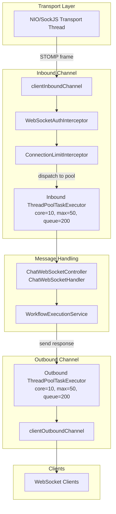

# Design Document: WebSocket Thread Pool

## Overview

This feature introduces dedicated, bounded thread pools for both the WebSocket inbound and outbound STOMP channels. Currently, Spring's `clientInboundChannel` uses a `DirectChannel` (synchronous dispatch), meaning long-running workflow executions block the transport thread and prevent other users' messages from being processed. By configuring `ThreadPoolTaskExecutor` instances on both channels, message handling is decoupled from the transport layer, enabling concurrent session processing under load.

The design extends the existing `WebSocketResilienceProperties` class with new pool sizing fields and modifies `WebSocketConfig` to wire dedicated executors into the channel registrations. A custom `CallerRunsPolicy` wrapper provides WARN-level logging when saturation occurs, ensuring operators have visibility into back-pressure events without silently dropping messages.

## Architecture



Key architectural decisions:

1. **Interceptors execute before pool dispatch** — Spring's `ChannelRegistration` registers interceptors on the channel itself, so `preSend` runs on the transport thread before the executor dispatches. This means auth rejection and connection limiting happen before consuming a pool thread.

2. **CallerRunsPolicy for saturation** — When the queue is full and all threads are busy, the submitting (transport) thread executes the task directly. This provides natural back-pressure without message loss.

3. **Separate pools for inbound and outbound** — Prevents inbound processing from starving outbound delivery and vice versa. Each pool is independently sized and monitored.

4. **Graceful shutdown with `setWaitForTasksToCompleteOnShutdown(true)`** — The executor waits up to 30 seconds for in-progress tasks before forcible termination, complementing the existing `GracefulShutdownListener`.

## Components and Interfaces

### Modified: `WebSocketResilienceProperties`

Extends the existing `@ConfigurationProperties` class with thread pool fields:

```java
// New fields added under chatbot.websocket prefix
@Min(1)
private int inboundPoolCoreSize = 10;

@Min(1)
private int inboundPoolMaxSize = 50;

@Min(1)
private int inboundPoolQueueCapacity = 200;

@Min(1)
private int outboundPoolCoreSize = 10;

@Min(1)
private int outboundPoolMaxSize = 50;

@Min(1)
private int outboundPoolQueueCapacity = 200;
```

A custom `@AssertTrue` method validates that `maxSize >= coreSize` for both pools:

```java
@AssertTrue(message = "inbound-pool-max-size must be >= inbound-pool-core-size")
public boolean isInboundPoolSizesValid() {
    return inboundPoolMaxSize >= inboundPoolCoreSize;
}

@AssertTrue(message = "outbound-pool-max-size must be >= outbound-pool-core-size")
public boolean isOutboundPoolSizesValid() {
    return outboundPoolMaxSize >= outboundPoolCoreSize;
}
```

### Modified: `WebSocketConfig`

New methods added to the existing configuration class:

| Method | Purpose |
|--------|---------|
| `configureClientInboundChannel(ChannelRegistration)` | Modified to add `.taskExecutor(inboundExecutor())` alongside existing interceptors |
| `configureClientOutboundChannel(ChannelRegistration)` | New override to configure outbound pool |
| `inboundExecutor()` | `@Bean` that creates and configures the inbound `ThreadPoolTaskExecutor` |
| `outboundExecutor()` | `@Bean` that creates and configures the outbound `ThreadPoolTaskExecutor` |

### New: `LoggingCallerRunsPolicy`

A thin wrapper around `ThreadPoolExecutor.CallerRunsPolicy` that logs at WARN level when saturation occurs:

```java
package com.xpressbees.chatbot.config;

public class LoggingCallerRunsPolicy extends ThreadPoolExecutor.CallerRunsPolicy {
    @Override
    public void rejectedExecution(Runnable r, ThreadPoolExecutor executor) {
        log.warn("WebSocket thread pool saturated! active={}, queueSize={}, executing on caller thread",
                executor.getActiveCount(), executor.getQueue().size());
        super.rejectedExecution(r, executor);
    }
}
```

### Unchanged: `WebSocketAuthInterceptor`, `ConnectionLimitInterceptor`

No changes required. These interceptors are registered on the channel via `registration.interceptors(...)` which ensures their `preSend` methods execute synchronously on the transport thread before the executor dispatches the message to a pool thread. Spring's channel interceptor mechanism guarantees this ordering.

### Unchanged: `GracefulShutdownListener`

The existing listener handles workflow execution tracking. The thread pool's own `setWaitForTasksToCompleteOnShutdown(true)` + `setAwaitTerminationSeconds(30)` provides pool-level shutdown coordination independently.

## Data Models

### Configuration Properties Mapping

| Property Key | Type | Default | Validation | Maps to |
|---|---|---|---|---|
| `chatbot.websocket.inbound-pool-core-size` | int | 10 | `@Min(1)` | `ThreadPoolTaskExecutor.corePoolSize` |
| `chatbot.websocket.inbound-pool-max-size` | int | 50 | `@Min(1)`, >= core | `ThreadPoolTaskExecutor.maxPoolSize` |
| `chatbot.websocket.inbound-pool-queue-capacity` | int | 200 | `@Min(1)` | `ThreadPoolTaskExecutor.queueCapacity` |
| `chatbot.websocket.outbound-pool-core-size` | int | 10 | `@Min(1)` | `ThreadPoolTaskExecutor.corePoolSize` |
| `chatbot.websocket.outbound-pool-max-size` | int | 50 | `@Min(1)`, >= core | `ThreadPoolTaskExecutor.maxPoolSize` |
| `chatbot.websocket.outbound-pool-queue-capacity` | int | 200 | `@Min(1)` | `ThreadPoolTaskExecutor.queueCapacity` |

### Thread Pool Runtime State (no persistence)

The thread pools are runtime constructs — no database schema changes are required. The executor exposes monitoring metrics via:
- `getActiveCount()` — currently executing threads
- `getQueue().size()` — pending tasks in queue
- `getPoolSize()` — current live thread count
- `getCompletedTaskCount()` — total completed tasks

These can be exposed via Spring Actuator in the future but are not part of this feature scope.

## Correctness Properties

*A property is a characteristic or behavior that should hold true across all valid executions of a system — essentially, a formal statement about what the system should do. Properties serve as the bridge between human-readable specifications and machine-verifiable correctness guarantees.*

### Property 1: Configuration Propagation

*For any* valid combination of core pool size (≥ 1), max pool size (≥ core), and queue capacity (≥ 1), when a `ThreadPoolTaskExecutor` is built from a `WebSocketResilienceProperties` instance containing those values, the executor's `corePoolSize`, `maxPoolSize`, and `queueCapacity` SHALL equal the corresponding property values.

**Validates: Requirements 1.2, 1.3, 1.4, 4.2, 4.3, 4.4**

### Property 2: Thread Naming Prefix

*For any* task submitted to the inbound executor, the thread executing that task SHALL have a name starting with "ws-inbound-". *For any* task submitted to the outbound executor, the thread executing that task SHALL have a name starting with "ws-outbound-".

**Validates: Requirements 1.5, 4.5**

### Property 3: Invalid Pool Size Rejection

*For any* integer value ≤ 0 assigned to `inboundPoolCoreSize`, `inboundPoolMaxSize`, `inboundPoolQueueCapacity`, `outboundPoolCoreSize`, `outboundPoolMaxSize`, or `outboundPoolQueueCapacity`, Jakarta Bean Validation SHALL produce a constraint violation, preventing application startup.

**Validates: Requirements 2.4, 2.5, 2.6, 4.6**

### Property 4: Cross-Field Max ≥ Core Validation

*For any* pair (coreSize, maxSize) where maxSize < coreSize (both ≥ 1), the `@AssertTrue` cross-field validation on `WebSocketResilienceProperties` SHALL report a violation, preventing application startup. Conversely, *for any* pair where maxSize ≥ coreSize, the validation SHALL pass.

**Validates: Requirements 2.7**

### Property 5: No Task Loss Under Saturation

*For any* bounded thread pool (core ≥ 1, max ≥ core, queue ≥ 1) configured with `CallerRunsPolicy`, and *for any* number of tasks submitted (including more than queue + max), the count of completed tasks SHALL equal the count of submitted tasks — no task is ever discarded.

**Validates: Requirements 5.1, 5.4**

## Error Handling

| Scenario | Behavior | User Impact |
|----------|----------|-------------|
| Invalid property value (< 1) | Application fails to start with `BindValidationException` listing the violated constraint | Operator sees clear error in startup logs indicating which property is invalid |
| `maxSize < coreSize` | Application fails to start with `AssertTrue` violation message: "inbound-pool-max-size must be >= inbound-pool-core-size" | Operator sees descriptive message in startup logs |
| Thread pool saturated (queue full, all threads busy) | `CallerRunsPolicy` executes the task on the submitting transport thread; WARN log emitted | Slight latency increase for the triggering client; no message loss; operators alerted via log |
| Shutdown timeout exceeded | After 30 seconds, `ThreadPoolTaskExecutor` interrupts remaining threads | In-progress messages may not complete; existing `GracefulShutdownListener` handles broader coordination |
| Interceptor throws during `preSend` | Exception propagates before pool dispatch; client connection terminated | Unauthenticated/over-limit clients rejected immediately; no pool thread consumed |

### Startup Logging

At application startup, the configuration logs at INFO level:

```
WebSocket inbound thread pool configured: coreSize=10, maxSize=50, queueCapacity=200, prefix=ws-inbound-
WebSocket outbound thread pool configured: coreSize=10, maxSize=50, queueCapacity=200, prefix=ws-outbound-
```

### Saturation Warning

When `CallerRunsPolicy` triggers:

```
WARN  c.x.c.config.LoggingCallerRunsPolicy - WebSocket thread pool saturated! active=50, queueSize=200, executing on caller thread
```

## Testing Strategy

### Property-Based Tests (jqwik)

Property-based testing is well-suited for this feature because the core logic involves configuration propagation and validation with clear input/output relationships across a wide input space.

**Library**: jqwik 1.8.2 (already in project dependencies)
**Minimum iterations**: 100 per property test
**Tag format**: `Feature: websocket-thread-pool, Property {N}: {description}`

| Property | Test Class | What It Verifies |
|----------|-----------|-----------------|
| Property 1: Configuration Propagation | `WebSocketThreadPoolPropertyTest` | Random valid (core, max, queue) tuples produce correctly configured executors |
| Property 2: Thread Naming Prefix | `WebSocketThreadPoolPropertyTest` | Tasks execute on threads with correct prefix |
| Property 3: Invalid Pool Size Rejection | `WebSocketThreadPoolValidationPropertyTest` | Random invalid values (≤ 0) trigger validation errors |
| Property 4: Cross-Field Validation | `WebSocketThreadPoolValidationPropertyTest` | Random (core, max) pairs validate correctly based on max ≥ core |
| Property 5: No Task Loss | `WebSocketThreadPoolSaturationPropertyTest` | Random task counts on saturated pools all complete |

### Unit Tests (JUnit 5 + Mockito)

| Test | What It Verifies |
|------|-----------------|
| Default property values | `inboundPoolCoreSize=10`, `maxSize=50`, `queueCapacity=200` (and outbound equivalents) |
| `LoggingCallerRunsPolicy` emits WARN log | Log appender captures warning with active count and queue size |
| Startup INFO log emission | Configuration is logged at application start |
| Interceptor ordering preserved | `configureClientInboundChannel` registers auth before connection limit |

### Integration Tests

| Test | What It Verifies |
|------|-----------------|
| Full context load with custom properties | Properties bind correctly from `application-test.properties` |
| STOMP message dispatches to pool thread | Message handler executes on `ws-inbound-*` thread |
| Auth rejection doesn't consume pool thread | Invalid auth throws before dispatch |
| Graceful shutdown waits for pool drain | In-progress tasks complete within timeout |

### Test Configuration

```properties
# application-test.properties additions
chatbot.websocket.inbound-pool-core-size=2
chatbot.websocket.inbound-pool-max-size=4
chatbot.websocket.inbound-pool-queue-capacity=5
chatbot.websocket.outbound-pool-core-size=2
chatbot.websocket.outbound-pool-max-size=4
chatbot.websocket.outbound-pool-queue-capacity=5
```

Small pool sizes in tests make saturation scenarios easy to reproduce without resource overhead.

