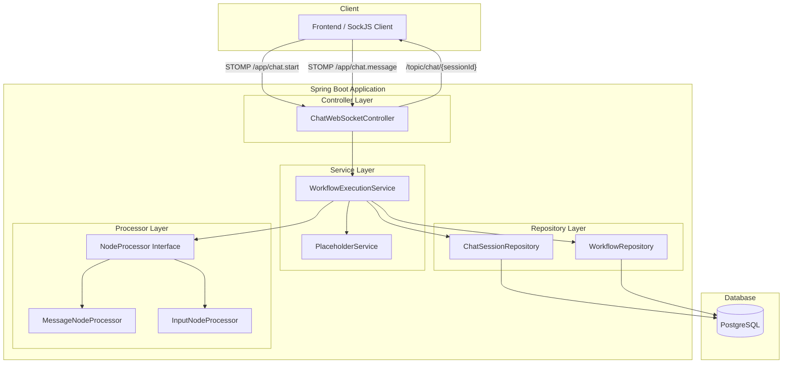
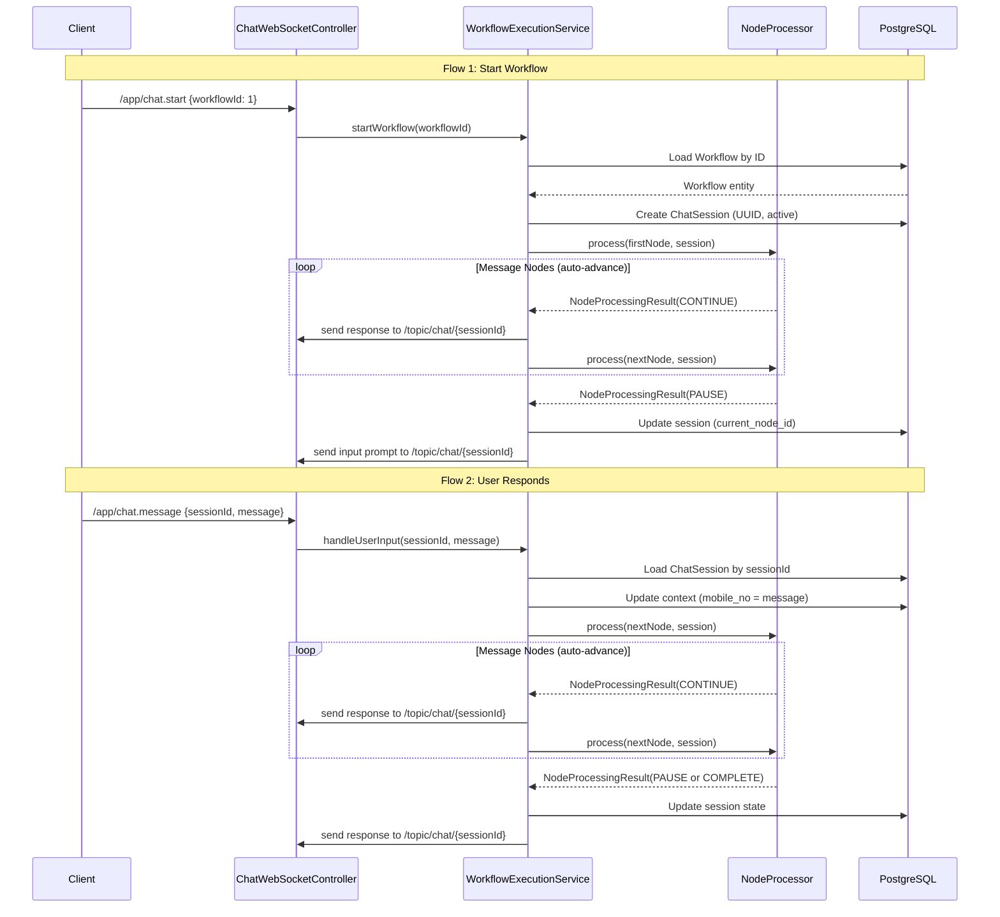

# Design Document: WebSocket Workflow Execution

## Overview

This design describes the real-time workflow execution engine that processes chatbot conversation flows over WebSocket (STOMP). The system walks users through a directed node graph — sending messages automatically, pausing at input nodes, collecting user responses, and resuming execution — all while persisting session state in PostgreSQL so no in-memory state is required.

**Key Design Decisions:**
- **Stateless server**: All session state is loaded from the database on each interaction. No threads wait for user input.
- **Strategy Pattern for node processing**: Each node type is handled by a dedicated `NodeProcessor` implementation, enabling new node types without modifying existing code.
- **STOMP over WebSocket**: Leverages Spring's `@MessageMapping` with a simple in-memory broker for pub/sub messaging to session-specific topics.
- **Sequential synchronous processing**: Message nodes are processed in a loop within a single request thread until an input node or end-of-workflow is reached.

## Architecture

### High-Level System Architecture



### WebSocket Message Flow



### Layered Architecture

| Layer | Responsibility | Key Classes |
|-------|---------------|-------------|
| **Controller** | WebSocket endpoint handling, message routing | `ChatWebSocketController` |
| **Service** | Orchestration, workflow graph traversal, session management | `WorkflowExecutionService`, `PlaceholderService` |
| **Processor** | Node-type-specific logic (Strategy Pattern) | `NodeProcessor`, `MessageNodeProcessor`, `InputNodeProcessor` |
| **Repository** | Data access via Spring Data JPA | `ChatSessionRepository`, `WorkflowRepository` |

## Components and Interfaces

### 1. WebSocket Configuration Update

The existing `WebSocketConfig` needs an application destination prefix added:

```java
@Override
public void configureMessageBroker(MessageBrokerRegistry config) {
    config.enableSimpleBroker("/topic");
    config.setApplicationDestinationPrefixes("/app");
}
```

### 2. Controller: `ChatWebSocketController`

```java
@Controller
public class ChatWebSocketController {

    private final WorkflowExecutionService workflowExecutionService;

    public ChatWebSocketController(WorkflowExecutionService workflowExecutionService) {
        this.workflowExecutionService = workflowExecutionService;
    }

    @MessageMapping("/chat.start")
    public void startWorkflow(ChatStartRequest request, SimpMessageHeaderAccessor headerAccessor);

    @MessageMapping("/chat.message")
    public void handleMessage(ChatMessageRequest request);
}
```

### 3. Service Interface: `WorkflowExecutionService`

```java
public interface WorkflowExecutionService {
    void startWorkflow(Long workflowId, String stompSessionId);
    void handleUserInput(String sessionId, String message);
}
```

### 4. Service Implementation: `WorkflowExecutionServiceImpl`

```java
@Service
public class WorkflowExecutionServiceImpl implements WorkflowExecutionService {

    private final WorkflowRepository workflowRepository;
    private final ChatSessionRepository chatSessionRepository;
    private final List<NodeProcessor> nodeProcessors;
    private final PlaceholderService placeholderService;
    private final SimpMessagingTemplate messagingTemplate;

    // Constructor injection of all dependencies

    @Override
    public void startWorkflow(Long workflowId, String stompSessionId) { ... }

    @Override
    public void handleUserInput(String sessionId, String message) { ... }

    private void processNodes(ChatSession session, Map<String, Object> currentNode,
                              Map<String, Object> workflowJson) { ... }

    private Map<String, Object> resolveNextNode(String currentNodeId,
                                                 Map<String, Object> workflowJson) { ... }

    private Map<String, Object> findFirstNode(Map<String, Object> workflowJson) { ... }

    private NodeProcessor findProcessor(Map<String, Object> node) { ... }

    private void sendResponse(String sessionId, ChatResponse response) { ... }

    private void sendError(String sessionId, String errorMessage) { ... }
}
```

### 5. Strategy Interface: `NodeProcessor`

```java
public interface NodeProcessor {
    boolean canHandle(Map<String, Object> node);
    NodeProcessingResult process(Map<String, Object> node, ChatSession session,
                                  PlaceholderService placeholderService);
}
```

### 6. Processing Result DTO

```java
@Data
@AllArgsConstructor
public class NodeProcessingResult {
    private Action action;  // CONTINUE, PAUSE, COMPLETE
    private ChatResponse response;

    public enum Action {
        CONTINUE,  // Auto-advance to next node
        PAUSE,     // Wait for user input
        COMPLETE   // End of workflow
    }
}
```

### 7. `MessageNodeProcessor`

```java
@Component
@Order(2)
public class MessageNodeProcessor implements NodeProcessor {

    @Override
    public boolean canHandle(Map<String, Object> node) {
        String type = (String) node.get("type");
        if (!"state".equals(type)) return false;
        Map<String, Object> config = (Map<String, Object>) node.get("config");
        return config == null || !config.containsKey("nodeType");
    }

    @Override
    public NodeProcessingResult process(Map<String, Object> node, ChatSession session,
                                         PlaceholderService placeholderService) {
        String name = (String) node.get("name");
        String response = placeholderService.resolve(name, session.getContext());
        ChatResponse chatResponse = new ChatResponse(node, response, session.getSessionId());
        return new NodeProcessingResult(NodeProcessingResult.Action.CONTINUE, chatResponse);
    }
}
```

### 8. `InputNodeProcessor`

```java
@Component
@Order(1)
public class InputNodeProcessor implements NodeProcessor {

    @Override
    public boolean canHandle(Map<String, Object> node) {
        String type = (String) node.get("type");
        if (!"state".equals(type)) return false;
        Map<String, Object> config = (Map<String, Object>) node.get("config");
        return config != null && "input".equals(config.get("nodeType"));
    }

    @Override
    public NodeProcessingResult process(Map<String, Object> node, ChatSession session,
                                         PlaceholderService placeholderService) {
        String name = (String) node.get("name");
        String response = placeholderService.resolve(name, session.getContext());
        ChatResponse chatResponse = new ChatResponse(node, response, session.getSessionId());
        // Update session to track waiting state
        session.setCurrentNodeId((String) node.get("id"));
        session.setCurrentType((String) node.get("type"));
        session.setCurrentNodeType("input");
        return new NodeProcessingResult(NodeProcessingResult.Action.PAUSE, chatResponse);
    }
}
```

### 9. `PlaceholderService`

```java
@Service
public class PlaceholderService {

    public String resolve(String template, Map<String, Object> context) {
        if (template == null || context == null) return template;
        String result = template;
        if (context.containsKey("mobile_no")) {
            result = result.replace("<mobile_no>", String.valueOf(context.get("mobile_no")));
        }
        return result;
    }
}
```

### 10. DTOs

```java
@Data
public class ChatStartRequest {
    private Long workflowId;
}

@Data
public class ChatMessageRequest {
    private String sessionId;
    private String message;
}

@Data
@AllArgsConstructor
@NoArgsConstructor
public class ChatResponse {
    private Map<String, Object> node;
    private String response;
    private String sessionId;
    private Boolean completed;  // only set on final node

    public ChatResponse(Map<String, Object> node, String response, String sessionId) {
        this.node = node;
        this.response = response;
        this.sessionId = sessionId;
    }
}

@Data
@AllArgsConstructor
public class ChatErrorResponse {
    private String error;
    private String sessionId;
}
```

### 11. Repository: `ChatSessionRepository`

```java
@Repository
public interface ChatSessionRepository extends JpaRepository<ChatSession, Long> {
    Optional<ChatSession> findBySessionId(String sessionId);
}
```

## Data Models

### Existing Table: `workflow`

```sql
CREATE TABLE IF NOT EXISTS workflow (
    id          BIGSERIAL PRIMARY KEY,
    name        VARCHAR(255) NOT NULL,
    workflow_json JSONB,
    created_at  TIMESTAMP NOT NULL DEFAULT NOW(),
    updated_at  TIMESTAMP NOT NULL DEFAULT NOW()
);
```

### New Table: `chat_session`

```sql
CREATE TABLE IF NOT EXISTS chat_session (
    id                BIGSERIAL PRIMARY KEY,
    session_id        UUID NOT NULL UNIQUE,
    workflow_id       BIGINT NOT NULL REFERENCES workflow(id),
    current_node_id   VARCHAR(255),
    current_type      VARCHAR(50),
    current_node_type VARCHAR(50),
    context           JSONB DEFAULT '{}',
    status            VARCHAR(20) NOT NULL DEFAULT 'active',
    created_at        TIMESTAMP NOT NULL DEFAULT NOW(),
    updated_at        TIMESTAMP NOT NULL DEFAULT NOW()
);

CREATE INDEX idx_chat_session_session_id ON chat_session(session_id);
CREATE INDEX idx_chat_session_status ON chat_session(status);
```

### Entity: `ChatSession`

```java
@Entity
@Table(name = "chat_session")
@Data
@NoArgsConstructor
@AllArgsConstructor
public class ChatSession {

    @Id
    @GeneratedValue(strategy = GenerationType.IDENTITY)
    private Long id;

    @Column(name = "session_id", nullable = false, unique = true)
    private String sessionId;

    @Column(name = "workflow_id", nullable = false)
    private Long workflowId;

    @Column(name = "current_node_id")
    private String currentNodeId;

    @Column(name = "current_type")
    private String currentType;

    @Column(name = "current_node_type")
    private String currentNodeType;

    @Type(JsonType.class)
    @Column(name = "context", columnDefinition = "jsonb")
    private Map<String, Object> context = new HashMap<>();

    @Column(name = "status", nullable = false)
    private String status;

    @Column(name = "created_at", updatable = false)
    private LocalDateTime createdAt;

    @Column(name = "updated_at")
    private LocalDateTime updatedAt;

    @PrePersist
    protected void onCreate() {
        createdAt = LocalDateTime.now();
        updatedAt = LocalDateTime.now();
    }

    @PreUpdate
    protected void onUpdate() {
        updatedAt = LocalDateTime.now();
    }
}
```

### Workflow JSON Structure (Reference)

```json
{
  "nodes": [
    { "id": "1", "name": "Welcome!", "type": "state", "config": null },
    { "id": "2", "name": "Enter mobile number", "type": "state", "config": { "nodeType": "input" } },
    { "id": "3", "name": "Your number is <mobile_no>", "type": "state", "config": null }
  ],
  "transitions": [
    { "sourceNodeId": "1", "targetNodeId": "2" },
    { "sourceNodeId": "2", "targetNodeId": "3" }
  ]
}
```

### STOMP Destination Mapping

| Direction | Destination | Purpose |
|-----------|------------|---------|
| Client → Server | `/app/chat.start` | Start a new workflow execution |
| Client → Server | `/app/chat.message` | Send user input for an active session |
| Server → Client | `/topic/chat/{sessionId}` | Push node responses and errors to a session |


## Correctness Properties

*A property is a characteristic or behavior that should hold true across all valid executions of a system — essentially, a formal statement about what the system should do. Properties serve as the bridge between human-readable specifications and machine-verifiable correctness guarantees.*

### Property 1: Placeholder Substitution Correctness

*For any* node name string containing the `<mobile_no>` token and *for any* session context map containing a `mobile_no` key with a non-null value, the `PlaceholderService.resolve()` method SHALL return the original string with all occurrences of `<mobile_no>` replaced by the context value; and if the context does not contain the key, the token SHALL remain unchanged.

**Validates: Requirements 6.1, 6.2, 6.3, 8.3**

### Property 2: Node Classification Mutual Exclusivity

*For any* node represented as a `Map<String, Object>`, exactly one of the following holds: (a) `InputNodeProcessor.canHandle` returns true (when `type` is `"state"` and `config.nodeType` is `"input"`), (b) `MessageNodeProcessor.canHandle` returns true (when `type` is `"state"` and config is null or `nodeType` is absent), or (c) neither processor handles it (resulting in default message-node behavior). The two processors SHALL never both return true for the same node.

**Validates: Requirements 9.2, 9.3, 9.4, 3.4**

### Property 3: Graph Traversal Returns Correct Next Node

*For any* valid workflow JSON containing a `transitions` array and a `nodes` array, and *for any* node whose `id` matches the `sourceNodeId` of at least one transition, `resolveNextNode` SHALL return the node whose `id` equals the `targetNodeId` of the first matching transition. If no transition exists with the given `sourceNodeId`, it SHALL return null (indicating end of workflow).

**Validates: Requirements 2.2, 4.3, 1.2**

### Property 4: Response Format Consistency

*For any* node processing result (whether from a Message_Node or Input_Node), the `ChatResponse` object SHALL contain: (a) a `node` field that is identical to the original node map from the workflow definition, (b) a `response` field that is the node's `name` with placeholder substitution applied, and (c) a non-null `sessionId` string.

**Validates: Requirements 8.1, 8.4, 2.1, 3.1**

### Property 5: Context Merge Preserves Existing Entries

*For any* existing session context map with N key-value pairs and a new user input stored under the key `mobile_no`, after the merge operation the context SHALL contain N or N+1 entries (depending on whether `mobile_no` already existed), the `mobile_no` key SHALL map to the new value, and all other keys SHALL retain their original values.

**Validates: Requirements 5.3, 4.2**

### Property 6: Workflow Completion Detection

*For any* node in a workflow graph that has no outgoing transition (no transition with `sourceNodeId` matching the node's `id`), when that node is the current node being processed, the engine SHALL mark the session status as `"completed"` and the final response SHALL include `completed = true`.

**Validates: Requirements 7.1, 7.2**

### Property 7: Infinite Loop Guard

*For any* workflow graph where a chain of consecutive Message_Nodes exceeds 50 without encountering an Input_Node or end-of-workflow, the engine SHALL stop processing and produce an error response. For chains of 50 or fewer, processing SHALL complete normally.

**Validates: Requirements 2.5**

### Property 8: Input Validation Rejects Invalid Workflow IDs

*For any* value that is null, not a number, or not representable as a valid `Long`, the `startWorkflow` operation SHALL produce an error response without creating a `ChatSession` record or loading a workflow. For any valid non-null numeric ID, the system SHALL attempt to load the corresponding workflow.

**Validates: Requirements 1.1, 1.6**

### Property 9: Session State Persistence After Input Node

*For any* input node encountered during processing, after the engine pauses, the persisted `ChatSession` record SHALL have `current_node_id` equal to the input node's `id`, `current_type` equal to `"state"`, `current_node_type` equal to `"input"`, and `status` equal to `"active"`.

**Validates: Requirements 3.2, 5.2**

## Error Handling

### Error Categories and Responses

| Error Condition | Response | Session Impact |
|----------------|----------|----------------|
| Invalid/missing workflowId | `ChatErrorResponse` with descriptive message | No session created |
| Workflow not found in DB | `ChatErrorResponse`: "Workflow not found" | No session created |
| Empty/missing transitions | `ChatErrorResponse`: "Workflow has no starting node" | No session created |
| Session not found | `ChatErrorResponse`: "No active session found" | N/A |
| Session not awaiting input | `ChatErrorResponse`: "Session is not awaiting input" | No state change |
| Session already completed | `ChatErrorResponse`: "Session is already completed" | No state change |
| Empty/missing message field | `ChatErrorResponse`: "Non-empty message is required" | No state change |
| Infinite loop detected (>50 nodes) | `ChatErrorResponse`: "Potential infinite loop detected" | Session remains active at last node |
| Database persistence failure | `ChatErrorResponse`: "Failed to persist session" | No state advancement |

### Error Response Delivery

All errors are sent to `/topic/chat/{sessionId}` if a session exists, or directly returned to the STOMP frame's reply channel if no session has been created yet.

### Exception Handling Strategy

```java
// In WorkflowExecutionServiceImpl
try {
    // workflow loading, session creation, node processing
} catch (WorkflowNotFoundException e) {
    sendError(sessionId, "Workflow not found: " + workflowId);
} catch (DataAccessException e) {
    sendError(sessionId, "Failed to persist session state");
} catch (Exception e) {
    sendError(sessionId, "Unexpected error during workflow execution");
}
```

The controller uses `@MessageExceptionHandler` for unhandled exceptions at the STOMP level:

```java
@MessageExceptionHandler
public void handleException(Exception ex, SimpMessageHeaderAccessor headerAccessor) {
    // Send error to user's session topic
}
```

## Testing Strategy

### Property-Based Testing

**Library**: [jqwik](https://jqwik.net/) (Java property-based testing framework, integrates with JUnit 5)

**Configuration**: Minimum 100 iterations per property test.

**Tag format**: `Feature: websocket-workflow-execution, Property {number}: {property_text}`

Each correctness property (1–9) will be implemented as a single `@Property` test method in jqwik:

| Property | Test Class | What's Generated |
|----------|-----------|-----------------|
| 1 (Placeholder) | `PlaceholderServicePropertyTest` | Random template strings, random context maps |
| 2 (Node Classification) | `NodeProcessorClassificationPropertyTest` | Random node maps with varying type/config |
| 3 (Graph Traversal) | `WorkflowGraphTraversalPropertyTest` | Random workflow JSON with nodes/transitions |
| 4 (Response Format) | `ChatResponseFormatPropertyTest` | Random nodes and sessions |
| 5 (Context Merge) | `ContextMergePropertyTest` | Random existing context maps, random new values |
| 6 (Completion Detection) | `WorkflowCompletionPropertyTest` | Random graphs with terminal nodes |
| 7 (Infinite Loop) | `InfiniteLoopGuardPropertyTest` | Random chain lengths (1–100 message nodes) |
| 8 (Input Validation) | `WorkflowIdValidationPropertyTest` | Random valid/invalid workflowId values |
| 9 (Session Persistence) | `SessionPersistencePropertyTest` | Random input nodes, verify session fields |

### Unit Tests (Example-Based)

- Start workflow with non-existent ID → error response (Req 1.5)
- Start workflow with empty transitions → error response (Req 1.7)
- Send message to non-existent session → error response (Req 4.5)
- Send message to session not awaiting input → error response (Req 4.6)
- Send message to completed session → error response (Req 7.3)
- Database failure during save → error response, no advancement (Req 5.5)
- Session creation generates valid UUID (Req 5.4)

### Integration Tests

- Full workflow execution over WebSocket: start → message nodes auto-advance → input node pauses → user responds → remaining nodes → completion (Reqs 1.4, 2.3, 2.4, 3.3, 4.4)
- STOMP destination routing verification (Req 8.2)
- Session reconnection after simulated restart (Req 5.6)

### Test Dependencies (pom.xml additions)

```xml
<dependency>
    <groupId>net.jqwik</groupId>
    <artifactId>jqwik</artifactId>
    <version>1.8.2</version>
    <scope>test</scope>
</dependency>
```
