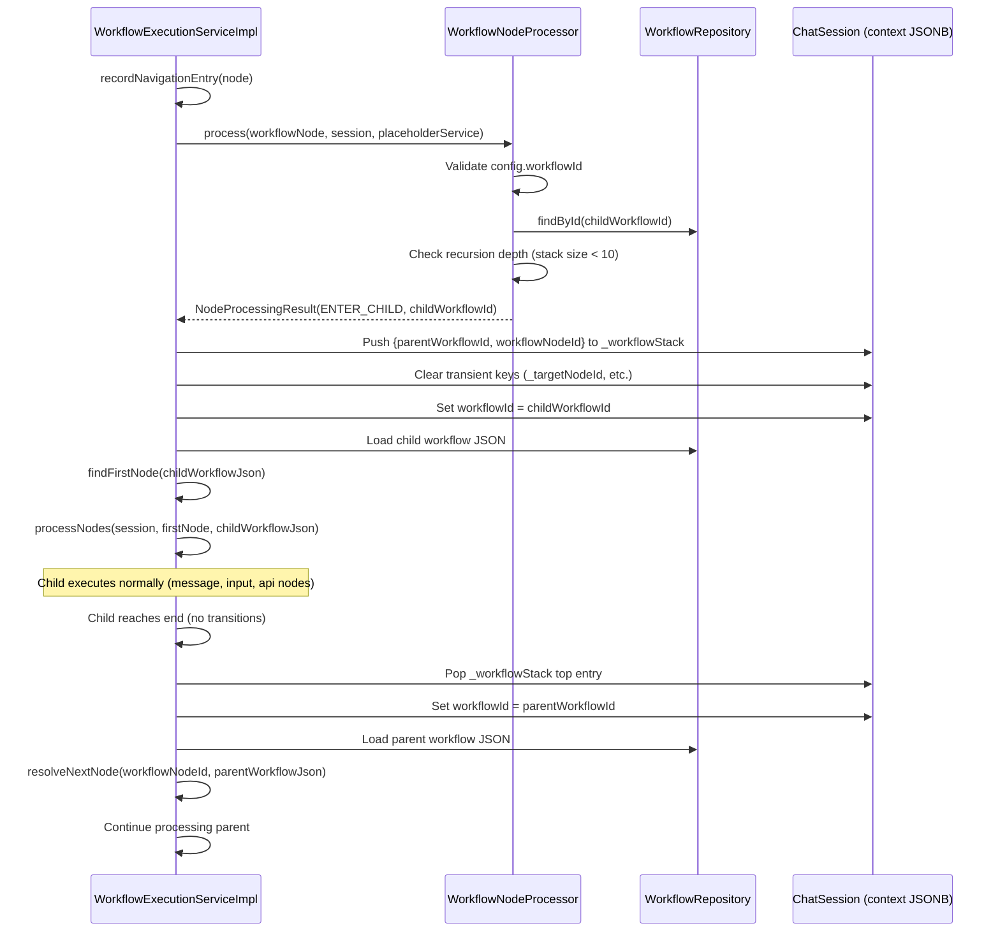
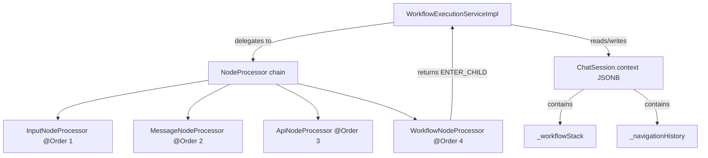

# Design Document: Workflow Node

## Overview

This design introduces a "workflow" node type that enables workflow composition — one workflow can call another by reference. When the execution engine encounters a workflow node, it pushes the current execution context onto a stack, switches the session to the referenced child workflow, and begins executing it. Upon child completion, the engine pops the stack and resumes the parent workflow from the next node.

The design leverages the existing `NodeProcessor` pattern (interface + `@Order` annotation + Spring auto-discovery) and stores all stack/history state within the session's existing JSONB `context` column, avoiding schema changes.

### Key Design Decisions

| Decision | Rationale |
|----------|-----------|
| Shared context (no isolation) | Child workflows need access to variables collected by the parent (e.g., user details). Simpler model, matches existing architecture. |
| Stack stored in session context JSONB | No new tables needed. Stack is small (max 10 entries). Atomic save with session. |
| `session.workflowId` swapped to active workflow | Existing resume logic in `handleUserInput` already loads workflow by `session.workflowId`. No changes needed to pause/resume for child workflows. |
| Max recursion depth = 10 | Prevents runaway nesting while allowing realistic multi-level composition. |
| Navigation history in context JSONB | Append-only list supports debugging and future back-button. Persisted atomically with session. |
| New `ENTER_CHILD` action on NodeProcessingResult | Signals the engine to perform the workflow switch without the processor needing direct access to the engine's internal methods. |

## Architecture



### Component Integration



## Components and Interfaces

### WorkflowNodeProcessor

**Package:** `com.xpressbees.chatbot.processor`

**Responsibility:** Validates the workflow node configuration, checks recursion limits, and signals the engine to enter the child workflow.

```java
@Component
@Order(4)
public class WorkflowNodeProcessor implements NodeProcessor {

    private static final int MAX_RECURSION_DEPTH = 10;
    private final WorkflowRepository workflowRepository;

    public WorkflowNodeProcessor(WorkflowRepository workflowRepository) {
        this.workflowRepository = workflowRepository;
    }

    @Override
    public boolean canHandle(Map<String, Object> node) {
        return "workflow".equals(node.get("type"));
    }

    @Override
    public NodeProcessingResult process(Map<String, Object> node, ChatSession session,
                                         PlaceholderService placeholderService) {
        // 1. Extract config.workflowId
        // 2. Validate presence, parsability, existence in DB
        // 3. Check recursion depth via _workflowStack size
        // 4. Return ENTER_CHILD result with child workflow ID
    }
}
```

**Error responses returned as `Action.CONTINUE` with descriptive ChatResponse:**
- Missing config or workflowId → "Workflow reference is missing from the node"
- Invalid (non-numeric) workflowId → "Workflow identifier is invalid"
- Workflow not found in DB → "No workflow found for ID: {id}"
- Recursion depth exceeded → "Maximum workflow nesting depth (10) exceeded"

### NodeProcessingResult Enhancement

A new action `ENTER_CHILD` is added to the existing `Action` enum:

```java
public enum Action {
    CONTINUE,
    PAUSE,
    COMPLETE,
    ENTER_CHILD  // New: signals engine to switch to child workflow
}
```

The processor stores the child workflow ID in the session context under a transient key `_childWorkflowId` before returning `ENTER_CHILD`. The engine reads and removes this key when handling the action.

### WorkflowExecutionServiceImpl Modifications

The engine's `processNodes` loop gains a new branch for `ENTER_CHILD`:

```java
} else if (result.getAction() == NodeProcessingResult.Action.ENTER_CHILD) {
    Long childWorkflowId = (Long) session.getContext().remove("_childWorkflowId");
    enterChildWorkflow(session, childWorkflowId, node);
    return; // Control transfers to child workflow processing
}
```

**New methods in WorkflowExecutionServiceImpl:**

| Method | Purpose |
|--------|---------|
| `enterChildWorkflow(session, childWorkflowId, workflowNode)` | Pushes stack, clears transients, swaps workflowId, loads child, finds first node, calls processNodes |
| `handleChildWorkflowEnd(session)` | Pops stack, restores parent workflowId, resolves next node, resumes processing |
| `recordNavigationEntry(session, node)` | Appends `{workflowId, nodeId, timestamp}` to `_navigationHistory` |
| `clearTransientKeys(context)` | Removes `_targetNodeId`, `_inputVariableName`, `_displayVariable`, `_buttonOptions` |
| `getWorkflowStack(context)` | Gets or initializes `_workflowStack` list from context |

### End-of-Workflow Detection Change

Currently, the engine detects workflow end when `resolveNextNode` returns `null`. This logic is modified:

```
IF resolveNextNode returns null:
    IF _workflowStack is non-empty:
        call handleChildWorkflowEnd(session)
    ELSE:
        mark session as "completed"
```

This applies in both `processNodes` (for CONTINUE results) and `handleInputNodeResume` / `handleApiNodeResume` (after user replies at the end of a child workflow).

## Data Models

### Workflow Stack Entry (stored in `_workflowStack`)

```json
{
  "parentWorkflowId": 5,
  "workflowNodeId": "node-uuid-abc"
}
```

- **parentWorkflowId** (Long): The workflow ID that was active before entering the child
- **workflowNodeId** (String): The ID of the workflow node in the parent, used to resolve the return position

The stack is a `List<Map<String, Object>>` stored in session context. Push appends to the end; pop removes from the end (LIFO).

### Navigation History Entry (stored in `_navigationHistory`)

```json
{
  "workflowId": 5,
  "nodeId": "node-uuid-abc",
  "timestamp": "2024-12-15T10:30:45.123"
}
```

- **workflowId** (Long): Which workflow the node belongs to
- **nodeId** (String): The node being visited
- **timestamp** (String, ISO-8601): When the visit was recorded

The history is a `List<Map<String, Object>>` stored in session context. Entries are only appended, never removed or modified.

### Workflow Node JSON Structure (within workflow_json.nodes[])

```json
{
  "id": "node-uuid-workflow-1",
  "type": "workflow",
  "name": "Call Payment Workflow",
  "config": {
    "workflowId": 12
  }
}
```

### Session Context Example (during child execution)

```json
{
  "userName": "Alice",
  "selectedProduct": "Widget",
  "_workflowStack": [
    { "parentWorkflowId": 1, "workflowNodeId": "node-uuid-workflow-1" }
  ],
  "_navigationHistory": [
    { "workflowId": 1, "nodeId": "node-msg-1", "timestamp": "2024-12-15T10:30:00" },
    { "workflowId": 1, "nodeId": "node-uuid-workflow-1", "timestamp": "2024-12-15T10:30:01" },
    { "workflowId": 12, "nodeId": "child-node-1", "timestamp": "2024-12-15T10:30:02" }
  ]
}
```

### ChatSession Entity (no schema changes)

The existing `ChatSession` entity is used as-is. The `workflowId` field is swapped to the active (child) workflow during child execution. The `context` JSONB column stores `_workflowStack` and `_navigationHistory` alongside user variables.

## Correctness Properties

*A property is a characteristic or behavior that should hold true across all valid executions of a system — essentially, a formal statement about what the system should do. Properties serve as the bridge between human-readable specifications and machine-verifiable correctness guarantees.*

### Property 1: Invalid workflowId rejection

*For any* string value in the config map's workflowId field that cannot be parsed as a Long, the WorkflowNodeProcessor SHALL return a NodeProcessingResult with Action CONTINUE and a response message indicating the identifier is invalid.

**Validates: Requirements 1.4**

### Property 2: Context preservation on child workflow entry

*For any* session context containing arbitrary user variables, when the engine enters a child workflow, all non-transient keys (keys not prefixed with underscore) SHALL remain present in the session context with their original values.

**Validates: Requirements 2.5, 3.1**

### Property 3: Transient key cleanup on child workflow entry

*For any* session context containing transient engine keys (_targetNodeId, _inputVariableName, _displayVariable, _buttonOptions), when the engine enters a child workflow, all of these transient keys SHALL be removed from the session context before the child's first node is processed.

**Validates: Requirements 3.4**

### Property 4: Workflow stack push correctness

*For any* workflow stack of size N (where N < 10) and any workflow node being processed, after the engine pushes a stack entry, the stack SHALL have size N+1 and the top entry SHALL contain the current session workflowId as parentWorkflowId and the workflow node's id as workflowNodeId.

**Validates: Requirements 4.2**

### Property 5: Workflow stack pop and parent restoration

*For any* non-empty workflow stack, when a child workflow reaches its end (no outgoing transitions), the engine SHALL pop the top entry and set session.workflowId to the popped entry's parentWorkflowId, resulting in a stack of size N-1.

**Validates: Requirements 4.3, 4.4, 4.5**

### Property 6: Session completion on empty stack at workflow end

*For any* session with an empty workflow stack whose currently executing node has no outgoing transitions, the engine SHALL set the session status to "completed".

**Validates: Requirements 4.6**

### Property 7: Recursion depth enforcement with state preservation

*For any* workflow stack of size >= 10, when a workflow node is encountered, the engine SHALL reject the invocation with an error response, and the workflow stack SHALL remain unchanged (same size, same entries) and the session status SHALL NOT be set to "completed".

**Validates: Requirements 5.2, 5.4**

### Property 8: canHandle rejects non-workflow node types

*For any* node map whose "type" value is a string not equal to "workflow", the WorkflowNodeProcessor's canHandle method SHALL return false.

**Validates: Requirements 6.3**

### Property 9: Child workflow pause preserves child workflowId

*For any* input or API node within a child workflow that causes a PAUSE, the session SHALL be saved with workflowId equal to the child workflow's ID (not the parent's), and currentNodeId pointing to the pausing node within the child workflow.

**Validates: Requirements 7.1, 7.4**

### Property 10: Navigation history is append-only with correct format

*For any* session with an existing navigation history of size N, after the engine processes one additional node, the history SHALL have size N+1, the first N entries SHALL be identical to the original entries, and the new entry SHALL contain exactly three fields: workflowId (Long matching session's current workflowId), nodeId (String matching the processed node's id), and timestamp (valid ISO-8601 string).

**Validates: Requirements 8.2, 8.3, 8.4, 8.6**

### Property 11: Child workflow variables retained after completion

*For any* variables added to the session context during child workflow execution, when the child workflow completes and the engine returns to the parent workflow, those variables SHALL remain present in the session context with their values unchanged.

**Validates: Requirements 3.2, 3.3**

### Property 12: Return to correct parent node after child completion

*For any* parent workflow containing a workflow node followed by a subsequent node, when the child workflow completes, the engine SHALL resume execution at the node immediately following the workflow node (resolved via the transition from workflowNodeId in the parent workflow's transitions list).

**Validates: Requirements 2.6**

## Error Handling

| Scenario | Behavior | User Impact |
|----------|----------|-------------|
| Missing config or workflowId | Return CONTINUE with error message | Message displayed, execution advances (engine treats as message node) |
| Invalid (non-numeric) workflowId | Return CONTINUE with error message | Same as above |
| Referenced workflow not found in DB | Return CONTINUE with error message | Same as above |
| Child workflow has no starting node (empty transitions) | Return CONTINUE with error message | Same as above |
| Recursion depth exceeded (stack >= 10) | Return CONTINUE with error message, halt execution | Error displayed, session paused (not completed) |
| Parent workflow unavailable on return | Send error via WebSocket, preserve context | Error displayed, context preserved for manual recovery |
| Workflow unavailable on resume after pause | Send error via WebSocket | Error displayed, session stays in paused state |

**Error Message Convention:** All error messages are sent as `ChatResponse` objects through the existing WebSocket topic (`/topic/chat/{sessionId}`), consistent with how `ApiNodeProcessor` and the engine currently handle errors.

**Transient Key Safety:** The `clearTransientKeys` method removes only the well-known engine keys (`_targetNodeId`, `_inputVariableName`, `_displayVariable`, `_buttonOptions`). It does NOT remove `_workflowStack` or `_navigationHistory` — these are structural, not transient.

## Testing Strategy

### Property-Based Tests (jqwik 1.8.2)

Property-based tests validate universal invariants across many generated inputs. Each property test maps to a correctness property defined above.

**Configuration:**
- Library: jqwik 1.8.2 (already in pom.xml)
- Minimum iterations: 100 per property
- Tag format: `// Feature: workflow-node, Property {N}: {title}`

**Test Class:** `WorkflowNodePropertyTest.java` in `src/test/java/com/xpressbees/chatbot/`

**Generators needed:**
- Random session context maps (String keys → Object values, mix of primitives and collections)
- Random workflow stack entries (parentWorkflowId as Long, workflowNodeId as String UUID)
- Random workflow node maps with type "workflow" and config containing workflowId
- Random non-numeric strings for invalid workflowId testing
- Random node type strings (excluding "workflow")
- Random navigation history lists

**Properties to implement:**
1. Invalid workflowId rejection (Property 1)
2. Context preservation on child entry (Property 2)
3. Transient key cleanup (Property 3)
4. Stack push correctness (Property 4)
5. Stack pop and parent restoration (Property 5)
6. Session completion on empty stack (Property 6)
7. Recursion depth enforcement (Property 7)
8. canHandle rejects non-workflow types (Property 8)
9. Navigation history append-only (Property 10)

### Unit Tests (JUnit 5)

Example-based tests for specific scenarios:

- `WorkflowNodeProcessorTest` — canHandle true/false, missing config, null workflowId, not-found workflow, empty child transitions, happy path ENTER_CHILD
- `WorkflowStackTest` — stack initialization, push first entry, cascading pops
- `NavigationHistoryTest` — first entry creation, preservation on session completion

### Integration Tests

- Full workflow execution: parent → child → return to parent
- Child workflow with input node pause → user reply → continue in child → complete child → return to parent
- Multi-level nesting (parent → child → grandchild → back to child → back to parent)
- Recursion protection trigger at depth 10

### Mocking Strategy

- `WorkflowRepository` — mocked in unit/property tests to control what workflows are "found"
- `ChatSessionRepository` — mocked to verify save calls
- `SimpMessagingTemplate` — mocked to verify WebSocket messages
- `PlaceholderService` — passed through (lightweight, no external dependencies)

